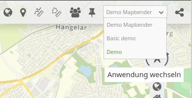
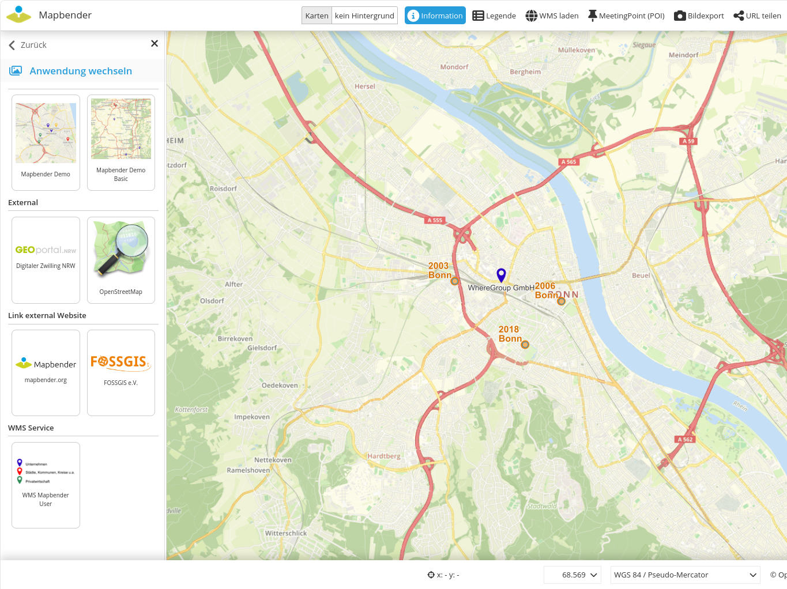
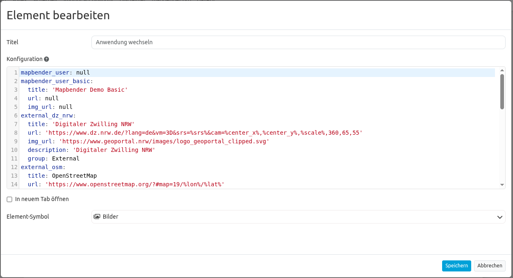

.. _applicationswitcher_de:

Anwendung wechseln (Application Switcher)
*****************************************

Der Anwendungswechsler bietet die Möglichkeit, zu anderen Mapbender-Anwendungen, zu anderen Portalen oder Websites zu wechseln. Dabei bleibt der Kartenausschnitt erhalten. Das Element verfügt über Platzhalter, die bei der Zusammenstellung von Adressen genutzt werden können.

Das Element kann in der oberen Werkzeugleiste, der Fußzeile oder der Seitenleiste definiert werden. 

In der oberen Werkzeugleiste oder Fußzeile wird es als Auswahlfeld angezeigt.

Wenn Sie das Element in der Seitenleiste platzieren, können Sie aus Karten wählen, die in Gruppen unterteilt sind.

Sie können von einer Anwendung zur anderen wechseln. Der Kartenausschnitt bleibt dabei erhalten.

Verweisen Sie auf geschützte Anwendungen, so werden diese nur zur Auswahl gestellt,
sofern Sie für den angemeldetetn Benutzer oder anonymen benutzer freigeschaltet sind.

Konfiguration
=============

* **Titel:** Titel des Elements. Dieser wird angezeigt, wenn der Mauszeiger eine längere Zeit über der Auswahl verweilt.
* **In neuem Tab öffnen:** Definiert, ob die Anwendung beim Wechsel in einem neuen Browser-Tab geöffnet werden soll.
* **Konfiguration:** Definieren Sie in diesem Bereich die Anwendungen, die zur Auswahl erscheinen sollen. Die Definition erfolgt im YAML-Syntax.

Sie können auf Anwendungen ohne weitere Parameter verweisen. Oder Sie können zusätzliche Parameter definieren.

* **title:** Definieren Sie einen alternativen Titel. Wenn kein Titel definiert ist, wird der Titel der Anwendung verwendet, wenn Sie auf eine vorhandene Mapbender-Anwendung Ihrer Installation verweisen (optional)
* **url:** Sie können einen Link hinzufügen und auf eine Mapbender-Anwendung, eine Website oder ein anderes Portal verweisen (optional).
* **img_url:** Link zu einem Bild, das Sie anzeigen möchten. (optional)
* **description:** Fügen Sie eine Beschreibung hinzu. Diese wird als Tooltip angezeigt (optional)
* **group:** Definieren Sie eine Gruppe. Anwendungen mit derselben Gruppe werden in einem Abschnitt mit dem Gruppentitel als Überschrift angezeigt (optional).

Die folgenden Platzhalter sind definiert und liefern Informationen zum derzeit in der Anwendung ausgewählten Bereich. Der Platzhalter kann in der URL-Definition verwendet werden:

* **%scale%:** Maßstab
* **%lat%:** latitude der Mittelpunktskoordinate
* **%lon%:** longitude der Mittelpunktskoordinate
* **%center_x%:** x-Wert der Mittelpunktskoordinate in der aktuell verwendeten Projektion 
* **%center_y%:** y-Wert der Mittelpunktskoordinate in der aktuell verwendeten Projektion 
* **%rotation%:** numerischer Wert der die Rotation der Karte repräsentiert
* **%srs%:** EPSG-Code
* **%zoom%:** Zoomfaktor 

Konfigurationsbeispiel: 

.. code-block:: yaml

    mapbender_user: # switch to another application
    mapbender_user_basic:
      title: 'Mapbender User Basic'
      url: null
      img_url: null
      group: 'Mapbender Demos'
    mapbender_user_basic_with_zoom:
      title: 'external: open with zoom'
      url: 'https://schulung.foss.academy/mapbender/application/mapbender_user?#%zoom%@%lat%/%lon%r%rotation%@EPSG:%srs%'
      description: Link to an external application with zoom and rotation.
      group: 'External'
    external_dz_nrw:
      title: 'www.dz.nrw.de with srs scale center_x and center_y'
      url: 'https://www.dz.nrw.de/?lang=de&vm=3D&srs=%srs%&cam=%center_x%,%center_y%,%scale%,360,65,55'
      img_url: null
      description: Link to Digitaler Zwilling NRW (external application).      
      group: 'External'
    external_osm:
      title: 'OSM with lon & lat'
      url: 'https://www.openstreetmap.org/?#map=19/%lon%/%lat%'
      img_url: 'https://upload.wikimedia.org/wikipedia/commons/b/b0/Openstreetmap_logo.svg'
      description: Link to OpenStreetMap (external application). 
      group: 'External'
    link_mapbender:
      title: 'Link: mapbender.org'
      url: 'https://mapbender.org'
      img_url: 'https://doc.mapbender.org/_images/mapbender_logo_font.png' #'https://mapbender.org/fileadmin/mapbender/resources/images/startseite/mapbender-stadt-markierungen.jpg'
      description: Link to the Mapbender Documentation      
      group: 'Link external Website'
    link_fossgis:
      title: 'Link: fossgis.de'
      url: 'https://fossgis.de'
      img_url: 'https://www.fossgis.de/mediawiki/images/d/d3/FOSSGIS_Logo_RGB_100x45mm_600dpi.png'
      description: Link to FOSSGIS e.V.      
      group: 'Link external Website'

YAML-Definition
---------------

Diese Vorlage kann genutzt werden, um das Element in einer YAML-Anwendung einzubinden. Bitte beachten Sie, dass Sie die Variablen mit doppelten Prozentzeichen (%%) in der URL-Definition angeben müssen.

.. code-block:: yaml

    title: Choose an Application              # Text wird als Tooltip angezeigt
    class: Mapbender\CoreBundle\Element\ApplicationSwitcher
    open_in_new_tab: true   # false/true Anwendung in neuem Browser-Tab öffnen
    applications:
      mapbender_user: # Wechsel zu anderer Mapbender-Anwendung
      mapbender_user_basic:
        title: 'Mapbender User Basic'
        url: null
        img_url: null
        group: 'Mapbender Demos'
      mapbender_user_basic_with_zoom:
        title: 'external Mapbender: open with zoom'
        url: 'https://schulung.foss.academy/mapbender/application/mapbender_user?#%%zoom%%@%%lat%%/%%lon%%r%%rotation%%@EPSG:%%srs%%'
        description: Link to an external application with zoom and rotation.        
        group: 'External'
      external_dz_nrw:
        title: 'www.dz.nrw.de with srs scale center_x and center_y'
        url: 'https://www.dz.nrw.de/?lang=de&vm=3D&srs=%%srs%%&cam=%%center_x%%,%%center_y%%,%%scale%%,360,65,55'
        img_url: null
        description: Link to Digitaler Zwilling NRW (external application). 
        group: 'External'
      external_osm:
        title: 'OSM with lon & lat'
        url: 'https://www.openstreetmap.org/?#map=19/%lon%/%lat%'
        img_url: 'https://upload.wikimedia.orgq/wikipedia/commons/b/b0/Openstreetmap_logo.svg'
        description: Link to OpenStreetMap (external application).         
        group: 'External'

