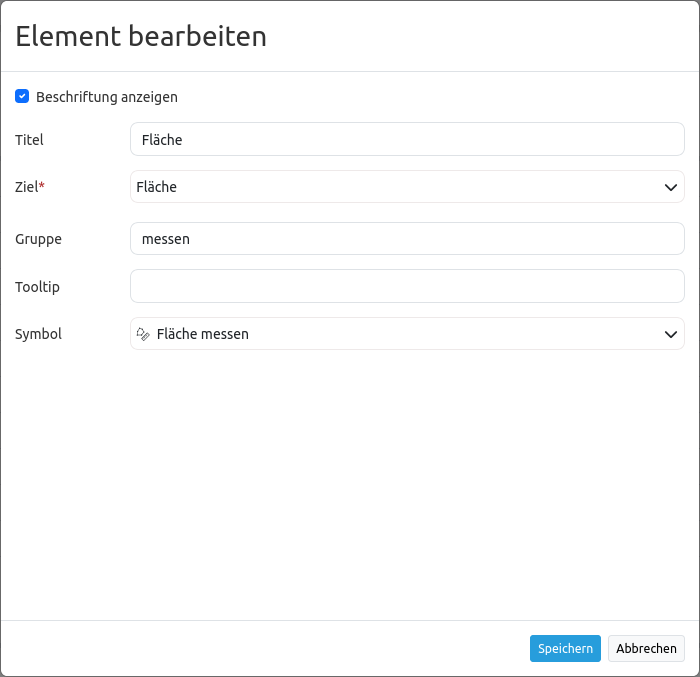

.. _button_de:

Button
******

Dieses Element stellt ein Button-Modul bereit. Einige Elemente wie die :ref:`legend_de`, :ref:`layertree_de`, :ref:`feature_info_de`, :ref:`ruler_de` und der :ref:`printclient_de` benötigen einen Button, um einen Dialog anzuzeigen oder um aktiviert zu werden, wenn das Element in den Kartenbereich oder die Fußleiste eingebunden wurde.

Buttons können optional gruppiert werden, sodass nur ein Button in der Gruppe aktiviert ist. Dies wird im Gruppen-Parameter eingestellt.
Es kann außerdem ein Button definiert werden, der sich auf eine Webseite oder ein Script bezieht und bei Aktivierung zu diesem weiterleitet. Bei dem Parameter *Target* stehen nur Funktionen zur Auswahl, die vorher in der Anwendung unter dem Reiter *Layouts* entweder in den Kartenbereich oder die Fußleiste eingebunden wurden.

Konfiguration
=============

.. image:: ../../../figures/de/button_configuration.png
     :scale: 80

* **Beschriftung anzeigen:** Schaltet die Beschriftung des Buttons an/aus (Standard: an).
* **Title:** Titel des Elements. Dieser wird in der Layouts Liste angezeigt und ermöglicht, mehrere Button-Elemente voneinander zu unterscheiden. Der Titel wird außerdem neben dem Button angezeigt, wenn "Beschriftung anzeigen" aktiviert ist.
* **Target:** Zielelement (Titel), das bei Anklicken des Buttons ausgelöst wird.
* **Group:** Hiermit kann das Element einer Gruppe hinzugefügt werden. Aus dieser Gruppe können nicht mehrere Buttons gleichzeitig aktiviert sein. Wird ein anderer Button aus der Gruppe ausgewählt, wird der vorher ausgewählte automatisch deaktiviert.
* **Tooltip:** Text, der angezeigt wird, wenn der Mauszeiger eine längere Zeit über dem Element verweilt.
* **Icon:** Symbol des Buttons, basierend auf einer CSS-Klasse.

Icons
-----

Für einige Symbole können zwei verschiedene Icon-Typen ausgewählt werden.

* Ein Symbol basierend auf einer Grafik (z.B. "About"),
* Ein Symbol basierend auf einer Schrift (z.B. "About (Font Awesome)").

Letztere basieren auf einem `IconSet <https://github.com/mapbender/icons>`_, das mit dem Mapbender als Modul ausgeliefert wird. Wir empfehlen die Verwendung der Symbole aus dieser Bibliothek.

.. hint:: Es ist auch möglich, ein Icon-Set zu deaktivieren und/oder andere Icons zu verwenden. Weitere Informationen finden Sie unter :ref:`de/customization/yaml:Icons anpassen`.

Mehr Informationen zu Icons unter:

* https://github.com/mapbender/icons
* https://rawgit.com/mapbender/icons/master/demo.html

Konfigurationsbeispiele:
=========================
Je nach Ziel der Anwendung werden unterschiedliche Buttons benötigt, die verschiedene Funktionen bieten. Diese können nach Bedarf und Wunsch integriert werden. 
Buttons können für Features eingebunden werden, die vorher im Kartenbereich konfiguriert wurden. Beispielsweise können die Legende oder die Linien- und/oder Flächenmessung über Buttons angesprochen werden:

Button für die Legende
-----------------------

Für Karten sind Legenden sehr hilfreich, da sich so die Betrachter der Karte über den Inhalt informieren können. Die Legende ist in diesem Anwendungsbeispiel im Kartenbereich eingebunden. Wie eine Legende konfiguriert wird, wird in der Dokumentation unter :ref:`legend_de` beschrieben.
Der Button für eine Legende wird wie folgt eingebunden:

Zuerst muss über das ``+`` - Zeichen in der Anwendung (unter Layouts, Obere Werkzeugleiste) das Element Button ausgewählt werden.

.. image:: ../../../figures/de/add_toolbar.png
     :scale: 80
     
Nach Auswahl des Elements Button öffnet sich der Dialog "Element hinzufügen – Button". Hier werden die Einstellungen zur Konfiguration des Buttons vorgenommen.
Die Bezeichnung des Buttons zum Öffnen der Legende wird im Feld *Title* eingetragen und lautet hier "Legende". Im Beispiel wurde kein Text für "Tooltip" definiert. Das heißt, es erscheint kein Text, wenn die Maus über den Button innehält. Als Icon können nun eine Vielzahl an Möglichkeiten ausgewählt werden. In diesem Fall wird die Option "Legend" gewählt.

.. image:: ../../../figures/de/button_legend_dialog_icon.png
     :scale: 80
     
Nun wird im Feld *Target* gewählt, welche vorher definierte Funktion mit dem Button angesprochen werden soll. Die Liste, die dort als Dropdown-Menü erscheint, beinhaltet alle Funktionen, die vorher im Kartenbereich, in der Sidepane oder Fußzeile konfiguriert wurden. Da hier der Button für die Legende konfiguriert wird, muss ebenfalls die Option "Legend" gewählt werden.

.. image:: ../../../figures/de/button_legend_dialog_target.png
     :scale: 80
     
Das Feld "Group" wird für diesen Fall leer gelassen. Der Button sieht in der Mapbender-Anwendung wie folgt aus:

.. image:: ../../../figures/de/button_legend_text.png
     :scale: 80
     
Da im Konfigurationsdialog zum Button Element bei *Beschriftung anzeigen* ein Haken gesetzt war, wird die Beschriftung neben dem Icon angezeigt. Ist dieser Haken nicht aktiviert, sieht der Button wie folgt aus:

.. image:: ../../../figures/de/button_legend_symbol.png
     :scale: 80
     
Wäre hier im Feld *Icon* statt "Legend" "Legend (Font Awesome)" ausgewählt und die Beschriftung aktiviert worden, sähe der Button wie folgt aus:

.. image:: ../../../figures/de/button_legend_font_awesome_text.png
     :scale: 80
     
Nun öffnet sich beim Klick auf den Button die Legende in einem Dialogfenster.

Button für Linien- und Flächenmessung
--------------------------------------

Auch die Funktionen der Linien- und Flächenmessung können über Buttons in eine Anwendung eingebunden werden. Auch in diesem Fall ist es notwendig, dass diese Funktionen schon in Kartenbereich, Sidepane oder Fußzeile konfiguriert sind.
In diesem Konfigurationsbeispiel sollen beide Buttons einer Gruppe zugeordnet werden, so dass entweder Linien oder Flächen gemessen werden können, jedoch nicht beides gleichzeitig.
Der Button wird, wie schon der Legendenbutton, über das ``+`` - Zeichen in der Anwendung unter dem Reiter *Layouts* im Bereich der oberen Werkzeugleiste eingebunden. Es erscheint der Dialog "Element hinzufügen – Button", der für die Konfiguration des Buttons für die Linienmessung wie folgt aussehen kann:

     
Im Anwendungsbeispiel ist die Bezeichnung (*Title*) des Buttons "Linienmessung". Als *Target* wird das vorher im Kartenbereich erstellte Element "line" eingebunden. Um die Gruppierung mit der Flächenmessung möglich zu machen, wird im Feld *Group* ein Gruppenname vergeben. Hier lautet die Bezeichnung der Gruppe "messen". Dieser Gruppenname wird analog auch bei dem Button für die Flächenmessung eingetragen. Der Text "Linien messen" wird beim Platzieren der Maus auf dem Button angezeigt (*Tooltip*). Als *Icon* wird "Line ruler" gewählt.

Das Element "line" wurde mithilfe der Funktion Linien-/Flächenmessung erstellt und als Linienmessung konfiguriert. Wie das Element Linien-/Flächenmessung konfiguriert wird, wird in der Dokumentation unter :ref:`ruler_de` beschrieben.

Der Button für die Flächenmessung wird analog eingebunden. Der Dialog der Konfiguration des Buttons sieht im Konfigurationsbeispiel wie folgt aus:

Zu beachten ist besonders das Feld *Group* mit dem Namen der Gruppe. Dieser muss mit dem Eintrag im Feld *Group* des Buttons "Linienmessung" übereinstimmen muss. Beide Buttons können in der Anwendung wie folgt aussehen:

.. image:: ../../../figures/de/button_measure.png
     :scale: 80

Ist der Button Linienmessung aktiv, sieht er wie folgt aus:

.. image:: ../../../figures/de/button_measure_activated.png
     :scale: 80

Sobald nun auf den Button Flächenmessung geklickt wird, wird die Funktion Linienmessung beendet und die Funktion Flächenmessung aktiviert.

YAML-Definition:
----------------

Diese Vorlage kann genutzt werden, um das Element in einer YAML-Anwendung einzubinden.

.. code-block:: yaml

    title:        # Titel
    tooltip:      # Text des Tooltips
    icon: ~       # Symbol verwendete CSS Klasse
    label: true   # false/true, um den Button zu beschriften. Der Standardwert ist true.
    target: ~     # Titel (Id) des Zielelements
    click:        # bezieht sich auf eine Webseite oder ein Skript, z.B.: http://mapbender.org
    group: ~      # Gruppe, in die der Button eingefügt werden soll. Nur ein Button pro Gruppe kann aktiviert sein.
    action: ~     # Methode, die aufgerufen wird, wenn der Button aktiviert wird. 
    deactivate: ~ # Methode, die aufgerufen wird, wenn der Button deaktiviert wird

