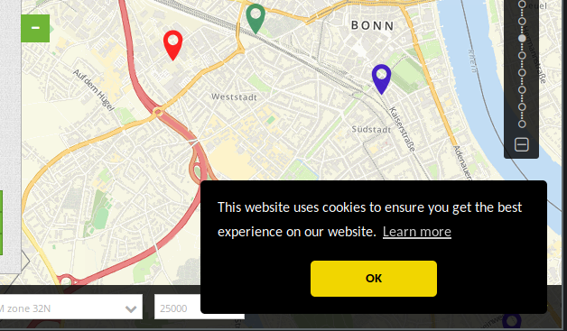

.. _cookieconsent_de:

Cookie-Banner
=============

Anwendungen unterstützen die Anzeige eines Cookie-Banners, welches in der Mapbender-Konfigurationsdatei ``parameters.yml`` eingerichtet werden kann. Wir nutzen dazu den Code von `Cookie Consent <https://cookieconsent.insites.com/>`_, ohne dass dabei ein Aufruf ins Internet gestartet wird.

Das Banner erscheint in einer beliebigen Anwendung beim ersten Aufruf.

Sobald die Mitteilung akzeptiert wurde, taucht das Banner so lange nicht auf, bis die Cookies im Webbrowser gelöscht worden sind. Mapbender ist abhängig von Cookies und dort wird die PHP-Session hinterlegt.

Konfiguration
-------------

Die Konfiguration findet in der ``parameters.yml``-Datei unter ``app/config/parameters.yml`` statt und gilt für die gesamte Mapbender-Instanz. Dazu muss der Parameter  ``mapbender.cookieconsent:`` mit dem Wert ``true`` oder ``false`` übergeben werden. Ist der Abschnitt nicht vorhanden oder der Parameterwert ``false`` gesetzt, wird das Banner nicht angezeigt.

Beispiel:

.. code-block:: yaml

    #Mapbender Cookie Consent Message
    mapbender.cookieconsent: true

.. tip:: Nach dem Ändern des Parameters müssen Sie die Inhalte des Cache-Verzeichnisses (``app/cache/\*``) löschen.