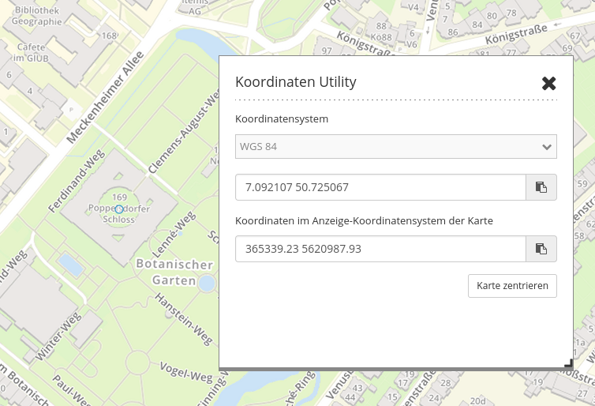
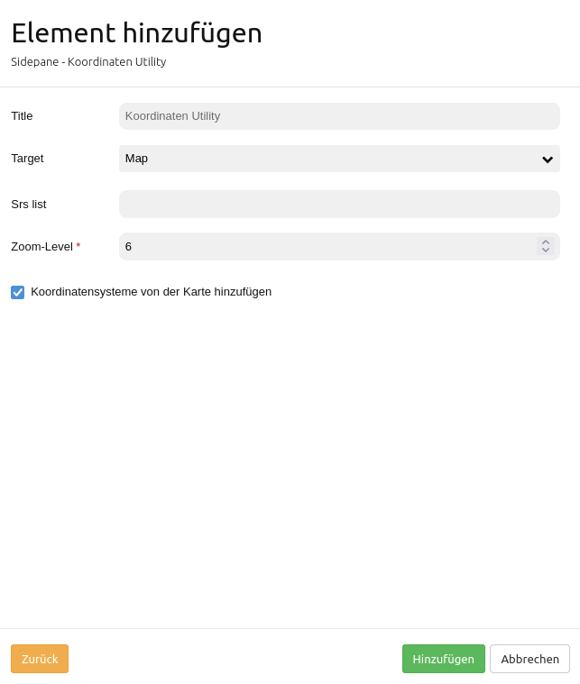

.. _coordinate_utility_de:

Koordinaten Utility
*******************

Koordinaten Utility erlaubt zwei verschiedene Koordinatenoperationen:

1. Es kann zu einem Punkt mithilfe des zugehörigen eingegebenen Koordinatenpunkts gesprungen werden.
2. Es kann der Klickpunkt aus der Karte anzeigt werden.

Beide Funktionen werden über eine Oberfläche realisiert.

In beiden Fällen ist zusätzlich eine dynamische Koordinatentransformation möglich, so dass auch Punkte anderer Koordinatensysteme eingegeben werden können.

Konfiguration
=============

* **Titel:** Titel des Elements
* **SRS-Liste:** Hier können weitere SRS angegeben werden, in denen das Tool transformieren können soll. Das Feld kann leer gelassen werden.
* **Zoomstufe** Zoom-Level der Karte (Standard: 6)
* **Koordinatensysteme von der Karte hinzufügen:** Ist die Checkbox aktiviert, so werden die von der :ref:`map_de` angegebenen Koordinatensysteme automatisch vom Tool unterstützt. Diese werden in der Karte angegeben und auch im  :ref:`srs_selector_de` unterstützt.

Sofern das Koordinaten Utility im Kartenbereich eingebunden werden soll, muss ein damit verknüpfter :ref:`button_de` entsprechend platziert werden. 

Benutzung
=========

**Koordinate abgreifen**

* Ist das Koordinaten Utility als Dialog geöffnet, reagiert die Karte auf einen Klick. Klicken Sie in die Karte und die Klickkoordinate wird in dem Dialog angezeigt.
* Ändern Sie das Koordinatensystem im Dialog mithilfe der Drop-Down-Liste. Die Klick-Koordinate wird in diesem angegebenen Koordinatensystem angezeigt.
* Die untere Zeile zeigt daher die Klickkoordinate noch in dem Original-Koordinatensystem der Karte.
* Die Schaltfläche hinter jeder Eingabezeile erlauben es, den Koordinatenwert direkt in die Zwischenablage zu kopieren.
* Wenn das Koordinaten Utility über die Sidepane eingebunden ist, kann über den Button **Koordinatensuche** zwischen einem Navigations- und einem Kooordinaten-Cursor gewechselt werden.

**Zur Koordinate zoomen**

* In dem Textfeld können eigene Koordinaten angegeben werden. Diese müssen in dem Koordinatensystem eingegeben werden, welches in der Drop-Down-Liste darüber festgelegt wurde.
* Über einen Klick auf die Schaltfläche **Karte zentrieren** wird zu dem Punkt gezoomt und dieser mit einem orangenen Symbol angezeigt.

YAML-Definition
===============

Diese Vorlage kann genutzt werden, um das Element in einer YAML-Anwendung einzubinden.

.. code-block:: yaml

    coordinatesutility:
        title: 'Koordinaten Utility'
        class: Mapbender\CoordinatesUtilityBundle\Element\CoordinatesUtility
        type: element
        target: map
        srsList:
            -
                name: 'EPSG:31466'
                title: '31466'
            -
                name: 'EPSG:31468'
                title: '31468'
            -
                name: 'EPSG:25833'
                title: '25832'
            -
                name: 'EPSG:4326'
                title: '4326'
                addMapSrsList: true
