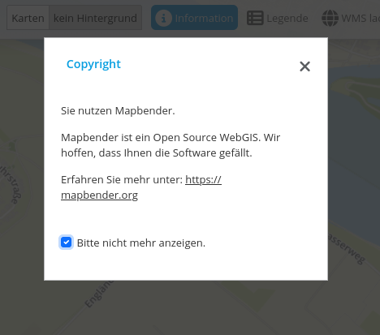
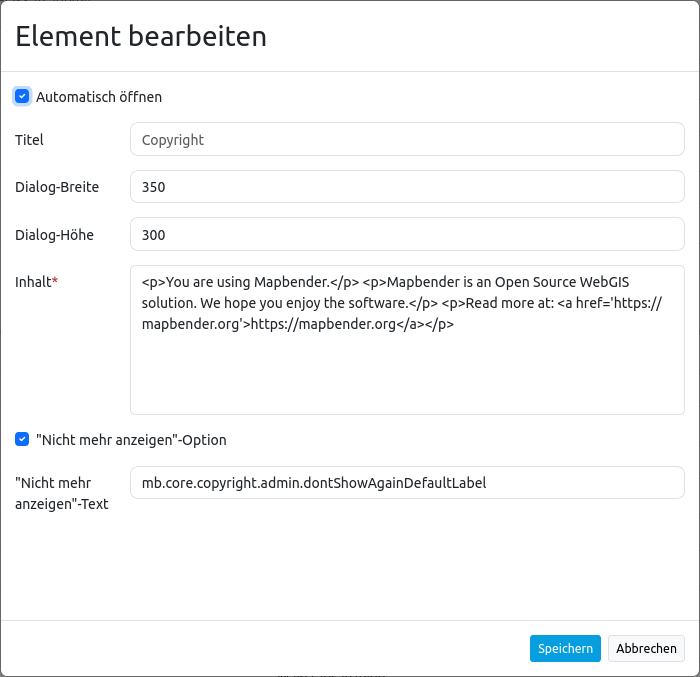

.. _copyright_de:

Copyright
*********

Dieses Element kann verwendet werden, um Text (auch HTML) in einem Dialog anzuzeigen. Der Dialog kann auf Wunsch beim Start automatisch erscheinen. Es können auch Links und Bilder integriert werden (siehe :ref:`html_de`).

Es kann die Option "Don't show again" aktiviert werden. Dann wird der Dialog erst wieder angezeigt, wenn sich der Text ändert.

Konfiguration
=============

* **Automatisch Öffnen:** Schaltet ein/aus, ob das Copyright Fenster beim Start der Anwendung automatisch geöffnet werden soll (Standard: aus).
* **Titel:** Titel des Elements. Der Titel wird neben dem Button angezeigt.
* **Dialog-Breite:** Breite des Popup Fensters (Standard: 300).
* **Dialog-Höhe:** Höhe des Popup Fensters (Standard: 170).
* **Inhalt:** Inhalt des Copyright Fensters. Dieser wird angezeigt, wenn das Element per Klick aktiviert wird (oder beim Start der Anwendung, wenn die "Automatisches Öffnen"-Option aktiviert wurde).
* **"Nicht mehr anzeigen"-Option** Checkbox. Definiert, ob die Option "Nicht mehr anzeigen" im Dialog erscheinen soll (Standard: false).
* **"Nicht mehr anzeigen"-Text** Text, der an der "Don't show again" Checkbox angezeigt werden soll.

Verweis auf eine Twig-Datei
---------------------------

Im Content-Bereich kann auch auf eine Twig-Datei verwiesen werden. Bitte beachten Sie, dass die Twig-Datei valides HTML enthalten muss.

.. code-block:: yaml

   '

YAML-Definition
---------------

Diese Vorlage kann genutzt werden, um das Element in einer YAML-Anwendung einzubinden.

.. code-block:: yaml

   class: Mapbender\CoreBundle\Element\Copyright
   title: "Copyright"              # Titel des Elements
   popupWidth: 300
   popupHeight: 170
   content: "You are using Mapbender.We hope you enjoy the software."    #Text, der erscheinen soll. HTML oder Verweis auf eine twig-Datei sind möglich.
   autoOpen: true                  # Automatisches Öffnen beim Start er Anwendung
   dontShowAgain: true             # default false
   dontShowAgainLabel: mb.core.copyright.admin.dontShowAgainDefaultLabel # ein individueller text kann definiert werden
