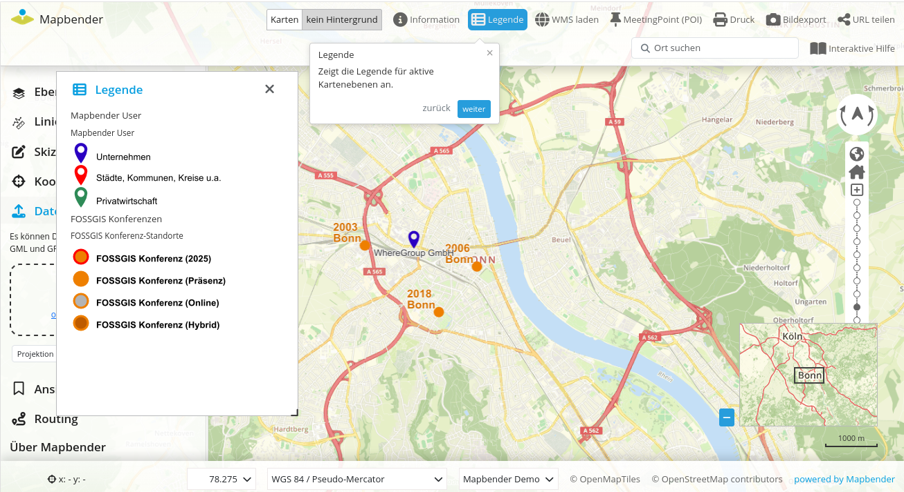
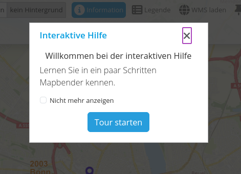
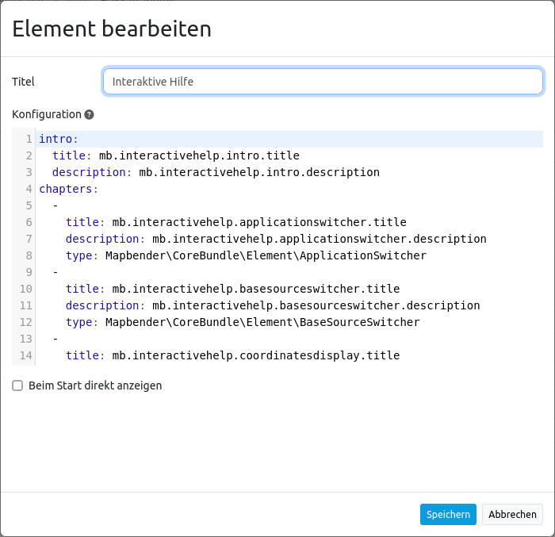

.. _interactivehelp_de:

Interaktive Hilfe
*****************

Die interaktive Hilfe ermöglicht es Benutzern, Hilfetexte zu verschiedenen Elementen der Anwendung anzuzeigen. Diese Funktion kann besonders nützlich sein, um neuen Benutzern den Einstieg zu erleichtern oder um spezifische Anleitungen für komplexe Funktionen bereitzustellen.

Konfiguration
=============

     
* **Titel:** Titel des Elements. Der Titel wird neben dem Button angezeigt.
* **Konfiguration:** Die Konfiguration erfolgt im YAML-Syntax, dabei kann eine Einführung (intro) für den Start-Dialog definiert werden. Außerdem können die einzelnen Stationen unter chapters definiert werden.
* **Beim Start direkt anzeigen:** Schaltet ein/aus, ob die Interaktive Hilfe beim Start der Anwendung automatisch geöffnet werden soll (Standard: aus).

Für die Sprachunterstützung wurden Variablen definiert und entsprechend übersetzt. Es können aber auch individuelle Angaben unter title und description erfolgen.

.. code-block:: yaml
    
    intro:
      title: mb.interactivehelp.intro.title
      description: mb.interactivehelp.intro.description
    chapters:
      -
        title: mb.interactivehelp.applicationswitcher.title
        description: mb.interactivehelp.applicationswitcher.description
        type: Mapbender\CoreBundle\Element\ApplicationSwitcher

