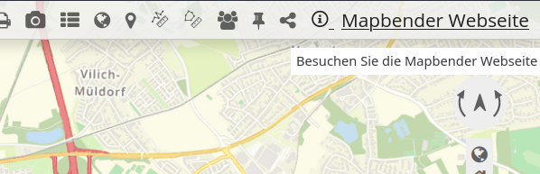
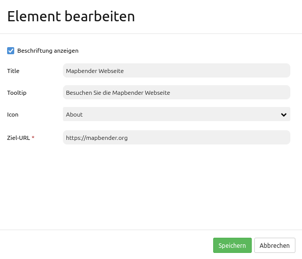

.. _link_de:

Link
****

 .. |mapbender-button-add| image:: ../../../figures/mapbender_button_add.png

Dieses Element stellt ein Button-Modul bereit, über das eine Webseite oder ein Skript verlinkt werden kann. 

Konfiguration
=============

* **Beschriftung anzeigen:** Schaltet die Beschriftung des Buttons an/aus (Standard: an).
* **Titel:** Titel des Elements. Dieser wird in der Layouts Liste angezeigt und ermöglicht, mehrere Button-Elemente voneinander zu unterscheiden. Der Titel wird außerdem neben dem Button angezeigt, falls die Checkbox "Beschriftung anzeigen" aktiviert ist.
* **Tooltip:** Text, der angezeigt wird, wenn der Mauszeiger eine längere Zeit über dem Element verweilt.
* **Symbol:** Symbol des Buttons, basierend auf einer CSS-Klasse.
* **Ziel-URL:** Angabe der Ziel-URL, auf die der Button verweist.

.. hint:: Es ist auch möglich, ein Icon-Set zu deaktivieren und/oder andere Icons zu verwenden. Weitere Informationen finden Sie unter :ref:`de/customization/yaml:Icons anpassen`.

YAML-Definition
---------------

Diese Vorlage kann genutzt werden, um das Element in einer YAML-Anwendung einzubinden.

.. code-block:: yaml

    title: Link                                # Titel
    class: Mapbender\CoreBundle\Element\Button
    tooltip: Besuchen Sie diese Webseite       # Text des Tooltips
    icon: iconInfoActive                       # Symbol verwendete CSS Klasse
    label: true                                # false/true, um den Button zu beschriften (Standard: true).
    click: https://mapbender.org               # bezieht sich auf eine Webseite oder ein Skript.
