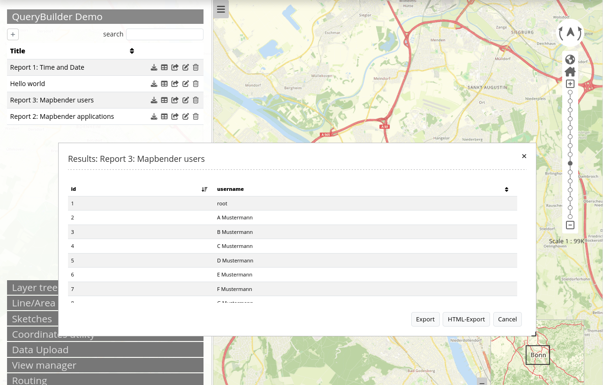

.. _querybuilder_de:

Query Builder
*************

Der QueryBuilder ist nicht im Standardumfang von Mapbender enthalten, kann aber ergänzt werden. Der QueryBuilder stellt ein Element bereit, über das Auswertungen aus der Datenbank angezeigt werden können. Sie können SQL-Abfragen definieren und mit einem Titel vergeben. Diese werden in der Anwendungen als Tabellen oder in eienr HTML-Ansicht angezeigt und können als Excelliste heruntergeladen werden.

Weitere Informationen finden Sie unter: https://github.com/mapbender/query-builder/blob/master/README.md

Konfiguration
=============

