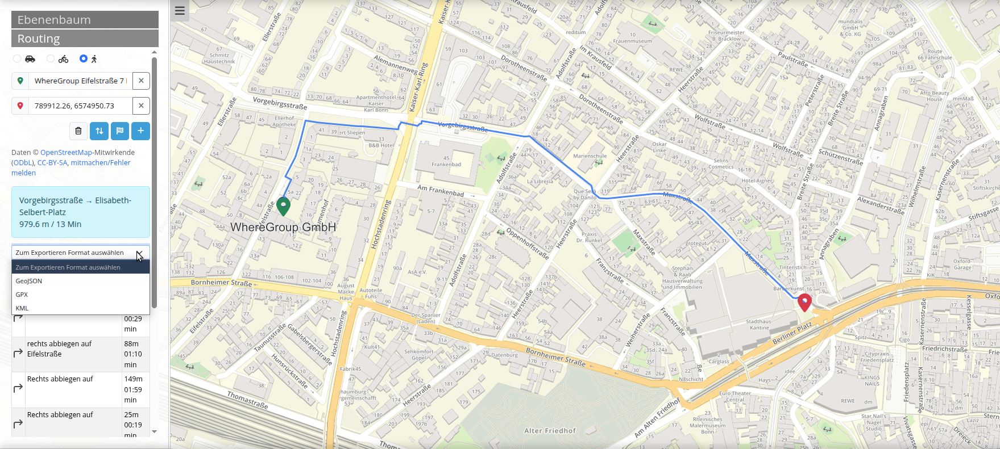
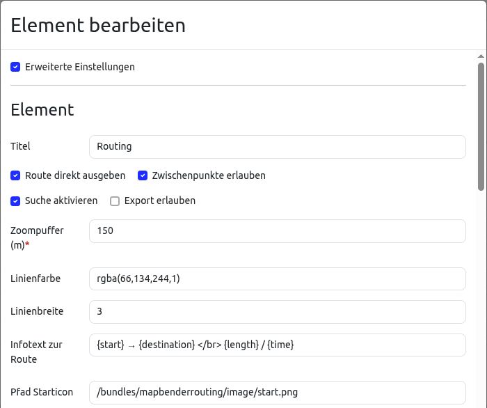
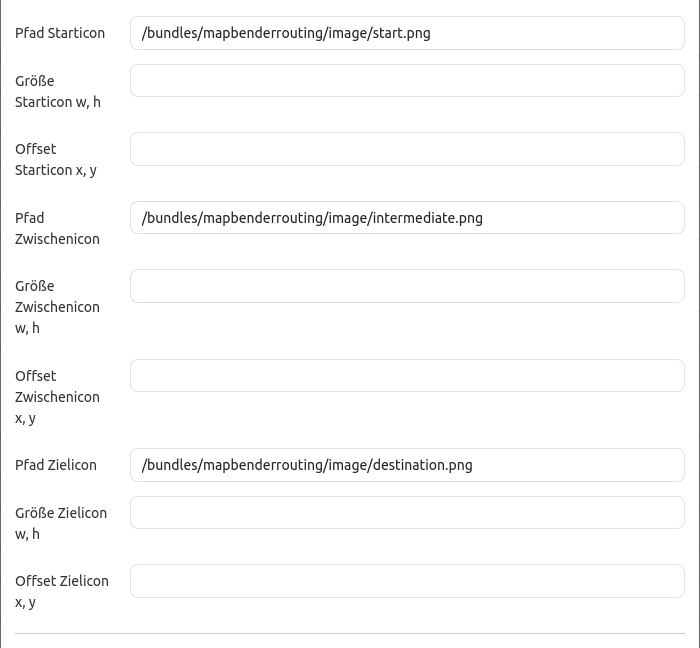
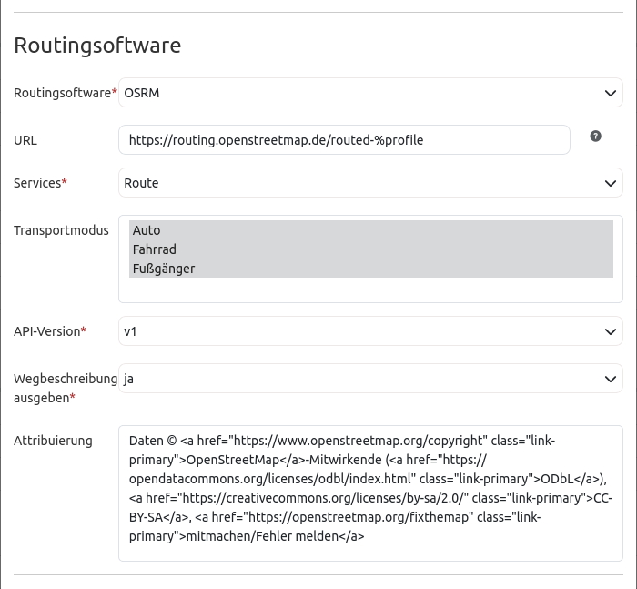
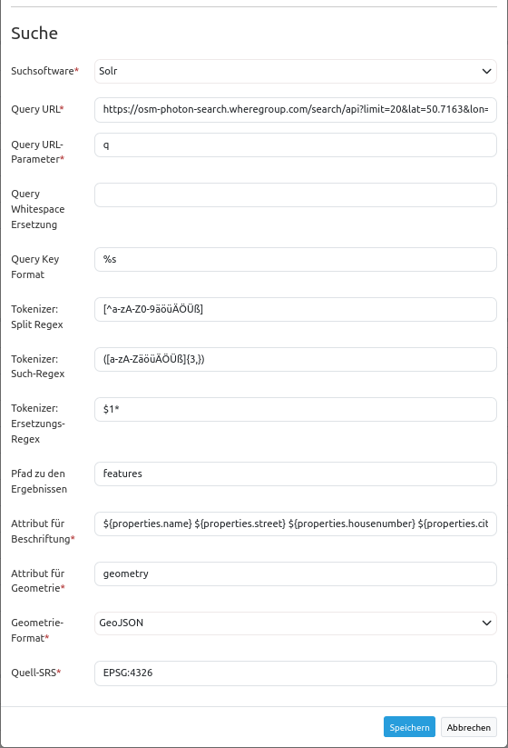

.. _routing_de:

Routing
*******

Das Routing-Element fügt einer Anwendung ein Streckenführung-Werkzeug hinzu. Nach Angabe von Start, Ziel und ggf. Zwischenpunkten wird eine geeignete Streckenführung in der Karte angezeigt. Zusätzlich können Informationen zur Strecke ausgegeben werden.

Konfiguration
=============

* **Erweiterte Einstellung:** Ermöglicht es weitere Einstellungen vorzunehmen (Standard: false).
* **Titel:** Titel des Elements.
* **Route direkt ausgeben:** Konfiguration zum Deaktivieren/Aktivieren des automatischen Routings ohne Interaktion des Nutzers (Standard: false).
* **Zwischenpunkte erlauben:** Konfiguration zum Deaktivieren/Aktivieren der Zwischenpunkten (Standard: false).
* **Suche aktivieren:** Konfiguration zum Deaktivieren/Aktivieren der Suchoption (Standard: false).
* **Export erlauben:** Konfiguration zum Deaktivieren/Aktivieren des Exports der Route (Standard: false).
* **Zoompuffer(m):** Definition eines Zoompuffers für die Ergebnisanzeige in Meter (Standard: 0).
* **Linienfarbe:** Anpassen der Lineinfarbe und Deckkraft per rgba Standard (Standard: rgba(66, 134, 244, 1)).
* **Linienbreite:** Anpassen der Linienbreite (Standard: 3).
* **Infotext zur Route:** Option einen Infotext zur Route zu implementieren (Standard: {start} → {destination}   {length} will take {time}).

* **Pfad Starticon:** Anpassen des Starticons (Standard: /bundles/mapbenderrouting/image/start.png).
* **Pfad Zwischenicon:** Anpassen des Zwischenicons (Standard: /bundles/mapbenderrouting/image/intermediate.png).
* **Pfad Zielicon:** Anpassen des Zielicons (Standard: /bundles/mapbenderrouting/image/destination.png).
* **Größe Icons:** Die Größe der verschiedenen Icons ist anpassbar.
* **Offset icons:** Das Offset der verschiedenen Icons ist anpassbar.

* **Routingsoftware:** Auswählen der Routingsoftware (OSRM, GraphHopper, PgRouting, Trias).
* **URL:** Setzen der URL-Adresse für die Routingsoftware oder wählen einer Variable, z.B. https://routing.openstreetmap.de/routed-%profile (Standard: https://).
* **Services:** Auswahl aus verschiedenen Services (Standard: Route).
* **Transportmodus:** Auswählen der Routing-Profile (Auto, Fahhrad, Füßgänger). Auch die Auswahl mehrerer ist möglich (Standard: false).
* **API-Version:** Version der API bestimmen (Standard: v1).
* **Wegbeschreibung ausgeben:** Auswählen ob es eine Wegbeschreibung geben soll oder nicht (Standard: nein).
* **Attributierung:** Angabe eines Quellenverweises (Standard: Siehe oben im Konfigurations Screenshot zur Routingsoftware).

* **Suchsoftware:** Auswählen des Such-Dienstes (derzeit nur Solr).
* **Query URL:** Setzen der URL-Adresse für die Suchsoftware.
* **Query URL-Parameter:** Der Suchparameterschlüssel, der angehängt wird (Standard: q).
* **Query Whitespace Ersetzung:** Setzen von Paramteren zum Ersetzung im Such-Therm.
* **Query Key Format:** Setzen des Such-Formats (Standard: %s).
* **Token Split-/Such-/Ersetzungs-Regex (JavaScript regex):** Tokenizer spaltet/sucht/ersetzt regexp.
    * **Token Split**, z.B.: ``[^a-zA-Z0-9äöüÄÖÜß]``
    * **Token Such**, z.B..: ``([a-zA-ZäöüÄÖÜß]{3,})``
    * **Token Ersetzung**, z.B..: ``$1*``
* **Pfad zu den Ergebnissen:** Setzen des Pfads, der vom Abfrageergebnis extrahiert wird (Standard: response.docs).
* **Attribut für Beschriftung:** Attribut oder mehrere Attribute , die als Ergebnis angezeigt werden sollen (Standard: label).
* **Attribut für Geometrie:** Attributname der Geometrie (Standard: geom).
* **Geometrieformat:** Geometrieformat, kann WKT oder GeoJSON sein (Standard WKT).
* **Quell-SRS:** EPSG-Code des primären Koordinatenbezugsystems (Standard EPSG:4326).

YAML-Definition
---------------

