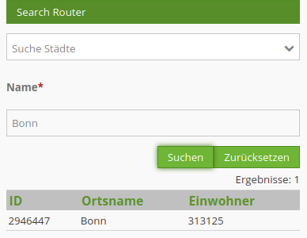
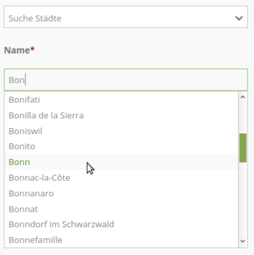
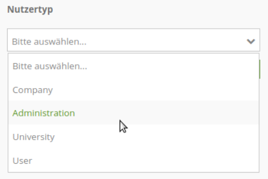

.. _search_router_de:

Suchen (Search Router)
**********************

Dieses Element erzeugt ein Suchformular mit Trefferausgabe, über das Objekte innerhalb der Karte lokalisiert werden können. Sowohl eine Verbindung zur Datenbank als auch das Formular und die Trefferausgabe sind über das :ref:`backend_de` konfigurierbar. Eine SQL-Suchfunktion wird unterstützt.

Konfiguration
=============

.. note:: **Hinweis:** Die Suche greift auf Tabellen in einer Datenbank zu. Dafür muss die Datenbank in Mapbender bekannt gegeben werden. Informationen dazu finden sich unter :ref:`yaml_de`.

Das Element kann entweder in der Sidepane oder als Button in der oberen Werkzeugleiste integriert werden. Zu der Konfiguration des Buttons besuchen Sie die Dokumentationsseite unter :ref:`button_de`.

.. image:: ../../../figures/de/search_router_edit_de.png
     :scale: 80

* **Title:** Titel des Elements. Dieser wird in der Layouts Liste angezeigt sowie als Titel in der Seitenleiste (Nutzung in der Sidepane) oder als Titel des Suchdialogs (Nutzung via Button).
* **Width:** Breite des Dialogs (nur wenn das Element als Dialog eingebunden wurde)
* **Height:** Höhe des Dialogs (nur wenn das Element als Dialog eingebunden wurde)

Über den Button ``+`` bei Routes können mehrere Suchen erstellt werden. Jede Suche beinhaltet die Felder *Title* und *Configuration*. Der eingegebene Titel bei *Title* ist in der Suche in der Anwendung in einer Auswahlbox selektierbar. So können mehrere Suchen unterschieden und ausgewählt werden. 

* **Routes:** Erstellung einer neuen Suche.
* **Title**: Titel der Suche (erscheint erst, wenn über das + bei Routes eine Suche hinzugefügt wurde)
* **Configuration**: Feld für die Konfiguration der Suche (erscheint erst, wenn über das + bei Routes eine Suche hinzugefügt wurde)

Konfiguration der einzelnen Suchen (Route Configuration)
--------------------------------------------------------

Die Definition der einzelnen Suchen erfolgt im YAML-Syntax im Textfeld **Configuration**. 

Hier erfolgt die Definition:

* der Datenbankverbindung
* der Suchtabelle bzw. Abfrage
* des Formularaufbaus
* der Aufbau der Trefferausgabe 
* sowie das Styling der Treffer in der Karte

.. code-block:: yaml

    class: Mapbender\CoreBundle\Component\SQLSearchEngine
    class_options:
        connection: geodata_db   # database alias from doctrine.yaml
        relation: polygons       # search table
        attributes:              # columns that are used in the form and in the result table
          - gid
          - name
          - type
          - city
        geometry_attribute: geom # reference to the geometry column
    form:
        name:
            type: Symfony\Component\Form\Extension\Core\Type\TextType
            options:
                required: true
            compare: exact
        city:
            type: Symfony\Component\Form\Extension\Core\Type\TextType
            options:
                required: false
                label: Ort/Stadt
            compare: ilike
    results:
        view: table
        count: true
        headers:
            gid: ID
            name: Name
            city: City/Town
        callback:
            event: click
            options:
                buffer: 10
                minScale: null
                maxScale: null

Class und Class Optionen
------------------------
Die Konfiguration beginnt mit der Angabe der class (immer class: Mapbender\CoreBundle\Component\SQLSearchEngine) sowie Informationen zur Datenbankverbindung, der Suchtabelle, den verwendeten Spalten und der Angabe der Geometriespalte.

Formular
--------
Im Bereich **form** können Textfelder und Auswahlboxen für das Suchformular definiert werden.

Die jeweilige Tabellenspalte wird angegeben und mit Definitionen für type, options und compare versehen.

Type
----

Das Formular unterstützt zwei Typen - type text für Textfelder und type choice für Auswahlfelder. 

Für jede Tabellenspalte, die im Formular erscheinen soll muss eine Konfiguration erstellt werden. Die Konfiguration beginnt mit dem Spaltennamen (in den Beispielen sind es die Spalten name und usertype).

* **label** - Sie können den Parameter label für die Spaltenbeschriftung angeben. Fehlt der Parameter wird der Tabellenspalten-Name mit führendem Großbuchstaben verwendet.

* **required** - Sie können definieren, ob ein Suchfeld zwingend gefüllt sein muss (Standard: false). Mit required: true wird ein Pflichtfeld erzeugt. Die Suche kann dann nicht abgeschickt werden, bevor alle Pflichtfelder gefüllt sind. Überschriften der Pflichtfelder werden mit einem roten * angezeigt.

Sie können außerdem den Vergleichsoperator definieren. Siehe 'comparison mode'.

Type text
~~~~~~~~~

Über den Type **text** können Textfelder in das Suchformular eingefügt werden.

Der type text unterstützt Autovervollständigung. Sofern sie diese nutzen möchten, müssen Sie zusätzliche additional attr-Parameter hinzufügen.

Unterstützte autocomplete-Paramter:

* **data-autocomplete**: on - Parameter zum Aktivieren der Autovervollständigung
* **data-autocomplete-distinct**: on - Gibt doppelte Ergebnisse der Autovervollständigung nur einmal aus
* **data-autocomplete-using**: column1, column2 - Definiert weitere Spalte/n des Suchformulars, die bei der Autovervollständigung berücksichtigt werden sollen.

* **type text** Beispiel mit Autocomplete und Pflichtfeld:

.. code-block:: yaml

    form:
        name:
	    type: Symfony\Component\Form\Extension\Core\Type\TextType                                                      # input box for text
            options:
                label: Name 
                required: true
            attr:
                data-autocomplete: 'on'           # aktiviere Autovervollständigung
                data-autocomplete-distinct: 'on'  # gleiche Treffer nur einmal anzeigen
                data-autocomplete-using: type, city   # Liste von weiteren Spalten für die Autovervollständigung (kommasepariert)           
            compare: exact                                          

Type choice
~~~~~~~~~~~

Der type **choice** ermöglicht die Definition von Auswahlboxen in dem Suchformular.

* **placeholder** - Es kann ein Platzhaltertext definiert werden. Dieser erscheint wenn noch keine Auswahl erfolgte.

Die Auswahlmöglichkeiten werden im Bereich choices definiert. Dabei werden ein Wert (value) und ein Schlüssel (key) angegeben.

* **key** - wird bei der Suchanfrage verwendet 
* **value** - wird in der Auswahlbox angezeigt 

.. note:: **Hinweis:** Ab Mapbender 3.2 sollte die Angabe in der Reihenfolge value: key erfolgen, die Typdefinition lautet type: Symfony\Component\Form\Extension\Core\Type\ChoiceType.

* **type choice** Beispiel für ein Feld mit Auswahlmöglichkeiten:

.. code-block:: yaml

    type:                                                         
        type: Symfony\Component\Form\Extension\Core\Type\ChoiceType                                                      # box with selection options as dropdown list
        options:
            label: Nutzertyp
            required: false
            placeholder: 'Bitte auswählen...'
            choices:                        
                Company: A
                Administration: B
                University: C
                User: D
                Sonstiges: E
        compare: exact     

Vergleichsmodus
---------------

Für jedes Feld kann ein Vergleichsmodus (compare mode) bestimmt werden. Dieser wird beim Senden der Suchanfrage verwendet. 

Folgende Vergleichsmodi werde unterstützt:

* **exact:** genauer Vergleich, Schlüssel = Wert (key = val)
* **iexact:** Vergleich, bei der Groß- / Kleinschreibung nicht unterschieden wird (case-insensitive)
* **like:** Standard, zweiseitiges 'like'
* **like-left:** linksseitiges 'like'
* **like-right:** rechtsseitiges 'like'
* **ilike**: zweiseitiges 'like', bei dem Groß- / Kleinschreibung nicht unterschieden wird (case-insensitive - \*searchstring\*)
* **ilike-left:** linksseitiges 'like', bei dem Groß- / Kleinschreibung nicht unterschieden wird (case-insensitive - \*searchstring)
* **ilike-right:** rechtsseitiges 'like', bei dem Groß- / Kleinschreibung nicht unterschieden wird (case-insensitive - searchstring\*)

Ergebnisausgabe
---------------
Im Bereich **results** erfolgt die Definition zum Aufbau der Trefferliste und das Styling der Treffer in der Karte.

.. code-block:: yaml

    results:
        view: table
        count: true
        exportcsv: true
        headers:
            gid: ID
            name: Name
            city: City/Town
        callback:
            event: click
            options:
                buffer: 10
                minScale: null
                maxScale: null

* **view**: immer Angabe **table**. Derzeit keine weiteren Optionen.
* **count**: Zeigt die Anzahl der Ergebnisse an (Standard: true).
* **exportcsv**: Erzeugt einen Button, der den Download der Trefferliste als CSV-Datei ermöglicht (Standard: false).
* **headers**: Definition der Ausgabespalten  und Spaltenbeschriftung.
* **callback**: Definition der Aktion beim Klick auf einzelne Treffer.
* **event**: immer Angabe **click**. Derzeit keine weiteren Optionen.
* **buffer**: Zoom zum Treffer mit einem definierten Puffer.
* **minScale and maxScale**: Zoom zum Treffer in einem Maßstab zwischen minScale und maxScale.

Styling der Ergebnisse
----------------------

Standardmäßig werden die Ergebnisse in der Karte in dem default-OpenLayers Style angezeigt.

.. image:: ../../../figures/de/search_router_example_colour_orangeblue.png
     :scale: 80

Sie können diese Farbgebung überschreiben, indem Sie eine styleMap-Konfiguration definieren. 

Die Konfiguration beinhaltet drei Stilkonfigurationen:

* **default**: Standardanzeige der Treffer
* **select**: Anzeige bei Auswahl
* **temporary**: Anzeige beim Mouseover

.. code-block:: yaml

    results:
        [...]
        styleMap:
            default:
                strokeColor: '#00ff00'  # Umrandungsfarbe
                strokeOpacity: 1        # 1 - opak (keine Transparenz) 0 - voll transparent
                strokeWidth: 3          # Umrandungsbreite
                fillColor: '#f0f0f0'    # Füllfarbe                
                fillOpacity: 0          # Opazität der Füllung, 0 - voll transparent
                pointRadius: 6          # Größe des Punktsymbols
            select:
                strokeColor: '#0000ff'
                strokeOpacity: 1
                strokeWidth: 4
                fillColor: '#ff00ff'
                fillOpacity: 0.8
                pointRadius: 10
            temporary:
               strokeColor: '#0000ff'
               fillColor: '#0000ff'
               fillOpacity: 1

Wird Opacity auf 0 gesetzt (fillOpacity: 0), so wird die Fläche nicht gefüllt, sondern transparent dargestellt. In der default-Definition wird lediglich eine grüne Umrandung
 dargestellt (strokeColor: '#00ff00'). 

Die selektierten Objekte in diesem Beispiel werden mit der Farbe Lila gefüllt uns sind mit leichter Opazität versehen. 
Sie verfügen über eine blaue Umrandung. 

Die temporäre Darstellung beim Mouse-Hover über ein Ergebnis erfolgt in blau. 

.. image:: ../../../figures/de/search_router_example_colour_purplegreen.png
     :scale: 80

Die styleMap-Angaben überschreiben Standardangaben. Daher müssen Sie lediglich die Angaben setzen, die Sie überschreiben möchten. Wenn Sie die Angaben weglassen wird der default-Stil verwendet.

Beachten Sie, dass die hexadezimalen Farbwerte in Anführungszeichen angegeben werden müssen, da das #-Zeichen ansonsten als Kommentar interpretiert wird.

Konfigurationsbeispiele
========================

1. Beispiel
-----------

In diesem Beispiel wurde eine Suche für den "Mapbender User"-Layer konfiguriert. Die Suche wurde in die Sidepane über das ``+`` -Zeichen in der Anwendung unter dem Layouts-Tab hinzugefügt.

.. image:: ../../../figures/de/add_sidepane.png
     :scale: 80

Der Konfigurationsdialog zu diesem Konfigurationsbeispiel sieht wie folgt aus:

.. image:: ../../../figures/de/search_router_example_dialog.png
     :scale: 80

Der Elementitel (*Title*) lautet Suchen. Dieser wird in der Sidepane als Titel angezeigt. Da das Element in der Sidepane eingebunden wird und nicht als Button, wurde bei Dialog kein Haken gesetzt. Der *Timeout factor* wurde auf 2 gestellt. In den Feldern *Width* und *Height* stehen zwar Werte, diese werden in der Anwendung jedoch nicht übergeben, da das Element in der Sidepane konfiguriert wird und diese die Werte nicht beachtet. Es wurde über das ``+`` -Zeichen bei *Routes* eine Suche eingebunden, die die Bezeichnung (*Title*) Mapbender User trägt. In *Configuration* wurde die yaml-Konfiguration des Elements eingefügt. Vollständig lautet diese:

.. code-block:: yaml

  class: Mapbender\CoreBundle\Component\SQLSearchEngine
  class_options:
    connection: geodata_db                                              # die Datenbank, auf die das Element zugreift
    relation: mapbender_user                                            # die Tabelle, auf die das Element zugreift
    attributes:                                                         # entspricht den Tabellenspalten in der Datenbank, die angesprochen werden sollen
      - gid
      - orga
      - town
      - usertype
    geometry_attribute: the_geom                                        # Definition der Geometrie Spalte
  form:                                                                 # ab hier beginnt die Konfiguration des Formulars
    orga:                                                               # Feld für die Suche nach dem Namen des Mapbender Users
      type: Symfony\Component\Form\Extension\Core\Type\TextType
      options:
        required: false                                                 # kein Pflichtfeld
        label: 'Mapbender User'                                         # Überschrift über dem Feld
        attr:                                                           # zusätzlich definierbare Attribute
          data-autocomplete: 'on'                                       # automatische Vervollständigung des eingetippten Suchbegriffs
          data-autocomplete-distinct: 'on'
      compare: ilike                                                    # Vergleichsmodus
    town:                                                               # Feld für die Suche nach der Stadt
      type: Symfony\Component\Form\Extension\Core\Type\TextType
      options:
        required: false                                                 # kein Pflichtfeld
        label: Stadt                                                    # Überschrift über dem Feld
        attr:
          data-autocomplete: 'on'
          data-autocomplete-distinct: 'on'
      compare: ilike
    usertype:                                                           # Feld für die Suche nach dem Nutzertyp
      type: Symfony\Component\Form\Extension\Core\Type\ChoiceType
      options:
        placeholder: 'Bitte auswählen...'                               # Text, der angezeigt wird, bevor etwas ausgewählt wurde
        choices:                                                        # die Auswahlmöglichkeiten; werden wie folgt angegeben: "Eintrag in der Spalte der Datenbank": "Angezeiger Name in der Dropdown-Liste"
          1: Company
          2: Administration
          3: University
          4: User
        required: false                                                 # kein Pflichtfeld
        label: Nutzertyp                                                # Überschrift über dem Feld
      compare: exact                                                    # Vergleichsmodus
  results:                                                              # Konfiguration der Ergebnisanzeige
    view: table                                                         # Tabelle ausgeben
    count: true                                                         # Anzahl der Ergebnisse anzeigen
    headers:                                                            # Titel der Spalte; werden wie folgt angegeben: Spaltenname in der Datenbank: Bezeichnung der Spalte in der Suchausgabe der Anwendung
      gid: ID
      orga: 'Mapbender User'
      town: Stadt
    callback:
      event: click                                                      # bei Klicken wird das Element selektiert
      options:
        buffer: 10
        minScale: null
        maxScale: 10000
    styleMap:                                                           # Styling der Punkte in der Karte
      default:                                                          # Styling aller angezeigten Punkte
        strokeColor: '#003366'
        strokeOpacity: 1
        fillColor: '#3366cc'
        fillOpacity: 0.5
      select:                                                           # Styling des selektierten Objekts
        strokeColor: '#330000'
        strokeOpacity: 1
        fillColor: '#800000'
        fillOpacity: 0.5
      temporary:
        strokeColor: '#0000ff'
        fillColor: '#0000ff'
        fillOpacity: 1

Auf dieser Abbildung wird gezeigt, welche Auswirkungen die vorgenommenen Konfigurationen in der yaml-Definition auf das Suchformular haben:

.. image:: ../../../figures/de/search_router_example_search_description.png
     :scale: 80

Dargestellt ist der Ausschnitt der yaml-Definiton, der das Formular konfiguriert. Tabellenspalten orga, town und usertype werden im Formular verwendet und sind jeweils als die Felder Mapbender User, Stadt und Nutzertyp eingebunden. Mapbender User und Stadt sind jeweils vom type Text. Nutzertyp hingegen gibt Auswahlmöglichkeiten in Form einer Dropdown-Liste vor. 

Der Text, der angezeigt werden soll, wenn noch nichts ausgewählt wurde, ist hier "Bitte auswählen…" (siehe Nr. **1** – placeholder: ‚Bitte auswählen...‘). Der Titel über den Feldern wird mit label festgelegt (siehe Nr. **2**). Das Attribut data-autocomplete: ‚on‘ bewirkt, dass Vorschläge aus der Datenbank zu dem eingegebenen Begriff vorgegeben und als Dropdown angezeigt werden (siehe Nr. **3**). Da der Vergleichsmodus ilike (compare: ilike) konfiguriert wurde, muss der Begriff nicht exakt eingegeben werden. Die Suche findet ebenfalls Ergebnisse die ähnlich zu dem eingegebenen Begriff sind (siehe Nr. **4** – Wheregr (das g wurde klein geschrieben, trotzdem werden die Ergebnisse WhereGroup mit großem G gefunden)). Bei dem Feldtype choice werden Auswahlmöglichkeiten vorgegeben. Diese Auswahlmöglichkeiten werden unter choices angegeben (siehe Nr. **5**). In der Tabelle sind die Auswahlmöglichkeiten als Zahlen hinterlegt (1, 2, 3, 4). In diesem Beispiel wurde jeder Zahl ein Text zugeordnet, der in der Dropdown-Liste angezeigt werden soll.

Eine vollständig ausgefüllte Suche nach dem Mapbender User WhereGroup, in der Stadt Bonn, des Nutzertyps Company und deren Ergebnis sieht wie folgt aus:

.. image:: ../../../figures/de/search_router_example_search_WG.png
     :scale: 80

Auf dieser Abbildung wird gezeigt, welche Auswirkungen die vorgenommenen Konfigurationen in der yaml-Definition auf die Anzeige der Ergebnisse haben:

.. image:: ../../../figures/de/search_router_example_results_description.png
     :scale: 80

Auf dieser Abbildung ist lediglich die Konfiguration der Ergebnisse angezeigt. Die Anzahl der Ergebnisse wird aufgrund von count: true (siehe Nr. **1**) angezeigt. Anschließend werden die Spaltentitel unter headers definiert (siehe Nr. **2**). Hier wird zuerst die Bezeichnung der Spalte in der Tabelle angegeben, sodass definiert wird auf welche Tabellenspalte sich die Ergebnisanzeige bezieht. Nach dem Doppelpunkt wird dann angegeben, welcher Titel in der Anwendung angezeigt werden soll. In dem Block styleMap wird das Styling der Punkte vorgenommen. Der Block default (siehe Nr. **3**) bezieht sieht dabei auf alle Punkte und der Block select (siehe Nr. **4**) nur auf das ausgewählte Objekt.

Da keines dieser Felder ein Pflichtfeld ist, kann die Suchabfrage auch nur mithilfe eines Feldes erfolgen.

2. Beispiel
-----------

Das folgende Beispiel baut auf dem Deutschen Geographischen Namenskatalog im Maßstab 1:250.000 des `Bundesamtes für Kartographie und Geodäsie <http://www.geodatenzentrum.de/geodaten/gdz_rahmen.gdz_div?gdz_spr=deu&gdz_akt_zeile=5&gdz_anz_zeile=1&gdz_unt_zeile=20>`_ auf. Die Daten wurden in die Tabelle ``gn250_p`` der Datenbank ``gisdb`` kopiert und eignen sich gut für eine Ortssuche. Die Daten haben viele verschiedene Spalten, u.a.:

- id: Die ID des Datensatzes
- name: Der Name des Datensatzes
- kreis: Der Landkreis (nicht für jeden Datensatz vorhanden)
- oba_wert: Die Art des Features (z.B.. Bahnhof, Museum, etc.)

Beispiel einer Suchkonfiguration in dem ``configuration`` Bereich:

.. code-block:: yaml

    class: Mapbender\CoreBundle\Component\SQLSearchEngine
    class_options:
      connection: geodata_db
      relation: gn250_p
      attributes:
        - id
        - name
        - kreis
        - oba_wert
      geometry_attribute: geom
    form:
      name:
        type: Symfony\Component\Form\Extension\Core\Type\TextType
        options:
          required: true
        compare: ilike
    results:
      view: table
      count: true
      exportcsv: true
      headers:
        id: ID
        name: Name
        kreis: Landkreis
        oba_wert: Art
      callback:
        event: click
        options:
          buffer: 10
          minScale: 500
          maxScale: 2500

YAML-Definition 
---------------

Diese Vorlage kann genutzt werden, um das Element in einer YAML-Anwendung einzubinden.

.. code-block:: yaml

   target: map                                          # ID des Kartenelements
   asDialog: true                                       # true, Erebniswiedergabe in einem Dialogfeld
   timeoutFactor:  3                                    # Timeout-Faktor (multipliziert mit autcomplete Verzögerung) um die Autovervollständigung zu verhindern, nachdem eine Suche gestartet wurde
   height: 500                                          # Höhe des Dialogs
   width: 700                                           # Breite des Dialogs
   routes:                                              # Sammlung von Suchrouten
       demo_polygon:                                    # für Maschinen lesbarer Name
      class: Mapbender\CoreBundle\Component\SQLSearchEngine  #  Suchmaschine, die verwendet werden soll
      class_options:                                    # Diese werden an die Suchmaschine weitergegeben
          connection: geodata_db                        # search_db, DBAL Verbindungsname, der benutzt werden soll, benutzen Sie ~ für default
          relation: polygons                            # Verbindungsauswahl, Unterabfragen können verwendet werden
          attributes: 
              - gid                                     # Liste von Spalten auswählen, expressions are possible
              - name 
              - type
              - city
          geometry_attribute: geom                      # Name der Geometriesplate, die genutzt werden soll. Achtung: Projektion muss mit Projektion des map-Elements übereinstimmen
      form:                                             # Einstellungen für das Suchformular
          name:                                         # Feldname, Spaltenname der genutzt werden soll 
              type: Symfony\Component\Form\Extension\Core\Type\TextType    # Eingabefeld, normalerweise Text oder Zahlen
              options:                                  # Einstellungen für das Eingabefeld
                  required: false                       # HTML5 benötigte Attribute
                  label: Name                           # benutzerdefinierte Beschriftung eingeben, sonst wird die Beschriftung von dem Feldnamen abgeleitet
                  attr:                                 # HTML5 benötigte Attribute
                      data-autocomplete: on             # Attribut, um Autovervollständigung zu aktivieren
                      data-autocomplete-distinct: on    # Attribut, dass Autovervollständigung aktiviert aber unterscheiden lässt
                      data-autocomplete-using: type     # komma separierte Liste von anderen Eingabefeldern, in denen WHERE Angaben für die Autovervollständigung gemacht werden                
              compare: ilike                            # Siehe unten für weitere Vergleichsformen
          city:
              type: Symfony\Component\Form\Extension\Core\Type\TextType
              options:
                  required: false
                  label: Ort/Stadt
              compare: ilike
          type:
              type: Symfony\Component\Form\Extension\Core\Type\ChoiceType 
              options:
                  placeholder: 'Bitte auswählen...'
                  required: false
                  choices:
                      A Company: A
                      B Administration: B
                      C University: C
                      D User: D
                      E Somthing else: E
      results:
          view: table                                   # Ansicht der Ergebnisse, Ausgabe z.B. als Tabelle
          count: true                                   # Anzahl der Treffer anzeigen
          exportcsv: true
          headers:                                      # Bezeichnung der Tabellenüberschriften und der entsprechenden Ergebnisspalten
              gid: ID                                   # Spaltenname -> Überschrift
              name: Name
              type: Type
              city: Ort/Stadt
          callback:                                     # Was beim Klick und Mauszeiger halten passiert
              event: click                              # Ergebnisliste (click oder mouseover)
              options:
                  buffer: 10                            # Puffert die Geometrieergebnise (Karteneinheiten) vor dem Zoomen
                  minScale: ~                           # Maßstabsbegrenzung beim Zoomen, ~ für keine Begrenzung
                  maxScale: ~
          styleMap:
              default:
                  strokeColor: '#00ff00'
                  strokeOpacity: 1
                  fillOpacity: 0
              select:
                  strokeColor: '#ff0000'
                  fillColor: '#ff0000'
                  fillOpacity: 0.4
              temporary:
                  strokeColor: '#0000ff'
                  fillColor: '#0000ff'
                  fillOpacity: 1

