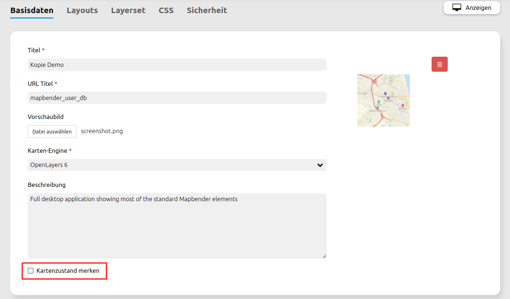

.. _persistent_map_view_de:

Persistente Kartenzustände
**************************

Diese Funktion macht bestimmte Kartenparameter und -einstellungen persistent: Eine Kartenanwendung kann dann in einem neuen Browser-Tab geöffnet werden, ohne dass dabei die Kartenparameter auf die Standardeinstellung zurückgesetzt werden.

Persistente und damit wiederherstellbare Informationen umfassen:

* Kartenposition, Maßstab, Koordinatenreferenzsystem, Drehung
* Aktivierte/deaktivierte Layer
* Aktivierte/deaktivierte Layersets
* Transparenz

.. note:: **Hinweis:** Die Persistenz beruht nur auf dem eigenen Browserspeicher und ist damit rein lokal. Dies trifft auch auf Systeme mit mehreren Anwendern zu. Die Funktion hat außerdem keinerlei Auswirkung auf den Mapbender Login.

Folgende Kartenparameter und Einstellungen sind nicht Teil persister Kartenzustände:

* WMS-Dimensionen
* interaktiv hinzugefügte Instanzen (WMS laden)
* interaktiv entfernte Instanzen (Ebenenbaum Kontextmenü)
* Umstrukturierung von Instanzen im Ebenenbaum (Drag & Drop)
* FeatureInfo Konfiguration für Instanz(en)

Konfiguration
=============

Persistente Kartenzustände werden über eine Checkbox für jede Anwendung unter dem Tab "Basisdaten" einzeln aktiviert.

Die Einbettung erzeugt eine neue Spalte in der Tabelle *mb_core_application*. Es muss deshalb eine Datenbankaktualisierung mit *bin/console doctrine:schema:update --force* durchgeführt werden.

YAML-Definition
---------------

Diese Vorlage kann genutzt werden, um das Element in einer YAML-Anwendung einzubinden. Zu beachten ist hierbei der neue Parameter *persistentView*. Wird dieser weggelassen, dann entspricht dies *false*.

.. code-block:: yaml

  parameters:
      applications:
          mapbender_user:
              title: Mapbender Demo Map
              screenshot: screenshot.png
              published: true
              persistentView: true      # Parameter zur Aktivierung der persistenten Kartenzustände
              template:  Mapbender\CoreBundle\Template\Fullscreen

