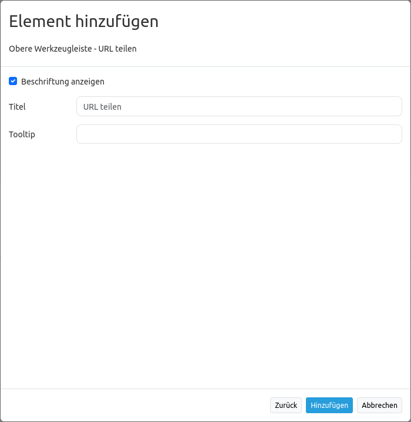

.. _shareurl_de:

URL teilen (Share URL)
**********************

Das Teilen von URLs kann durch den Einbau eines entsprechenden Elements vereinfacht werden. Dieses wird als Button in der oberen Werkzeugleiste oder der Fußzeile eingebunden.

.. image:: ../../../figures/de/share_url.png
     :scale: 80

Durch einen Klick auf das Element wird die URL in der Zwischenablage gespeichert. Gängige Browser-Interaktionen (z.B. In neuem Tab öffnen) sind ebenfalls möglich.

Das Element speichert folgende Informationen:

* Grundlegende Kartenparameter (Kartenposition, Maßstab, Drehung, Referenzsystem)
* Layer- und Layerset-Einstellungen (Auswahl sowie Transparenz)

.. note:: **Hinweis:** Folgende Informationen werden nicht übergeben: interaktiv hinzugefügte Instanzen (WMS laden), interaktiv entfernte Instanzen (Ebenenbaum Kontextmenü) sowie Änderungen der Layerreihenfolge (Drag & Drop).

Konfiguration
=============

* **Beschriftung anzeigen:** Schaltet die Beschriftung des Buttons an/aus (Standard: an).
* **Titel:** Titel des Elements. Entspricht dem Button-Titel.
* **Tooltip:** Text, der angezeigt wird, wenn der Mauszeiger längere Zeit über dem Element verweilt.

YAML-Definition
---------------

Diese Vorlage kann genutzt werden, um das Element in einer YAML-Anwendung einzubinden.

.. code-block:: yaml

    title: Teile diese Kartenansicht          # Optionaler Titel, standardmäßig wird "URL teilen" verwendet (string oder leer).
    class: Mapbender\CoreBundle\Element\ShareUrl
    tooltip: Ich werde beim Hovern angezeigt  # Optionaler Titel, entpricht bei Weglassung dem Titel (string oder leer).
    label: true                               # Aktiviert Darstellung des Titels, zeigt bei FALSE das Element Icon an (Standard: true).

