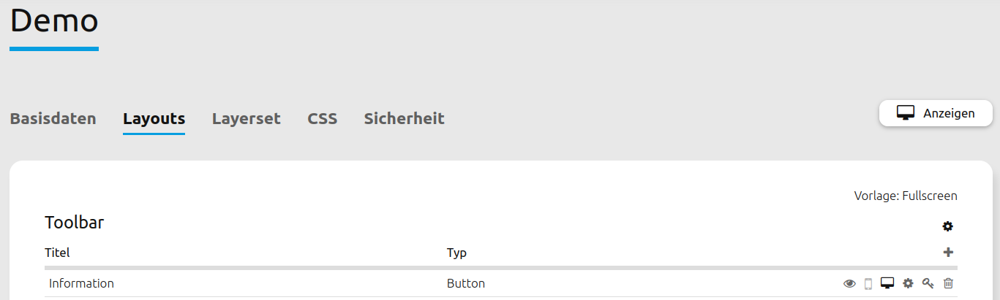
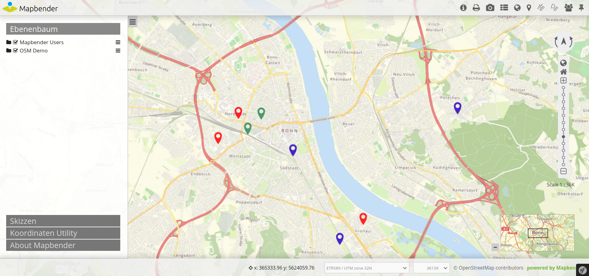
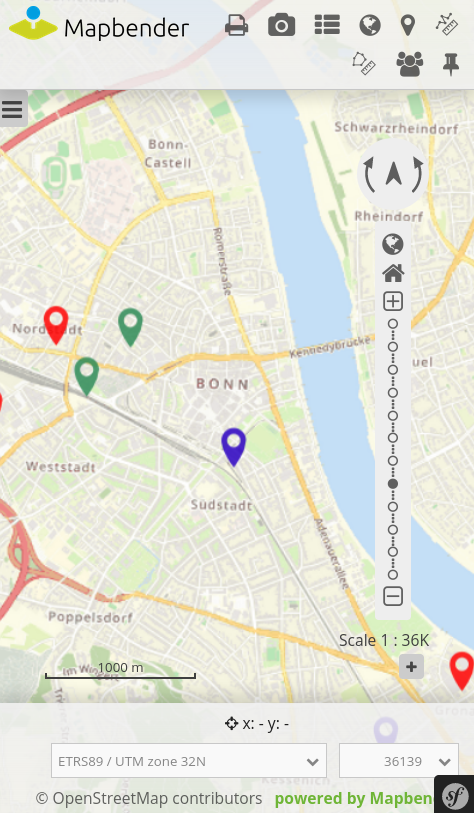

.. _layouts_de:

Layouts
*******

Responsives Design
==================

Mapbender bietet ein responsives Webdesign zur besseren Übersichtlichkeit an. Jedes Element in der oberen Werkzeugleiste und Sidepane kann dabei für unterschiedliche Ansichten individuell konfiguriert werden (Mobiles Endgerät, Desktop oder beides).

.. image:: ../../../../figures/de/responsive_design_overview.png
     :width: 100%

Alternativ kann das Design auch für ganze Layout-Bereiche definiert werden. Dadurch werden alle zugehörigen Elemente automatisch nicht mehr angezeigt, wenn eine bestimmte Ansicht ausgewählt ist.

.. image:: ../../../../figures/de/responsive_design_template.png
     :width: 100%

Anwendungsbeispiel
------------------

Im folgenden Beispiel wird das Element "Information" aus der mobilen Ansicht entfernt.

In der Desktopansicht ist das Element in der oberen Werkzeugleiste vorhanden.

 
Das Element wird in der mobilen Ansicht nicht mehr angezeigt.
     

