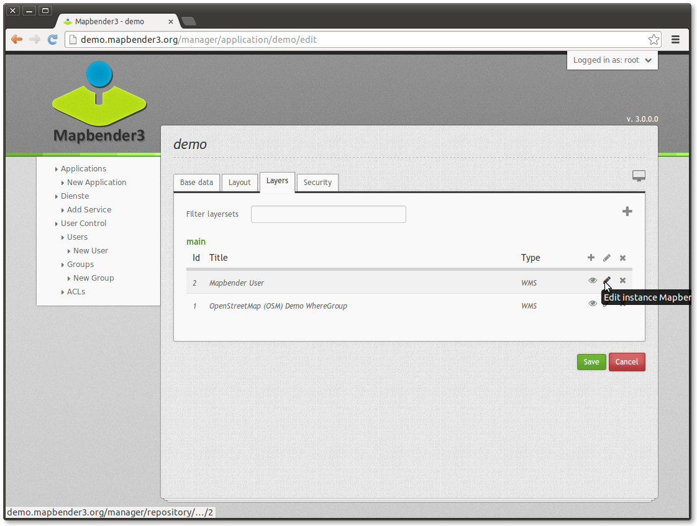
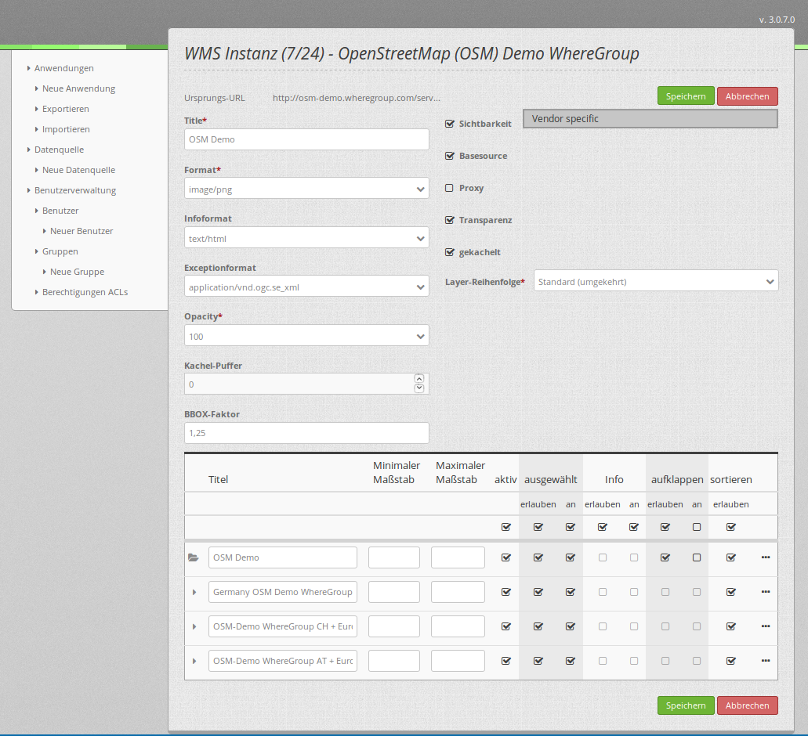

.. _layerset-en:

Layersets und Layerset-Instanzen
================================

Ein Layerset ist ein logischer Container, die einen oder mehrere Layerset-Instanzen (WMS Dienste) beinhalten kann. Ein typisches Beispiel sind die Unterscheidung in den Layerset "main" für die Hauptkarte und "overview" für die Übersichtskarte. Sie können weitere Layersets definieren, die optional in der Karte dargestellt werden oder auch im Layertree als eigener Ordner erscheinen (thematische Layer).

Layerset-Instanzen
------------------

Layerset-Instanzen enthalten die Optionen, wie ein WMS angesprochen werden kann: das Bildformat, das Infoformat, Exceptionformat, die Maßstäbe für die einzelnen Layer und vieles mehr.

Sobald ein WMS Dienst in einen Layerset eingebunden wird, ist er als Layerset-Instanz mit der Anwendung verknüpft.

Der Screenshot zeigt die Instanz ``7/24`` basierend auf einem WMS-Dienst. Die zugehörige Datenquelle ist die Nr. 7, die Layerset-Instanz selbst hat die Laufnummer 24. Sie basiert auf dem OSM-Dienst der WhereGroup und kann in diesem Dialog für die Anwendung konfiguriert werden.

**Die Eigenschaften aus den WMS-Capabilities:**

- **Title:** Der Titel der Instanz, der in der Liste der Layersets und ihrer Instanzen angezeigt wird.

- **Format:** Das Bildformat, mit dem die Kartenbilder über den GetMap Request in der Anwendung abgerufen werden sollen. Für Rasterkarten und Luftbilder empfiehlt sich das JPG Format, für z.B. Straßenkarten das PNG Format. Im Zweifel: PNG.

- **Infoformat:** Das Format, in denen die GetFeatureInfo Anfragen an den WMS abgeschickt werden soll. Im Zweifel: text/html oder ein analoges HTML-Format, was dann in den Dialog des `FeatureInfo <../basic/feature_info>`_ verwendet werden kann.

- **Exceptionformat:** wählen Sie das Format für Fehlermeldungen aus dem OGC Exception Formaten, die der WMS anbietet.

**Die Eigenschaften für die Anwendung**

- **Opacity:** wählen Sie die Deckkraft des Dienstes in Prozent. Dieser Wert wird dann auch für den Benutzer im `Layertree <../basic/layertree>`_ gesetzt, wenn dort im Menü auch die "Opacity" aktiviert ist.

- **Kachel-Puffer (Tile buffer):** Dieser Parameter gilt für Dienste, die gekachelt angefordert werden und gibt an, ob weitere umgebende Kacheln abgerufen werden sollen. Damit sind diese bei einer Pan-Bewegung schon heruntergeladen und sichtbar. Je höher der Wert, desto mehr umgebende Kacheln werden abgerufen. Default: 0.

- **BBOX-Faktor:** Dieser Parameter gilt für Dienste, die nicht-gekachelt angefordert werden. Hier kann man angeben, wie groß das zurückgegebene Bild sein soll. Ein Wert größer 1 wird ein größeres Kartenbild anfordern. Default: 1.25 und kann gerne auf 1 gesetzt werden.

- **Sichtbarkeit:** Der Dienst kann mit dieser Schaltfläche sichtbar geschaltet werden.

- **BaseSource:** Der Dienst soll als BaseSource (Basisdienst) behandelt werden. Dies hat Auswirkungen auf den `BaseSourceSwitcher <../basic/basesourceswitcher>`_, der nur BaseSources anzeigen soll und auf den `Layertree <../basic/layertree>`_, in dem diese BaseSources dann auch ausgeblendet werden können. Siehe auch die `Hinweise <hinweise-layersets_>`_ weiter unten.

- **Proxy:** Bei Aktivierung wird der Dienst über Mapbender als Proxy angefordert. Siehe die `Hinweise <hinweise-layersets_>`_ weiter unten.

- **Transparenz:** Ist dieser Schalter aktiviert (und das ist er standardmäßig) wird der Dienst mit transparenten Hintergrund angefordert. Also im WMS GetMap-Request mit dem Parameter ``TRANSPARENT=TRUE``.

- **Gekachelt (Tiled):** Der Dienst wird in Kacheln angefordert. Der Standard ist nicht gekachelt. Siehe die folgenden `Hinweise <hinweise-layersets_>`_.

**Layer-Reihenfolge:**

Es gibt zwei Möglichkeiten, wie die Layerreihenfolge dem Layerbaum übergeben wird:

- **Standard**
- **QGIS Style**

Diese Unterscheidung hat ihre Ursprünge in der Art und Weise wie WMS-Dienste und Capabilities-Dokumente aufgebaut sind.

Die `OGC Referenzimplementierung eines WMS <http://www.opengeospatial.org/standards/wms/quickstart>`_ beschreibt den Aufbau eines Beispiel WMS unter: `http://metaspatial.net/cgi-bin/ogc-wms.xml?REQUEST=GetCapabilities&SERVICE=WMS&VERSION=1.3 <http://metaspatial.net/cgi-bin/ogc-wms.xml?REQUEST=GetCapabilities&SERVICE=WMS&VERSION=1.3>`_

Dieser WMS zeigt einige Punkt, Linien und Flächenobjekte und Rasterbilder an. Das Capabilities Dokument listet dabei die Bilddaten (z.B. DTM) weiter oben als die Punkte (z.B. osm_points als vorletzter Layer). Dieses Prinzip übernimmt der Mapbender sowohl in den DataSources, wo der Dienst in Mapbender eingeladen und registriert wird als auch in den Layerset-Instanzen.

Im Layerbaum dreht sich dann aber die Reihenfolge um, da aus unserer Erfahrung der Benutzer es gewohnt ist, dass der Layer, der im Layerbaum weiter oben steht auch als oberster Layer gezeichnet wird. Diese Erfahrung hat ein Benutzer auch, wenn er ein Desktop-GIS nutzt. Punkte sind dann im Layerbaum weiter oben und Rasterdaten weiter unten.

Der `QGIS Server <https://www.qgis.org/>`_ verhält sich hier aber anders. Einen WMS kann man mithilfe der QGIS-Projektdatei sehr einfach auf einen QGIS Server deployen und die Reihenfolge der Layer in den WMS Capabilities ist dann gleich der Reihenfolge, die man im eigenen QGIS-Projekt genutzt hat. Also generell: Punkte oben, weiter darunter die Linien, dann zum Schluß die Polygondaten oder Rasterbilder. QGIS und QGIS Server sind dabei nicht die einzigen Programme, die das so machen, aber die besten. Für den GetMap Aufruf ist das dann wieder irrelevant, da dort die Art und Weise der Aufrufe und wie diese dann an den Klienten zurückgesendet werden in der WMS-Spezifikation geklärt ist.

Die folgende Tabelle fasst das Verhalten nochmal zusammen:

+----------------------------------------+----------------------+------------------------+
|                                        | layer order standard | layer order QGIS style |
+========================================+======================+========================+
| WMS Capabilities (from top to bottom)  | polygon, line, point | point, line, polygon   |
+----------------------------------------+----------------------+------------------------+
| Layerset-Instance (from top to bottom) | polygon, line, point | point, line, polygon   |
+----------------------------------------+----------------------+------------------------+
| Layertree  (from top to bottom)        | point, line, polygon | point, line, polygon   |
+----------------------------------------+----------------------+------------------------+

Damit kann Mapbender auf die unterschiedlichen Art und Weisen reagieren, wie ein WMS Capabilities Dokument aufgebaut hat, indem einfach die Reihenfolge in dem Layerbaum angepasst wird.

.. _hinweise-layersets:

Hinweise zu den Auswirkungen der einzelnen Konfigurationen
----------------------------------------------------------

**Basesources:**

Es gibt viele Möglichkeiten den Layertree zu füllen und mit Basisdiensten zu arbeiten:
- Z.B. durch das Verstecken im Layerbaum und das Nutzen des `BaseSourceSwitcher <../basic/basesourceswitcher>`_.
- Oder auch mit den Möglichkeiten des `thematischen Layerbaums <../basic/layertree>`_ zu arbeiten, verschiedene Layersets anlegen und die Basisdienste und thematische Diensten dort verteilen und im Layerbaum unterscheiden.

Für welche Möglichkeit Sie sich entscheiden, hängt ganz von Ihren Vorlieben ab.

**Proxy:**

Wozu dient dieser Schalter? Die Proxynutzung macht dann Sinn, wenn man vermeiden möchte, dass der Webbrowser als Klient direkt auf den Dienst zugreift, wie dies durch OpenLayer ja standardmäßig passiert. Ist dieser Schalter aktiviert, greift der Mapbender mit seiner URL auf den Dienst zu, verarbeitet die Bilder und stellt sie in der Karte dar. D.h. man kann über Firewalls sehr leicht einen über das Netzwerk-geschützten Dienst anbieten, der nur von dem Webserver angesprochen werden darf, auf dem der Mapbender läuft.

**Kachelung, Kartengröße und Performance:**

Der Parameter "Gekachelt" wird benutzt, um das Kartenbild in einzelnen Kacheln anzufordern und nicht als ganzes Bild. Das sollte man generell einschalten, wenn man einen `Mapproxy <https://mapproxy.de/>`_ eingebunden hat, der den Dienst gekachelt bereitstellt. Es macht aber auch für normale, ungekachelte Dienste Sinn, da die gefühlte Wartezeit beim Nutzer geringer ist: Das Kartenbild erscheint, obwohl noch nicht alle Kacheln abgerufen worden sind.

Man muss dabei aber beachten: Die Anzahl der Anfragen an einen WMS vergrößert sich rapide: Je nach Bildschirm-Auflösung und eingestellter Kachelgröße im `Kartenelement <../basic/map>`_ werden statt einer viele Anfragen abgeschickt. Die zurückgelieferten Bilder sind zwar nicht besonders groß (normalerweise nimmt man Kachelgrößen von 256x256 oder 512x512 Pixel), aber zahlreich. Auch in Hinblick auf die Verwendung des **Kachel-Puffers**. Es ist also eine Abwägung und eine Fall- zu Fall-Unterscheidung, wie man den Dienst ansprechen möchte. Die Performance kann auch über eigene Maßstabsangaben der Layer gesteigert werden, wenn der Dienst diese etwas zu locker vorgegeben hat.

Es gibt des Weiteren noch hier und da WMS-Dienste, die nur eine maximale Kartenbildgröße unterstützen und mit den hohen Auflösungen die Mapbender anfragen kann nicht zurechtkommen. Das Fullscreen-Template kann auf die maximale Bildschirmbreite gezogen werden und das angeforderte Kartenbild ist dann in etwa der Breite und Höhe des sichtbaren Browserfensters.

Weitere Informationen
---------------------

* Information zur Benutzung von Layersets finden Sie in auch im `Quickstart <../../quickstart#konfiguration-von-diensten>`_

* Die Bedeutung der Layersets für die Anzeige im Layertree ist im Abschnitt zu den Thematischen Layern in der `Layertree-Dokumentation <../basic/layertree>`_ beschrieben.

* Ebenso können einzelne Layersets in der `Karte <../basic/map>`_ an- und abgeschaltet werden.
