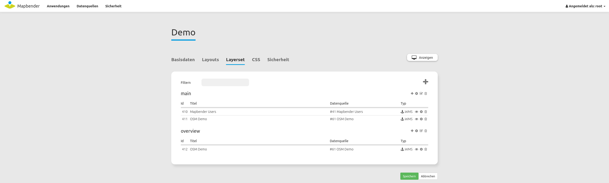

.. _layerset_de:

Layerset
********

Ein Layerset ist ein logischer Container, der einen oder mehrere Layerset-Instanzen (WMS-Dienste) beinhalten kann. Ein typisches Beispiel ist die Unterscheidung zwischen dem Layerset "main" (Hauptkarte) und "overview" (Übersichtskarte). Es besteht die Möglichkeit, weitere Layersets zu definieren. Diese werden entweder in der Karte direkt oder auch im Layertree als eigener Ordner dargestellt (thematische Layer).

Layerset-Instanzen
==================

Layerset-Instanzen enthalten unterschiedliche Optionen, mit denen WMS-Dienste angesprochen werden können: das Bildformat, das Infoformat, Exceptionformat, die Maßstäbe für die einzelnen Layer und vieles mehr. Aus der Layerset-Übersicht können mit dem Zahnrad-Button einzelne Instanzen konfiguriert werden.

Sobald ein WMS-Dienst in ein Layerset eingebunden wird, ist er als Layerset-Instanz mit der Anwendung verknüpft.
Der Screenshot zeigt die `private Instanz <layerset.rst#freie-und-private-instanzen>`_ ``2/28`` basierend auf einem WMS-Dienst. Die zugehörige Datenquelle ist die Nr. 2. Die Layerset-Instanz selbst hat die Laufnummer 28.

**Die Eigenschaften aus den WMS-Capabilities:**

- **Title:** Der Titel der Instanz, der in der Liste der Layersets und ihrer Instanzen angezeigt wird.

- **Format:** Das Bildformat, mit dem die Kartenbilder über den GetMap-Request in der Anwendung abgerufen werden sollen. Für Rasterkarten und Luftbilder empfiehlt sich das JPG Format, für z.B. Straßenkarten das PNG Format. Im Zweifelsfall sollte PNG verwendet werden.

- **Infoformat:** Das Format, in denen die GetFeatureInfo Anfragen an den WMS abgeschickt werden soll. Im Zweifel: text/html oder ein analoges HTML-Format, was dann in den Dialog des `FeatureInfo <../basic/feature_info>`_ verwendet werden kann. Alternativ ist die Verwendung von text/plain möglich.

- **Exceptionformat:** Das Format für Fehlermeldungen aus den OGC Exception Formaten, welche der WMS anbietet.

**Die Eigenschaften für die Anwendung**

- **Opacity:** Die Deckkraft des Dienstes in Prozent. Dieser Wert ist nur dann für den Benutzer im `Layertree <../basic/layertree>`_ konfigurierbar, wenn im Menü auch die "Opacity" aktiviert ist.

- **Kachel-Puffer (Tile buffer):** Dieser Parameter gilt für Dienste, die gekachelt angefordert werden und gibt an, ob weitere umgebende Kacheln abgerufen werden sollen. Damit sind diese bei einer Pan-Bewegung schon heruntergeladen und sichtbar. Je höher der Wert, desto mehr umgebende Kacheln werden abgerufen (Standard: 0).

- **BBOX-Faktor:** Dieser Parameter gilt für Dienste, die nicht gekachelt angefordert werden. Hier kann angegeben werden, wie groß das zurückgegebene Bild sein soll. Ein Wert größer 1 wird ein größeres Kartenbild anfordern (Standard: 1.25, kann auf 1 gesetzt werden).

- **Vendor Specific Parameters:** Siehe unten.

- **Sichtbarkeit:** Der Dienst kann mit dieser Schaltfläche sichtbar geschaltet werden.

- **BaseSource:** Der Dienst soll als BaseSource (Basisdienst) behandelt werden. Dies hat Auswirkungen auf den `BaseSourceSwitcher <../basic/basesourceswitcher>`_, der nur BaseSources anzeigen soll und auf den `Layertree <../basic/layertree>`_, in dem diese BaseSources dann auch ausgeblendet werden können. Siehe auch unter `Hinweise <hinweise-layersets_>`_.

- **Proxy:** Bei Aktivierung wird der Dienst über Mapbender als Proxy angefordert. Siehe auch unter `Hinweise <hinweise-layersets_>`_.

- **Transparenz:** Ist dieser Schalter aktiviert (und das ist er standardmäßig) wird der Dienst mit transparentem Hintergrund angefordert. Also im WMS GetMap-Request mit dem Parameter ``TRANSPARENT=TRUE``.

- **Gekachelt (Tiled):** Der Dienst wird in Kacheln angefordert (Standard: nicht gekachelt). Siehe auch unter `Hinweise <hinweise-layersets_>`_.

**Layer-Reihenfolge:**

Es gibt zwei Möglichkeiten, wie die Layerreihenfolge dem Layerbaum übergeben wird:

- **Standard**
- **QGIS Style**

Diese Unterscheidung hat ihre Ursprünge in der Art und Weise wie WMS-Dienste und Capabilities-Dokumente aufgebaut sind.

Die `OGC Referenzimplementierung eines WMS <http://www.opengeospatial.org/standards/wms/quickstart>`_ beschreibt den Aufbau eines Beispiel WMS unter: `http://metaspatial.net/cgi-bin/ogc-wms.xml?REQUEST=GetCapabilities&SERVICE=WMS&VERSION=1.3 <http://metaspatial.net/cgi-bin/ogc-wms.xml?REQUEST=GetCapabilities&SERVICE=WMS&VERSION=1.3>`_

Dieser WMS zeigt einige Punkt-, Linien- und Flächenobjekte und Rasterbilder an. Das Capabilities Dokument listet dabei die Bilddaten (z.B. DTM) weiter oben als die Punkte (z.B. osm_points als vorletzter Layer). Dieses Prinzip übernimmt Mapbender sowohl in den DataSources, wo der Dienst in Mapbender eingeladen und registriert wird, als auch in den Layerset-Instanzen.

Im Layerbaum dreht sich diese Reihenfolge dann aber um. Unserer Erfahrung nach vereinfacht dies die Nutzerfreundlichkeit. Denn somit werden Layer, welche weiter oben im Ebenenbaum positioniert sind, auch als oberste Layer angezeigt. Dieses Verhalten ist überlicherweise auch in einem Desktop-GIS zu finden. Punkte werden dann im Layerbaum weiter oben und Rasterdaten weiter unten dargestellt.

Der `QGIS Server <https://www.qgis.org/>`_ verhält sich hier aber anders. Ein WMS kann mithilfe der QGIS-Projektdatei sehr einfach auf einen QGIS Server konfiguriert werden. Die Reihenfolge der Layer in den WMS Capabilities ist dann gleich der Reihenfolge, die im eigenen QGIS-Projekt genutzt wird. Es gilt generell: Punkte oben, darunter die Linien, dann zum Schluß die Polygondaten oder Rasterbilder. QGIS und QGIS Server stellen dabei nicht die einzigen Programme dar, welche dies so machen. Sie sind aber die besten. Für den GetMap Aufruf sind diese Einstellungen dann wieder irrelevant. Denn die WMS-Spezifikation klärt bereits die Art und Weise der Aufrufe und wie diese an den Klienten zurückgesendet werden.

Die folgende Tabelle fasst das Verhalten nochmal zusammen:

+----------------------------------------+----------------------+------------------------+
|                                        | layer order standard | layer order QGIS style |
+========================================+======================+========================+
| WMS Capabilities (from top to bottom)  | polygon, line, point | point, line, polygon   |
+----------------------------------------+----------------------+------------------------+
| Layerset-Instance (from top to bottom) | polygon, line, point | point, line, polygon   |
+----------------------------------------+----------------------+------------------------+
| Layertree  (from top to bottom)        | point, line, polygon | point, line, polygon   |
+----------------------------------------+----------------------+------------------------+

Damit kann Mapbender auf die unterschiedlichen Art und Weisen reagieren, die ein WMS Capabilities Dokument aufgebaut hat, indem einfach die Reihenfolge in dem Layerbaum angepasst wird.

Freie und private Instanzen
---------------------------

Alle Layerset-Instanzen werden standardmäßig als private Instanzen erstellt. Private Instanzen müssen für jede Anwendung individuell konfiguriert werden. Freie Instanzen ermöglichen die Einbindung einer vorkonfigurierten Layerset-Instanz in mehreren Anwendungen. Freie Instanzen können bspw. verwendet werden, um für mehrere Anwendungen, welche gleich konfigurierte Layerset-Instanzen teilen, nicht mehrmals die gleiche Konfiguration durchführen zu müssen. Änderungen einer freien Instanz sind in allen Anwendungen, in denen die Instanz eingebunden ist, wirksam.

Eine Layerset-Instanz kann in der Bearbeitungsansicht über den blauen Button "In freie Instanz umwandeln" umgeändert werden. Über den gleichen Button lässt sich eine freie Instanz wieder in eine private Instanz umwandeln.

In der Layersets-Übersicht sind freie Instanzen in der Spalte "Typ" mit einem Funk-Symbol gekennzeichnet.

Private Instanzen sind wiederum mit einem Anker-Symbol gekennzeichnet.

Um eine freie Instanz in eine Anwendung einzubinden, kann diese als Datenquelle beim Hinzufügen einer Instanz ausgewählt werden.

Zu einer Übersicht aller freien Instanzen kann über das Menü zu **Datenquellen -> Freie Instanzen** navigiert werden.

.. image:: ../../../figures/de/layerset/shared_instances_overview.png

.. _layer_konfiguration:

Layerkonfiguration
==================

Über die verschiedenen Checkboxen können Sie verschiedene Einstellungen treffen. Beachten Sie dabei, dass die oberste Checkbox der Liste jeweils für alle Instanzen denselben Status auswählt.

* Titel: Layertitel der Service Information (anpassbar).
* Aktiv an/aus (active on/off): Aktiviert/deaktiviert ein Thema in dieser Anwendung. Sobald dieser Haken nicht gesetzt ist, werden alle anderen Haken derselben Instanz ignoriert.
* Auswählen erlauben (select allow): Der Layer ist im Ebenenbaum auswählbar.
* Auswählen an (select on): Der Layer ist bei Anwendungsstart im Ebenenbaum aktiv.
* Info erlauben (info allow): Die Infoabfrage wird für diesen Layer zugelassen.
* Info an (info on): Die Infoabfrage wird beim Start aktiviert.
* Minimaler/Maximaler Maßstab (minsc/maxsc): Der Maßstabsbereich, in dem der Layer angezeigt wird.
* Aufklappen (toggle): Aufklappen des Layers beim Start der Anwendung.
* Sortieren (reorder): Die Ebenen können über Drag & Drop in der Anwendung verschoben werden.

* ... -> öffnet einen Dialog mit weiteren Informationen:
* Name: Layername der Service Information (wird beim getMap-Request verwendet und ist nicht veränderbar).
* Style: Wenn ein WMS mehr als einen Stil anbietet, können Sie einen anderen Stil als den Standard-Stil wählen.

.. _hinweise-layersets:

Hinweise zu den Auswirkungen der einzelnen Konfigurationen
==========================================================

Basesources
-----------

Es gibt viele Möglichkeiten, den Layertree zu füllen und mit Basisdiensten zu arbeiten:
- Bspw. durch das Verstecken im Layerbaum und das Nutzen des `BaseSourceSwitcher <../basic/basesourceswitcher>`_.
- Oder auch mit den Möglichkeiten des `thematischen Layerbaums <../basic/layertree>`_ zu arbeiten, verschiedene Layersets anzulegen und die Basisdienste und thematischen Dienste dort zu verteilen und im Layerbaum zu unterscheiden.

Für welche Möglichkeit Sie sich entscheiden, hängt ganz von Ihren Vorlieben ab.

Proxy
-----

Wozu dient dieser Schalter? Die Proxynutzung macht Sinn, wenn vermieden werden soll, dass der Webbrowser als Client direkt auf den Dienst zugreift (dies ist die OpenLayers Standardeinstellung). Ist der Schalter jedoch aktiviert, greift Mapbender mit seiner URL auf den Dienst zu, verarbeitet die Bilder und stellt sie in der Karte dar. D.h. es kann über Firewalls sehr leicht ein über das Netzwerk geschützter Dienst angeboten werden, der nur von dem Webserver angesprochen werden darf, auf dem Mapbender läuft.

Kachelung, Kartengröße und Performance
--------------------------------------

Der Parameter "Gekachelt" wird benutzt, um das Kartenbild in einzelnen Kacheln anzufordern und nicht als ganzes Bild. Bei Nutzung eines `Mapproxy <https://mapproxy.de/>`_ , der den Dienst gekachelt bereitstellt, sollte der Parameter eingeschaltet werden. Es macht aber auch für normale, ungekachelte Dienste Sinn, da die gefühlte Wartezeit beim Nutzer geringer ist: Das Kartenbild erscheint, obwohl noch nicht alle Kacheln abgerufen worden sind.

Man muss dabei aber beachten: Die Anzahl der Anfragen an einen WMS vergrößert sich rapide: Je nach Bildschirm-Auflösung und eingestellter Kachelgröße im `Kartenelement <../basic/map>`_ werden statt einer viele Anfragen abgeschickt. Die zurückgelieferten Bilder sind zwar nicht besonders groß, aber zahlreich. Auch in Hinblick auf die Verwendung des **Kachel-Puffers**. Es ist somit eine Abwägungs- und Fall-zu-Fall-Unterscheidung, wie der Dienst angesprochen werden soll. Die Performance kann auch über eigene Maßstabsangaben der Layer gesteigert werden, wenn der Dienst diese etwas zu locker vorgegeben hat.

Es gibt des Weiteren noch hier und da WMS-Dienste, die nur eine maximale Kartenbildgröße unterstützen und mit den hohen Auflösungen, die Mapbender anfragen kann, nicht zurechtkommen. Das Fullscreen-Template kann auf die maximale Bildschirmbreite gezogen werden und das angeforderte Kartenbild ist dann in etwa der Breite und Höhe des sichtbaren Browserfensters.

Vendor Specific Parameter
-------------------------

In einer Layerset Instanz können Vendor Specific Parameter angegeben werden, die an den WMS Request angefügt werden. Die Umsetzung folgt den Angaben der multi-dimensionalen Daten in der WMS Spezifikation.
In Mapbender können die Vendor Specific Parameter genutzt werden, um Benutzer und Gruppeninformation des angemeldeten Benutzers an die WMS-Anfrage zu hängen. Es können auch feste Werte übermittelt werden.
Das folgende Beispiel zeigt die Definition eines Parameters „group“, der als Inhalt die Gruppe des gerade in Mapbender angemeldeten Nutzers weitergibt.

* Name: Parameter Name im WMS Request.
* default: Standardwert
* Vstype: Mapbender-spezifische Variablen: Gruppe (groups), User (users), Simple.
* Hidden: Wenn dieser Wert gesetzt wird, werden die Anfragen serverseitig versendet, sodass die Parameter nicht direkt sichtbar sind.

Momentan eignet sich das Element, um den Dienst nur an bestimmte Benutzer und Gruppen weiterzugeben. Dies geschieht z.B. für Benutzer über die ``$id$`` und für Gruppen über den Parameter ``$groups$``.

Weitere Informationen
---------------------

* Information zur Benutzung von Layersets finden Sie auch im `Schnellstart <../../quickstartl#datenquellen-sources-verwenden>`_.

* Tipps, wie sich das Kacheln von WMS begrenzen lässt, finden Sie in den `FAQs <../../FAQ#performance>`_.

* Die Bedeutung der Layersets für die Anzeige im Layertree ist im Abschnitt zu den Thematischen Layern in der `Layertree-Dokumentation <../basic/layertree>`_ beschrieben.

* Ebenso können einzelne Layersets in der `Karte <../basic/map>`_ an- und abgeschaltet werden.
