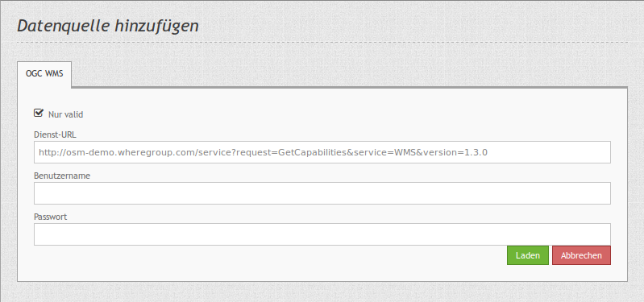

.. _source:

Source (Datenquelle)
====================

Über die Datenquellen können Sie OGC-WMS Dienste in der Version 1.1.1 und 1.3.0 in Mapbender registrieren.

Informationen zum Einbinden von Diensten und der Nutzung in Mapbender finden Sie im `Quickstart Dokument <../quickstart.html#laden-von-web-map-services>`_.

* **Dienst URL**: URL zum Capabilities-Dokument des WMS Dienstes (z.B.: ``http://osm-demo.wheregroup.com/service?SERVICE=WMS&Version=1.3.0&REQUEST=GetCapabilities``)

* **Benutzername / Passwort**: Eingabe von Benutzername und Passwort bei gesicherten Diensten.

* **nur valid**: Hiermit werden die WMS Dienste auf Validität überprüft. Dabei werden nur die Standard-Namensräume unterstützt. WMS Dienste, die in ihren Capabilities auf weitere Schema-Dateien verweisen können daher nicht als "valide" eingebunden werden. Diese Einschränkung stammt aus Erfahrungen mit falsch konfigurierten WMS Diensten, die Probleme bei der Nutzung gemacht haben.

  In der Regel verweisen OGC-WMS Capabilities auf ``xsi:schemaLocation="http://www.opengis.net/wms http://schemas.opengis.net/wms/1.3.0/capabilities_1_3_0.xsd``. Die dort unterstützen Namensräume sind:
  
  * http://www.w3.org/1999/xlink,
  * http://www.opengis.net/wms,
  * http://www.w3.org/2001/XMLSchema

  Dienste, die ohne Validitätsüberprüfung registriert wurden, erscheinen in der Diensteliste mit einem Ausrufezeichen. In vielen Fällen funktionieren diese Dienste mit Mapbender, obwohl sie eigene Schemata eingebunden haben.

  .. image:: ../../../figures/entities/source_not_valid.png
       :scale: 80
