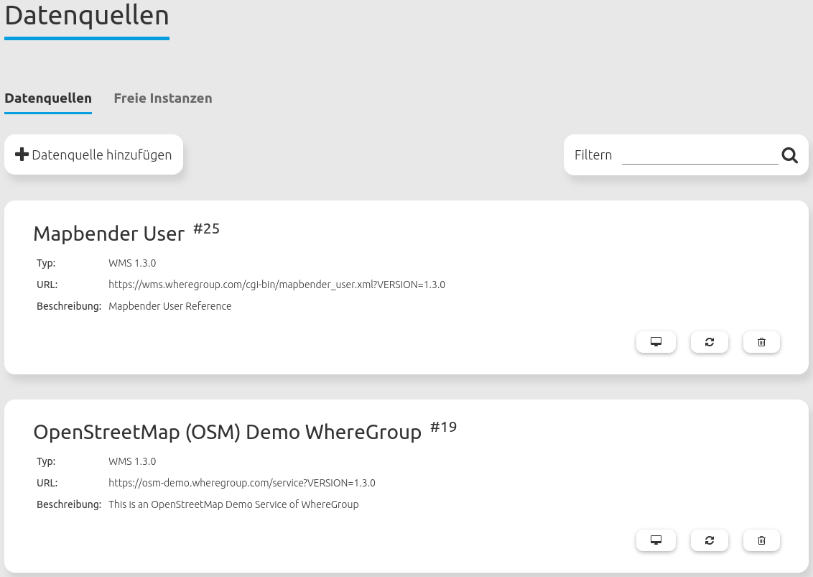

.. _source_de:

Datenquellen (Sources)
======================

Über den Backend-Menübereich Datenquellen können OGC WMS- und WMTS/TMS-Dienste in den Versionen 1.1.1 und 1.3.0 in Mapbender registriert werden.

Informationen zum Einbinden von Diensten und die Nutzung in Mapbender-Anwendungen finden Sie im `Quickstart Dokument <../../quickstart.html#laden-von-web-map-services>`_.

Datenquelle laden
-----------------

.. tip:: **Hinweis**: Es ist wichtig, dass die Datenquelle vor dem Hochladen auf ihre Richtigkeit überprüft wird. Dies erfolgt über den Aufruf des getCapabilities-Requests im Browser.

``Datenquelle hinzufügen``: Button zum Hinzufügen eines Dienstes, öffnet einen Konfigurationsbereich mit folgenden Parametern:

* **Typ**: Dropdown-Auswahl zwischen Datentyp OGC WMS und OGC WMTS / TMS (Pflichtangabe).

* **Dienst-URL**: URL zum Capabilities-Dokument des Dienstes (z.B. für OGC WMS Version 1.3.0: ``http://osm-demo.wheregroup.com/service?SERVICE=WMS&Version=1.3.0&REQUEST=GetCapabilities``)

* **Benutzername / Passwort**: Eingabe von Benutzername und Passwort bei gesicherten Diensten.

Mit einem Klick auf ``Laden`` wird der Dienst in Mapbender registriert.

  .. image:: ../../../figures/de/mapbender_add_source.png
     :scale: 80

Nach einer erfolgreichen Dienstregistrierung zeigt Mapbender Informationen zum Dienst in einem Übersichtsfenster an.

Datenquellen - Übersicht
------------------------

Die Bereiche Datenquellen und Freie Instanzen listen die erfolgreich geladenen und konfigurierten Dienste auf:

* **Filter**: Filtert die Dienste nach kontextspezifischer Eingabe, berücksichtigt Name, URL, Typ und Beschreibung.
* **Metadaten anzeigen**: Zeigt die Metadaten eines ausgewählten Dienstes an. Öffnet einen neuen Bereich, der in mehreren Reitern Metadaten, Mapbender-Anwendungen mit Zugriff, Kontaktinformationen, Details (z.B. Version) und die Layer des Dienstes ausgibt.
* **Datenquelle aktualisieren**: Aktualisiert die Dienst-Informationen durch erneutes Laden des getCapabilities-Dokuments.
* **Datenquelle entfernen**: Entfernt den Dienst aus Mapbender.

Datenquellen-Kontextmenü
------------------------

Im Metadatendialog eines Dienstes befindet sich oben rechts außerdem das Datenquellen-Kontextmenü. Es ermöglicht folgende Funktionen:

* **Datenquelle aktualisieren**: Aktualisiert die Dienst-Informationen durch erneutes Laden des getCapabilities-Dokuments.
* **Freie Instanz erzeugen**: Erzeugt eine freie Instanz aus der Datenquelle. Diese wird im Bereich "Freie Instanzen" angezeigt. 
* **Löschen**: Entfernt die freie Instanz aus Mapbender.

  .. image:: ../../../figures/de/source_overview.png
     :scale: 80
