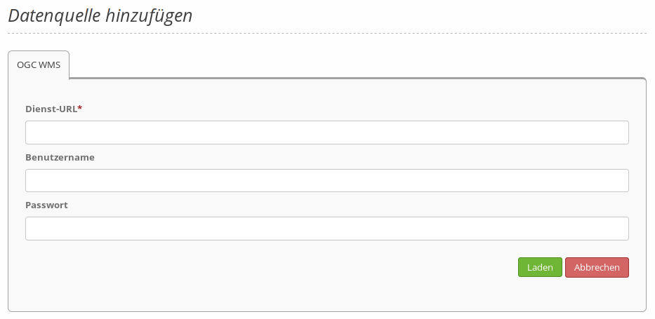

.. _sources_de:

Datenquellen (Sources)
======================

Über die Datenquellen können Sie OGC-WMS Dienste in der Version 1.1.1 und 1.3.0 in Mapbender registrieren.

Informationen zum Einbinden von Diensten und der Nutzung in Mapbender finden Sie im `Quickstart Dokument <../../quickstart.html#laden-von-web-map-services>`_.

* **Typ**: Vordefinierte Datentypauswahl (OGC WMS bzw. OGC WMTS / TMS).

* **Dienst URL**: URL zum Capabilities-Dokument des WMS Dienstes (z.B.: ``http://osm-demo.wheregroup.com/service?SERVICE=WMS&Version=1.3.0&REQUEST=GetCapabilities``)

* **Benutzername / Passwort**: Eingabe von Benutzername und Passwort bei gesicherten Diensten.

  In der Regel verweisen OGC-WMS Capabilities auf ``xsi:schemaLocation="http://www.opengis.net/wms http://schemas.opengis.net/wms/1.3.0/capabilities_1_3_0.xsd``. Die dort unterstützen Namensräume sind:
  
  * http://www.w3.org/1999/xlink,
  * http://www.opengis.net/wms,
  * http://www.w3.org/2001/XMLSchema

Datenquelle aktualisieren
-------------------------
Die Aktualisierung einer Datenquelle erfolgt zunächst über den Aufruf die Seite Datenquellen im Backend. Nachdem Sie den gewünschten Dienst in der Liste gefunden haben, betätigen Sie den Aktualisieren-Button.
Anschließend kann die Datenquelle aktualisiert werden: Dazu ändern Sie die URL (oder andere Einstellungen wie Benutzername und/oder Passwort). Sofern die Datenquelle nicht aktualisiert werden soll, kann der Abbrechen-Button gedrückt werden, um alle getätigten Änderungen zu verwerfen.
Falls die Änderungen vorgenommen werden sollen, klicken Sie auf den Laden-Button, um die Datenquelle zu aktualisieren. Diese aktualisierte Version wird anschließend in den Konfigurationseinstellungen angezeigt.