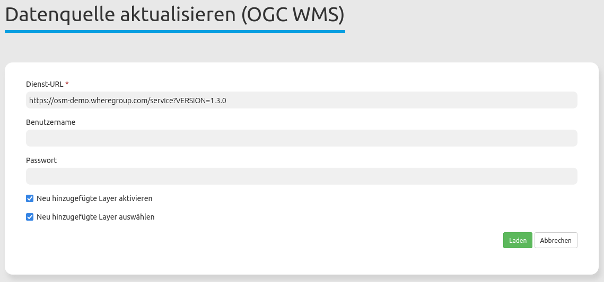

.. _sources_de:

  .. |mapbender-button-update| image:: ../../../figures/mapbender_button_update.png

Datenquellen (Sources)
======================

Über die Datenquellen können Sie OGC WMS bzw. OGC WMTS / TMS Dienste in der Version 1.1.1 und 1.3.0 in Mapbender registrieren. Informationen zum Einbinden von Diensten und der Nutzung in Mapbender finden Sie im `Quickstart Dokument <../../quickstart.html#laden-von-web-map-services>`_.

* **Typ**: Vordefinierte Auswahl des Typs der Datenquelle (OGC WMS bzw. OGC WMTS / TMS).

* **Dienst-URL**: URL zum Capabilities-Dokument des Dienstes (z.B.: ``http://osm-demo.wheregroup.com/service?SERVICE=WMS&Version=1.3.0&REQUEST=GetCapabilities``)

* **Benutzername / Passwort**: Eingabe von Benutzername und Passwort bei gesicherten Diensten.

Datenquellen aktualisieren
--------------------------
Die Aktualisierung einer Datenquelle erfolgt zunächst über den Aufruf der Seite ``Datenquellen`` im Backend.
Wählen Sie aus der Liste die zu aktualisierende Datenquelle aus. Es ist möglich, die Liste anhand des Suchfelds nach Diensten zu filtern.
Klicken Sie anschließend neben der gewünschten Datenquelle auf den |mapbender-button-update| ``Datenquelle aktualisieren``-Button.
Dadurch öffnet sich die Aktualisierungsmaske. Hier können Sie auch die URL oder Benutzername / Passwort des Dienstes anpassen.

.. hint:: Datenquellen lassen sich über diese Maske auch aktualisieren, ohne dass Änderungen vorgenommen wurden.

Zusätzlich bietet die Maske zwei Checkboxen an:

* **Neu hinzugefügte Layer aktivieren**: Ist der Haken an dieser Checkbox gesetzt, sind durch die Aktualisierung neu geladene Dienst-Layer automatisch in Anwendungen aktiv. Ist der Haken nicht gesetzt, erscheinen neue Layer nicht im Ebenenbaum.
* **Neu hinzugefügte Layer auswählen**: Ist der Haken an dieser Checkbox gesetzt, werden durch die Aktualisierung neu geladene Dienst-Layer automatisch in Anwendungen sichtbar und sind aktiv. Dazu muss allerdings auch ``Neu hinzugefügte Layer aktivieren`` gesetzt sein. Ist ``Neu hinzugefügte Layer auswählen`` nicht gesetzt, erscheint der Layer zwar im Ebenenbaum, ist aber nicht aktiviert.

Falls die Änderungen vorgenommen werden sollen, klicken Sie auf den ``Laden``-Button, um die Datenquelle zu aktualisieren. Dabei wird das getCapabilities-Dokument neu ausgelesen. Die aktualisierte Version wird anschließend in den Konfigurationseinstellungen angezeigt und Änderungen werden in Anwendungen, in denen der Dienst verwendet wird, angewandt.