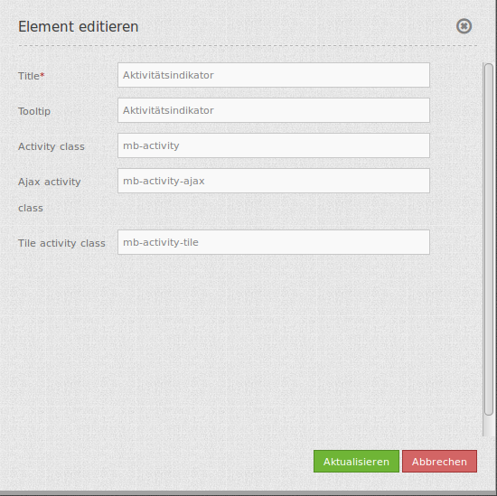

.. _activity_indicator_de:

Aktivitätsindikator (Activity Indicator)
========================================

Der Aktivitätsindikator (Sanduhr) ist ein einfaches Modul, das Aktivitäten anzeigt (Ajax-Aufrufe und Kartenaufrufe). 
In der voreingestellten Konfiguration wird ein Schrift-Symbol verwendet. 

Der Aktivitätsindikator kann in Sidepane, Footer oder Toolbar implementiert werden. Standardmäßig sieht er folgendermaßen aus: 

.. image:: ../../../figures/activity_indicator.png
     :scale: 100

Konfiguration
-------------

* **Title:** Titel des Elements
* **Tooltip:** Der hier eingegebene Text wird angezeigt, wenn der Mauszeiger längere Zeit über dem Element verweilt.
* **Activity class:** CSS Klasse, die Aktivitäten anzeigt (Ajax oder Kacheln)
* **Ajax activity class:** CSS Klasse, die Ajax-Aktivitäten anzeigt
* **Tile activiy class:** CSS Klasse, die Kartenaufrufe anzeigt

YAML-Definition:
----------------

Diese Vorlage kann genutzt werden, um das Element in einer YAML-Anwendung einzubinden.

.. code-block:: yaml

    activityClass: mb-activity          # CSS Klasse, die Aktivitäten anzeigt (Ajax oder Kacheln)
    ajaxActivityClass: mb-activity-ajax # CSS Klasse, die Ajax-Aktivitäten anzeigt
    tileActivityClass: mb-activity-tile # CSS Klasse, die Kartenaufrufe anzeigt

