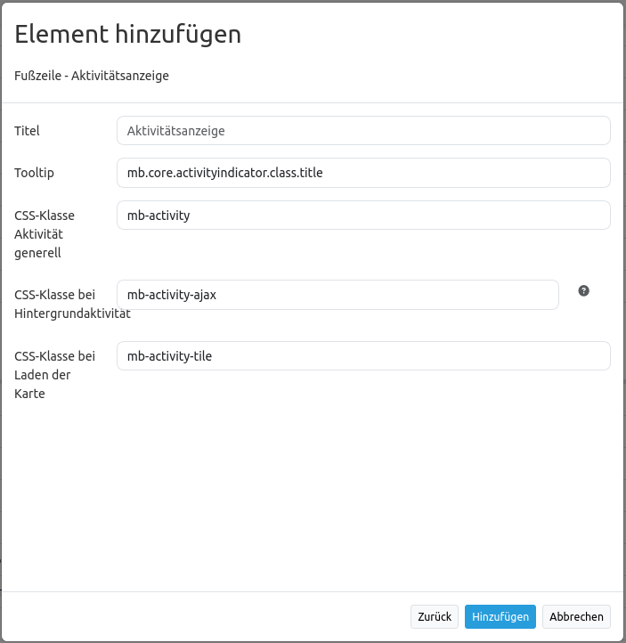

.. _activity_indicator_de:

Activity Indicator (Aktivitätsindikator)
========================================

Der Aktivitätsindikator (Sanduhr) ist ein einfaches Modul, das Aktivitäten anzeigt (Ajax-Aufrufe und Kartenaufrufe). 
In der voreingestellten Konfiguration wird ein Schrift-Symbol verwendet. 
Dieses kann ganz einfach in der CSS-Datei ``fom//src//FOM//CoreBundle//Resources//public//css/frontend//mapbender3_theme.css`` geändert werden.

Konfiguration
-------------

* **Title:** Titel des Elements
* **Tooltip:** Der hier eingegebene Text wird angezeigt, wenn der Mauszeiger längere Zeit über dem Element verweilt.
* **Activity class:** CSS Klasse, die Aktivitäten anzeigt (Ajax oder Kacheln)
* **Ajax activity class:** CSS Klasse, die Ajax-Aktivitäten anzeigt
* **Tile activiy class:** CSS Klasse, die Kartenaufrufe anzeigt