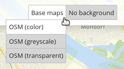

.. _basesourceswitcher_de:

BaseSourceSwitcher (Themenwechsel)
*********************************************************************

Mit diesem Element kann zwischen vordefinierten Themen (BaseSources), z. B. Hintergrundkarten, gewechselt werden. Die Definition der BaseSources erfolgt in der Anwendung im Reiter Layersets für den entsprechenden Layer. Die Bearbeitungsoberfläche des gewünschten Layers muss dazu geöffnet werden. Um diesen als BaseSource verwenden zu können, ist es notwendig, ein Häkchen bei Basesource zu setzen:

.. image:: ../../../figures/de/basesourceswitcher_basesource.png
     :scale: 80

Über Buttons kann zwischen den verschiedenen Themen gewechselt werden. Es kann dabei immer nur ein Thema aktiv sein.

Zu jeder Datenquelle kann eine Gruppe definiert werden. Alle Definitionen einer Gruppe werden als Dropdown-Liste angezeigt, wobei der Gruppenname als übergeordneter Eintrag erscheint.

Konfiguration
=============

Die Konfiguration geschieht in zwei Schritten:

#. Erzeugen eines Elements zum Wechseln der vordefinierten Themen (Titel, Tooltip und Target)
#. Hinzufügen von Themen mit einer oder mehrerer Quellen und optionaler Definition einer Gruppe

.. image:: ../../../figures/de/basesourceswitcher_de.png
     :scale: 80

* **Title:** Text, der neben dem About Dialog Button angezeigt wird.
* **Tooltip:** Text, der erscheint, wenn der Mauszeiger längere Zeit über dem Button gehalten wird.
* **Target:** Zielelement (Titel(ID)) des Buttons, das bei Anklicken des Buttons ausgelöst wird.
* **Instancesets:** Themengruppen, die untergeordnete Themenkarten enthalten und als übergeordneter Gruppenname in der Toolbar erscheinen.

In dem Konfigurationsbeispiel sieht man, dass entweder ein, kein oder mehrere Einträge pro Instanceset gewählt werden können. Durch eine Group-Angabe lassen sich Gruppen bilden, die dann über die Dropdown-Liste zusammengefasst werden.

* **Title**: Name der Themenkarte
* **Group**: Optionale Zuweisung zu einer vorher definierten Themengruppe
* **Instances**: Quellen für die Themenkarte

Einbinden in Sidepane
-----------------------
Der BaseSourceSwitcher kann in der Sidepane mit einer Kartenvorschau eingebunden werden.

.. image:: ../../../figures/de/basesourceswitcher_kartenvorschau.png
     :scale: 80

Das Styling wird über CSS angepasst. Als Vorbereitung werden Screenshots der Hintergrundkarten mit der Größe 110x110px erstellt und im web-Verzeichnis abgelegt (Screenshots müssen von außen erreichbar sein).
Danach wird der BaseSourceSwitcher, wie in „Konfiguration“ beschrieben, in die Sidepane eingebunden. **Die Einbindung mit Kartenvorschau funktioniert nur in der Sidepane und nicht in der Toolbar! Zusätzlich müssen alle Gruppierungen entfernt werden, falls diese vorher genutzt wurden.**

Anschließend wird die CSS-Vorlage (siehe unten) in der Anwendung unter dem Tab „CSS“ eingebunden. Um die Vorlage an die eigene Anwendung anzupassen, müssen die Nummern der data-sourcesets und die Bildpfade je Dienst verändert werden.
Die passenden Nummern für das Layerset finden Sie in dem Tab „Layersets“ unter ID (gebraucht wird lediglich die InstanceID).

CSS-Vorlage:
------------

.. code-block:: css

     .mb-element-basesourceswitcher li[data-state='active'] {
          position: static;
          background-color: #578e2a;
          color: #578e2a;
          font-size: 12px;
          font-weight: 800;
          padding: 4px;
          border-right-width: 1px;
          margin-bottom: 5px;
          margin-right: 5px; }

     .mb-element-basesourceswitcher li[data-state=''] {
          background-color: #ffffff;
          color: #6fb536;
          font-weight: 800;
          font-size: 12px;
          padding: 4px;
          margin-bottom: 5px;
          margin-right: 5px;
          opacity: 0.4; }

     .mb-element-basesourceswitcher li:hover {
          border-color: #6fb536;
          background-color: #6fb536;
          color: #6fb536;
          padding: 4px;
          margin-bottom: 5px;
          margin-right: 5px;
          opacity: 1; }

     .mb-element-basesourceswitcher li {
          position: relative;
          border-radius: 3px;
          border: 1px solid;
          border-color: #848484; }

     .mb-element-basesourceswitcher li[data-sourceset='8'] {
          background: url("osm.png");
          width: 110px;
          height: 110px; }

     .mb-element-basesourceswitcher li[data-sourceset='11'] {
          background: url("webatlas_grau.png");
          width: 110px;
          height: 110px; }

     .mb-element-basesourceswitcher li[data-sourceset='10'] {
          background: url("webatlas_farbe.png");
          width: 110px;
          height: 110px; }

YAML-Definition:
----------------

.. code-block:: yaml

    title:                                              # Titel
    tooltip:                                            # Text des Tooltips
    target: map                                         # ID des Kartenelements
    sourcesets:                                         # Liste der Sourcesets.
        - { title: sourcesetname, group: groupname,
            sources: [sourceId]}                        # sourceset: Titel,
                                                        # group: (optional) Gruppenname der Gruppen der Sourcesets über "group name"
                                                        # sources Liste der Sources
        - { title: sourcesetname, group: groupname,
            sources: [sourceId]}

Class, Widget & Style
============================

* **Class:** Mapbender\\CoreBundle\\Element\\BaseSourceSwitcher
* **Widget:** mapbender.element.basesourceswitcher.js
