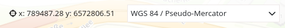
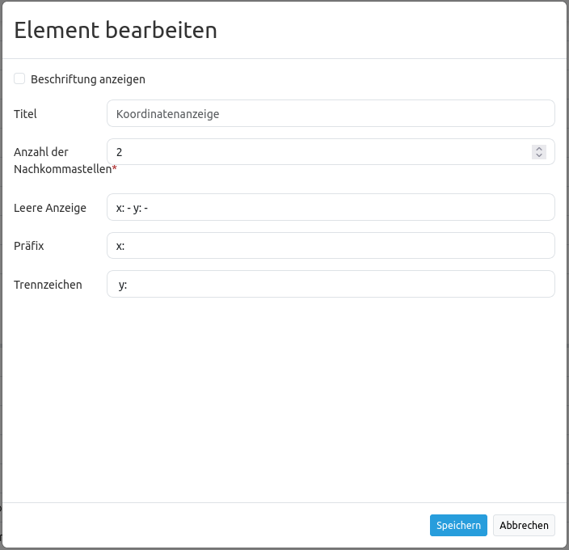

.. _coordinates_display_de:

Coordinates Display (Koordinatenanzeige)
****************************************

Das Koordinatenanzeige-Element zeigt die Kartenkoordinaten der aktuellen Mausposition an. Die Koordinaten sind abhängig vom eingestellten räumlichen Referenzsystem, welches im `Spatial Reference System Selector <srs_selector.html>`_ geändert werden kann.

So sieht die Koordinatenanzeige für unterschiedliche Koordinatensysteme aus:

ETRS89 / UTM zone 32N (EPSG:25832):

.. image:: ../../../figures/de/coordinates_display_etrs89_zone32.png
     :scale: 80

DHDN / 3-degree Gauss-Kruger zone 2 (EPSG:31466):

.. image:: ../../../figures/de/coordinates_display_gauss_krueger_zone2.png
     :scale: 80

WGS 84 (EPSG:4326):

.. image:: ../../../figures/de/coordinates_display_wgs84.png
     :scale: 80

WGS 84 / Pseudo-Mercator (EPSG:3857):

Konfiguration
=============

* **Beschriftung anzeigen (Show label):** Schaltet die Beschriftung an/aus. Die Beschriftung richtet sich nach dem Title.
* **Title:** Titel des Elements. Dieser wird links neben den Koordinaten angezeigt, wenn "Beschriftung anzeigen" aktiviert ist.
* **Num digits:** Anzahl der Nachkommastellen der Koordinaten.
* **Target:** ID des Kartenelements, auf das sich das Element bezieht.
* **Empty:** Angezeigter Text, wenn sich die Maus nicht in der Karte befindet (Standard: 'x= - y= -').
* **Prefix:** Präfix vor der X-Koordinate (Standard 'x= ').
* **Separator:** Separator nach X- und vor Y-Koordinate (Standard ' y= ').

YAML-Definition:
----------------

.. code-block:: yaml

   numDigits: 2                   # die Anzahl der Nachkommastellen, die jede Koordinate haben soll
   target: ~                      # ID des Kartenelements
   label: true                    # false/true, um den Button zu beschriften (Standard: true).
   empty: 'x= - y= -'             # zeigt diesen Text, wenn die Maus sich nicht in der Karte befindet.
   prefix: 'x= '                  # zeigt ein Präfix vor der X-Koordinate.
   separator: ' y= '              # zeigt einen Separator vor der Y-Koordinate.

CSS-Styling
===========

Das Element kann über den folgenden CSS-Style angepasst werden, beispielsweise um die Breite zu vergrößern.

.. code-block:: css

                .mb-element-coordsdisplay {
                    width: 500px;
                }

