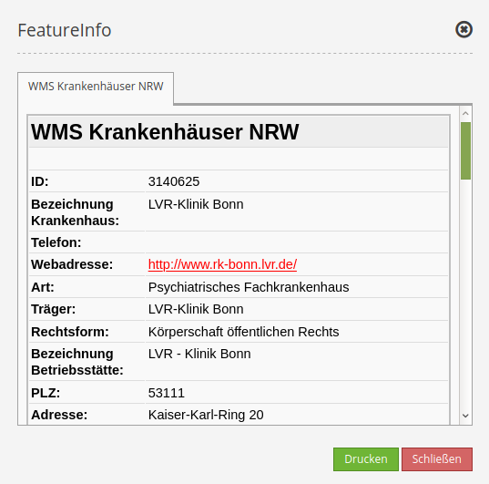
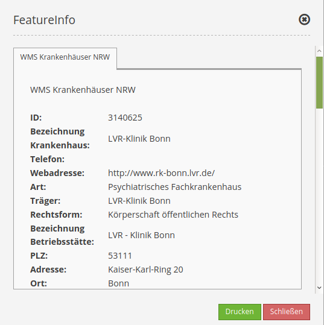
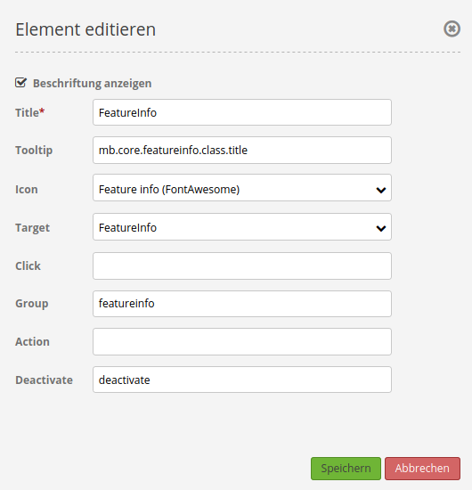

.. _feature_info_de:

FeatureInfo (Information)
*************************

Dieses Element stellt eine Informationsabfrage bereit, die per WMS funktioniert.

.. image:: ../../../figures/de/feature_info.png
     :scale: 80
     
Als Beispiel diente der WMS "Krankenhäuser NRW" (http://www.wms.nrw.de/wms/krankenhaus?) vom Ministerium für Gesundheit, Emanzipation, Pflege und Alter NRW. 

Konfiguration
=============

.. image:: ../../../figures/de/feature_info_configuration.png
     :scale: 80

* **Automatisches Öffnen (Autoopen):** Schaltet ein/aus, ob das Informationsfenster beim Start der Anwendung automatisch geöffnet werden soll (Default: ausgeschaltet).
* **Beim Schließen deaktivieren:** Steuert, ob das FeatureInfo beim Schließen des Ergebnisfensters deaktiviert wird oder nicht, der Standardwert ist false.
* **Print Result:** Anzeige eines Links, über den die abgefragten Daten ausgedruckt werden können. Standardwert ist false.
* **Title:** Titel des Elements. Dieser wird in der Layouts Liste angezeigt und ermöglicht, mehrere Button-Elemente voneinander zu unterscheiden. Der Titel wird außerdem neben dem Button angezeigt, wenn “Beschriftung anzeigen” aktiviert ist.
* **Target:** ID des Kartenelements, auf das sich das Element bezieht.
* **Type:** Auswahl, ob die Info als Element oder Dialog angezeigt werden soll. Default und mandatory: Dialog.
* **Display type:** Anzeige der Information als Tabs oder in Accordionform (Default: tabs).
* **Max count:** Maximale Anzahl an Treffern/Ergebnissen, die angezeigt werden soll.
* **Width/Height:** Größe des Dialogfeldes (Breite und Höhe in Pixel).
* **Original Zeigen:** Original css-Stil des Ergebnisses wird angezeigt (Default: true).
* **nur valide zeigen:** Dieser Parameter hängt sehr vom Format des GetFeatureInfo Responses ab. Beispiel UMN: Solange ein Template korrekte HTML Head und Body Elemente definiert (z.B. über die Angabe einer Headers und Footers Datei), interpretiert Mapbender das Resultat als valide. Fehlen diese Head und Body Angaben, so gilt dies für Mapbender als nicht valide.
* **Tooltip:** Text, der angezeigt wird, wenn der Mauszeiger eine längere Zeit über dem Element verweilt.

Einstellungen im Layertree
---------------------------

Layer "Krankenhäuser NRW" ist sichtbar und FeatureInfo-Abfrage für den Layer aktiviert:

.. image:: ../../../figures/de/feature_info_on.png
     :scale: 80

Layer "Krankenhäuser NRW" ist sichtbar und FeatureInfo-Abfrage für den Layer deaktiviert:

.. image:: ../../../figures/de/feature_info_off.png
     :scale: 80

Layer "Krankenhäuser NRW" ist nicht sichtbar und FeatureInfo-Abfrage für den Layer aktiviert:

.. image:: ../../../figures/de/feature_info_on_layer_invisible.png
     :scale: 80
     
Obwohl der Layer nicht sichtbar ist, erfolgt in diesem Fall trotzdem die FeatureInfo-Abfrage.

Anzeige als Original und gestyled
---------------------------------

Mit der Option "Original zeigen" wird die Originaldarstellung des FeatureInfo Responses genutzt. Ist die Option deaktiviert, wird versucht eine einheitliche Darstellung in Mapbender zu erreichen.

Beispiel Original:

Beispiel gestyled:

Anzeige als Tabs und Accordion
------------------------------

Mit dem Schalter "Type" können die Responses mehrerer Dienste in unterschiedlichen Tabs oder als Accordion angezeigt werden.

Beispiel Tabs:

.. image:: ../../../figures/de/feature_info_tabs.png
     :scale: 80

Beispiel Accordion:

.. image:: ../../../figures/de/feature_info_accordion.png
     :scale: 80

Ausdruck der Resultate
----------------------

Mit dem Schalter "Print result" kann die Information des FeatureInfo ausgedruckt werden. Eine Druckschaltfläche ist dann in dem FeatureInfo-Dialog sichtbar. Das Drucken geschieht über den Druckdialog des Webbrowsers.

Um alle Bilder und Hintergrundfarben im Ausdruck zu erhalten, sollten Sie die Druckeinstellungen des Webbrowsers beachten: In Firefox kann man die Option "Hintergrund drucken" im Druckoptionendialog anschalten, in Chrome-basierten Browsern nennt sich die Option "Hintergrundgrafiken". Die übermittelten Schriften können bei einem Ausdruck in PDF je nach Viewer unterschiedlich gut funktionieren. Des Weiteren modifizieren die meisten Browser Webseiten etwas vor dem Druck, damit nicht so viel Tinte/Toner verbraucht wird.

Button-Konfiguration
--------------------

Für das Element wird ein Button verwendet. Siehe das Kapitel `Button <../misc/button.html>`_ für die generelle Konfiguration. Der folgende Screenshot zeigt ein Beispiel für einen FeatureInfo-Button, der so lange aktiviert ist, bis er vom Benutzer wieder deaktiviert wird. Eine weitere Möglichkeit, ihn zu deaktivieren, wäre, den FeatureInfo-Dialog zu schließen, wenn bei diesem die Option "Beim Schließen deaktivieren" angeschaltet ist.

* **Group:** featureinfo
* **Deactivate:** deactivate

YAML-Definition:
----------------

.. code-block:: yaml

   title: FeatureInfo      # Titel des Elements
   tooltip: Feature Info   # Text des Tooltips
   type: dialog            # Default und mandatory: dialog.
   target: map             # ID des Kartenelements
   autoActivate: false     # true, wenn die Infoabfrage beim Start der Anwendung geöffnet wird, der Standardwert ist false.
   deactivateOnClose: true # true/false um die Funktion nach dem Schließen des Ergebnisfensters zu deaktivieren, der Standardwert ist true
   onlyValid: false        # Korrekte HTML Ausgabe erfordern. Standardwert ist false.
   printResult: false      # Anzeige eines Links, über den die Infoabfrage ausgedruckt werden kann. Standardwert ist false.
   showOriginal: false     # Der Original css-Stil des Ergebnisses wird angezeigt. Standardwert ist false.
   displayType: tabs       # tabs/accordion Default: tabs
   width: 700              # Breite des Dialogs in Pixel, Standardwert: 700
   height: 500             # Höhe des Dialog in Pixel, Standardwert: 500

Class, Widget & Style
=====================

* **Class:** Mapbender\\CoreBundle\\Element\\FeatureInfo
* **Widget:** mapbender.element.featureInfo.js
* **Style:** mapbender.elements.css
