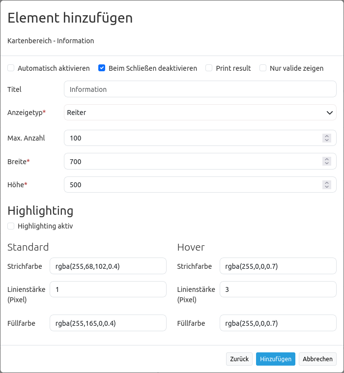

.. _feature_info_de:

FeatureInfo (Information)
*************************

Mit diesem Element können Sie Informationen eines WMS abfragen. In der folgenden Abbildung sehen Sie ein Beispiel für eine solche Informationsabfrage. Es wurde hierfür der WMS "Krankenhäuser NRW" (http://www.wms.nrw.de/wms/krankenhaus?) vom Ministerium für Gesundheit, Emanzipation, Pflege und Alter NRW verwendet.

.. image:: ../../../figures/de/feature_info.png
     :scale: 80

Der Dienst Krankenhäuser NRW (https://www.wms.nrw.de/wms/krankenhaus?Service=WMS&Version=1.3.0&Request=getCapabilities) dienst zur Veranschaulichung.
     
Konfiguration
=============

Das Element FeatureInfo wird im Content eingebunden:

.. image:: ../../../figures/de/feature_info_content.png
     :scale: 80

* **Automatisches Öffnen:** Schaltet ein/aus, ob das Informationsfenster beim Start der Anwendung automatisch geöffnet werden soll (Standard: false).
* **Beim Schließen deaktivieren:** Steuert, ob das FeatureInfo beim Schließen des Ergebnisfensters deaktiviert wird oder nicht (Standard: false).
* **Print Result:** Anzeige eines Links, über den die abgefragten Daten ausgedruckt werden können (Standard: true).
* **Nur valide zeigen** Anzeige von validen WMS
* **Title:** Titel des Elements. Dieser wird in der Layouts Liste angezeigt und ermöglicht, mehrere Button-Elemente voneinander zu unterscheiden. Der Titel wird außerdem neben dem Button angezeigt, wenn “Beschriftung anzeigen” aktiviert ist.
* **Target:** ID des Kartenelements, auf das sich das Element bezieht.
* **Display type:** Anzeige der Information als Tabs oder in Accordionform (Standard: tabs).
* **Max count:** Maximale Anzahl an Treffern/Ergebnissen, die angezeigt werden soll.
* **Width/Height:** Größe des Dialogfeldes (Breite und Höhe in Pixel).
* **Highlighting aktiv** Aktivierung des FeatureInfo Highlightings.
* **Grundfarbe** Farbe mit der ausgewählte Geometrien hervogehoben werden.
* **Hover-Farbe** Farbe mit der ausgewählte Geometrien hervogehoben werden, wenn man darüber hovert.

Für das Element wird zudem ein Button benötigt. Zu der Konfiguration des Buttons besuchen sie die Dokumentationsseite unter `Button <../misc/button.html>`_.

Einstellungen im Ebenenbaum
---------------------------

Layer ist sichtbar und FeatureInfo-Abfrage für den Layer ist aktiviert:

.. image:: ../../../figures/de/feature_info_on.png
     :scale: 80

Layer ist sichtbar und FeatureInfo-Abfrage für den Layer ist deaktiviert:

.. image:: ../../../figures/de/feature_info_off.png
     :scale: 80

Layer ist nicht sichtbar; es erfolgt keine FeatureInfo-Abfrage, auch wenn diese aktiviert ist:

.. image:: ../../../figures/de/feature_info_on_layer_invisible.png
     :scale: 80
     

Anzeige als Tabs und Accordion
------------------------------

Mit dem Schalter "Type" können die Antworten der einzelnen Dienste in unterschiedlichen Reitern oder als Akkordeon angezeigt werden.

Beispiel Reiter:

.. image:: ../../../figures/de/feature_info_tabs.png
     :scale: 80

Beispiel Akkordeon:

Ausdruck der Resultate
----------------------

Mit dem Schalter "Drucken" kann die Information des FeatureInfo ausgedruckt werden. Eine Druckschaltfläche ist dann in dem FeatureInfo-Dialog sichtbar. Das Drucken geschieht über den Druckdialog des Webbrowsers.

Um alle Bilder und Hintergrundfarben im Ausdruck zu erhalten, sollten Sie die Druckeinstellungen des Webbrowsers beachten: In Firefox kann man die Option "Hintergrund drucken" im Druckoptionendialog anschalten, in Chrome-basierten Browsern nennt sich die Option "Hintergrundgrafiken". Die übermittelten Schriften können bei einem Ausdruck in PDF je nach Viewer unterschiedlich gut funktionieren. Des Weiteren modifizieren die meisten Browser Webseiten etwas vor dem Druck, damit nicht so viel Tinte/Toner verbraucht wird.

FeatureInfo Highlighting
------------------------

Einzelne Geometrien eines WMS können über die Infoabfrage in der Karte farblich hervorgehoben werden. Dies ist besonders bei der Arbeit mit umfangreichen WMS hilfreich, da so einzelne Geometrien leichter zugeordnet werden können.

.. image:: ../../../figures/de/feature_info_configuration_highlighting.png
     :scale: 80

Eine Infoabfrage mit aktiviertem FeatureInfo Highlighting könnte beispielsweise folgendermaßen aussehen:

.. image:: ../../../figures/de/feature_info_highlighting.png
     :scale: 80

In der Abbildung wurden mehrere Geometrien in der Karte ausgewählt (PLZ: 53111, 53113 und 53115). Der FeatureInfo Dialog zeigt die Informationen zu diesen Objekten an. Die Fläche mit der PLZ 53115 wird durch Hovering rot in der Karte markiert.

Das FeatureInfo Highlighting kann im FeatureInfo-Element im Content-Bereich aktiviert werden. Dort sind auch Grund- und Hoverfarbe auswählbar.

Darüber hinaus muss die HTML-Ausgabe der Infoabfrage angepasst werden. Hierfür ist es notwendig, dass die Geometrieabfrage versteckt als WKT über ein HTML-div erfolgt. Zusätzlich muss der EPSG-Code übergeben werden und eine eindeutige ID in dem HTML-div vorliegen (siehe Konfigurationsbeispiel unten).
Mapbender wertet nach korrekter Konfiguration diese Informationen aus und stellt die Geometrien in der Karte dar. Beim Mouse-Over auf den Treffern des Infofensters wird die dazugehörige Geometrie farblich entsprechend hervorgehoben. Anpassungen können für MapServer, QGIS Server, GeoServer erfolgen.

Die notwendige Anpassung wird hier am Beispiel von MapServer gezeigt. In der DATA-Angabe wird zusätzlich die Geometrie als WKT ausgegeben. Außerdem wird das FeatureInfo-Template angepasst. Wird nun ein WMS über GetFeatureInfo abgefragt, werden die entsprechenden Flächen in der Karte hervorgehoben.

.. code-block:: bash

  DATA "geom from (Select *, ST_AsText(geom) as geom_wkt from plz) as foo USING UNIQUE gid USING SRID 4326"

  

  <table>
  	...
  <table>
  

YAML-Definition:
----------------

.. code-block:: yaml

   title: FeatureInfo             # Titel des Elements
   tooltip: Feature Info          # Text des Tooltips
   type: dialog                   # Standard, Pflichtfeld: dialog
   target: map                    # ID des Kartenelements
   autoActivate: false            # true, wenn die Infoabfrage beim Start der Anwendung geöffnet wird (Standard: false)
   deactivateOnClose: true        # true/false, um die Funktion nach dem Schließen des Ergebnisfensters zu deaktivieren (Standard: true)
   onlyValid: false               # Korrekte HTML Ausgabe erfordern. Standardwert ist false.
   printResult: false             # Anzeige eines Links, über den die Infoabfrage ausgedruckt werden kann (Standard: false)
   displayType: tabs              # tabs/accordion (Standard: tabs)
   width: 700                     # Breite des Dialogs in Pixel, Standardwert: 700
   height: 500                    # Höhe des Dialog in Pixel, Standardwert: 500
   maxCount: 100	              # Maximale Anzahl an Treffern/Ergebnissen, die angezeigt werden soll
   highlighting: false            # FeatureInfo Highlighting (Standard: false)
   featureColorDefault: #ffa500   # Farbe zur Hervorhebung ausgewählter Geometrien
   featureColorHover: #ff0000     # Farbe zur Hervorhebung beim Hovern über ausgewählte Geometrien

