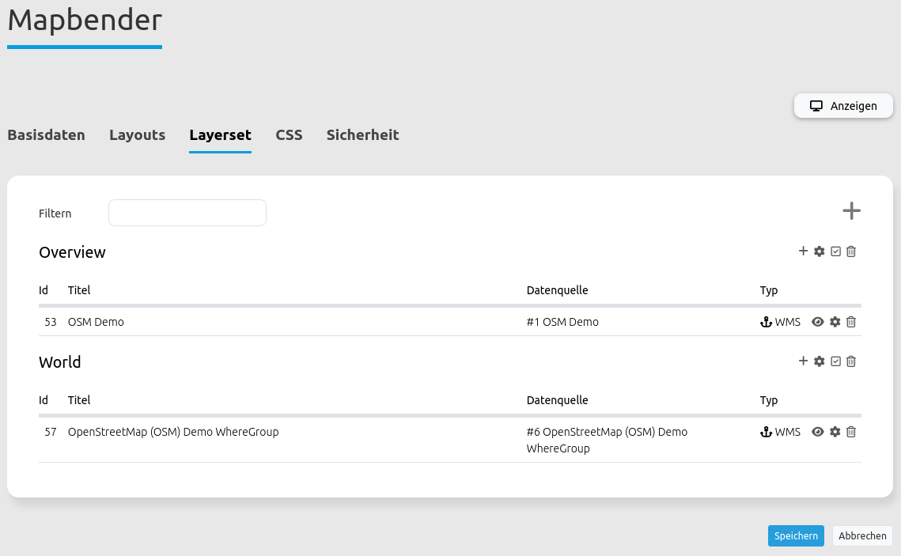
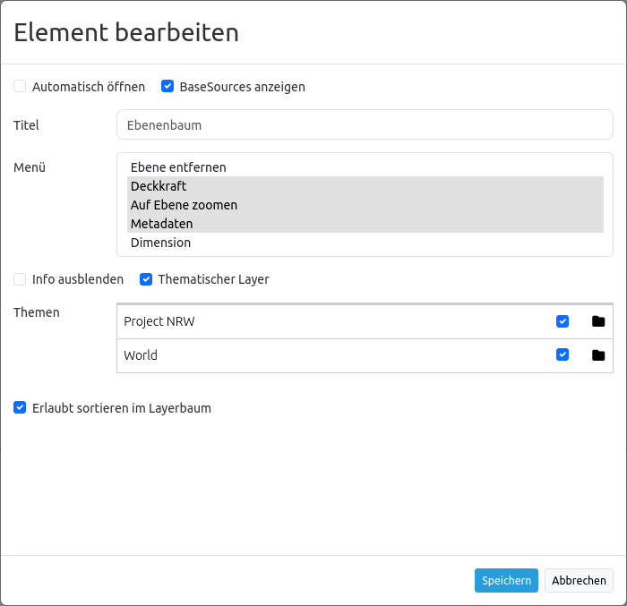
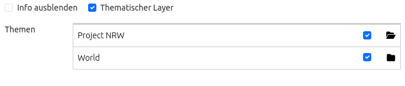

.. _layertree_de:

Ebenenbaum (Layertree)
**********************

Funktionen
==========

* Anzeige von Layern
* Anzeige von Layergruppen
* Anzeige thematischer Layergruppen
* Aktivieren und Deaktivieren von Layern
* Aktivieren und Deaktivieren der Abfrage von Layern
* Verändern der Layerreihenfolge
* Zoom zum Kartenausschnitt eines Layers
* Abfrage der Metadaten eines Layers
* Zeitliche Dimension eines Layers kontrollieren

.. figure:: ../../../figures/layertree/layertree_example_dialog.png
           :scale: 80
           :alt: Ebenenbaum im Dialogfenster zeigt Dienste mit Ebenen

           Einfacher Ebenenbaum im Dialogfenster zeigt Dienste mit Ebenen.

.. figure:: ../../../figures/layertree/layertree_example_sidepane.png
           :scale: 80
           :alt: Thematischer Ebenenbaum in der Sidepane

           Thematischer Ebenenbaum in der Sidepane

Zur Konfiguration des Ebenenbaums gibt es verschiedene Verknüpfungspunkte zu anderen Elementen, die beachtet werden müssen: 

* `Layersets <../backend/layerset.html>`_
* `Kartenelement <map.html>`_
* `Datenquellen <../backend/source.html>`_

Konfiguration
=============

Allgemeine Konfiguration
------------------------

Um Layersets im Ebenenbaum nutzen zu können, sind verschiedene Anpassungen notwendig. Diese betreffen die:

#. Einrichtung unterschiedlicher Layersets
#. Einrichtung in der Karte zur Anzeige der Layersets
#. Einrichtung des Ebenenbaums selbst

Über den Reiter **Layerset** können Layersets definiert und Datenquellen in eine Anwendung eingebunden werden. 
Die Instanzen sind die Referenzen auf die einzelnen WMS-Dienste. Über den großen ``+``-Button kann ein neues Layerset hinzugefügt werden. In dieses lassen sich im Anschluss neue Layer über das Hinzufügen von im Backend registrierten Instanzen einbinden. Das Layerset "overview" wird im Beispiel für die Anzeige der Übersichtskarte verwendet. 
Eine Dokumentation, wie die Dienste korrekt registriert und eingebunden werden, findet sich unter der `Datenquellen <../backend/source.html>`_ und `Layersets <../backend/layerset.html>`_. 

           Einrichtung von Layersets für die Einbindung in den Ebenenbaum.

Damit die neu eingebundenen Layersets auch in der Anwendung erscheinen, müssen diese im `Kartenelement <map.html>`_ angegeben werden. 
Durch das Aktivieren der gewünschten Layersets wird definiert, ob diese in der Kartenansicht verwendet werden. 
Auch wird hierüber die Reihenfolge definiert, in der die Layersets im Ebenenbaum und in der Karte erscheinen: Die Einträge in der Auflistung können per Drag & Drop verschoben werden.

.. figure:: ../../../figures/layertree/layertree_configuration_map_simple.png
           :scale: 80
           :alt: Einrichtung der Layersets im Kartenelement.

           Einrichtung der Layersets im Kartenelement.

Workflow einfacher Ebenenbaum
-----------------------------

Im Folgenden gehen wir eine beispielhafte Konfiguration eines Ebenenbaums mit Basisfunktionen in drei Schritten durch: 

#. Einrichtung eines Layersets
#. Einrichtung in der Karte zur Anzeige des Layersets
#. Einrichtung des Ebenenbaums

**Einrichtung eines Layersets**

Im Beispiel ist ein **Layerset** mit einer Instanz definiert:

* Layerset World: 
    * Instanz OSM Demodienst https://osm-demo.wheregroup.com/service?&REQUEST=GetCapabilities&SERVICE=WMS&VERSION=1.3.0

Die registrierte Instanz des OSM-Demodienstes wird bei der Installation von Mapbender bereits mitgeliefert. Diese muss nur noch über den Anwendungsreiter **Layerset** in ein Layerset eingebunden werden. Im Beispiel wurde das Layerset "World" genutzt. 
Bei Schwierigkeiten bei der Einbindung kann die Dokumentation der `Layersets <../backend/layerset.html>`_ weiterhelfen. 

           Einrichtung eines Layersets für die Einbindung in den Ebenenbaum.

**Einrichtung in der Karte zur Anzeige des Layersets**

Als Nächstes erfolgt die Einrichtung des `Kartenelements <map.html>`_ zur Anzeige des Layersets in der **Karte**. Dazu wechseln wir in den Anwendungsreiter **Layouts** und bearbeiten dann das Kartenelement im Kartenbereich.
Wichtig ist, dass im Bereich Layersets das Layerset World aktiviert wird, damit es in der Anwendung angezeigt wird. 

Bei Fragen zur weiteren Konfiguration der Karte kann die Dokumentation des `Kartenelements <map.html>`_ weiterhelfen.

.. figure:: ../../../figures/layertree/layertree_configuration_map_simple.png
           :scale: 80 
           :alt: Einrichtung im Kartenelement zur Anzeige des Layersets.

           Einrichtung im Kartenelement zur Anzeige des Layersets.

**Einrichtung des Ebenenbaums**

Zuletzt erfolgt die Einrichtung des **Ebenenbaums** selbst. 
Die im Kartenelement angegebenen Instanzen können im Ebenenbaum präziser definiert werden. Wenn eine vordefinierte Anwendung kopiert wurde, sollte der Ebenenbaum bereits funktionieren. Beim erneuten Einbinden des Elements in die Anwendung kann dieses mit den Standardeinstellungen genutzt werden, ohne dass weitere Anpassungen zwingend notwendig sind.

Für das Verstehen der Funktionen und das eigene Erstellen eines Ebenenbaums bearbeiten wir nun das Ebenenbaum-Element im Kartenbereich.

.. figure:: ../../../figures/layertree/layertree_configuration_1.png
           :scale: 80 
           :alt: Einrichtung des Ebenenbaums im Kartenbereich.

           Einrichtung des Ebenenbaums im Kartenbereich.

Über die Checkbox **BaseSources anzeigen** werden Instanzen, die als Basesource in die Anwendung geladen wurden, auch im Ebenenbaum angezeigt.

Wenn **Automatisches Öffnen** aktiv ist, wird der Ebenenbaum beim Anwendungsstart geöffnet. Der **Titel** des Elements ermöglicht die Unterscheidung mehrerer eingebundener Ebenenbäume.

Über **Menu** kann eine Auswahl von Funktionen aktiviert werden, die dann im Ebenenbaum zur Verfügung gestellt werden.

* *Remove layer* (Entfernen von Layern aus dem Ebenenbaum erlauben)
* *Opacity* (Deckkraft eines einzelnen Layers verändern)
* *Zoom to layer* (Layer zentriert in seiner vollen Ausdehnung anzeigen)
* *Metadata* (Metadaten eines Layers anzeigen)
* *Dimension* (Dimension eines Layers kontrollieren - mehr Informationen unter `Dimensions handler <../misc/dimensions_handler.html>`_ )

.. figure:: ../../../figures/layertree/layertree_menu.png
           :scale: 80
           :alt: Konfiguration der Funktionen für das Kontextmenü.

           Konfiguration der Funktionen für das Kontextmenü.

Die einzelnen Funktionen können durch Klicken auf die Schaltfläche aktiviert werden. Alle aktiven Funktionen werden farbig hinterlegt. In der Anwendung erscheint im Ebenenbaum rechts neben jedem Layer ein Kontextmenü. Durch einen Klick auf das Menü klappt ein Fenster auf und die zuvor aktivierten Funktionen können genutzt werden. Durch einen Klick auf den x-Button oben rechts kann das Menü wieder geschlossen werden.

.. figure:: ../../../figures/layertree/layertree_menu_map.png
           :scale: 80
           :alt: Kontextmenü der Layer im Ebenenbaum.

           Kontextmenü der Layer im Ebenenbaum.

Die Funktion **Visibility bei Ordnern ausblenden** ermöglicht die Sicherung der Konfiguration der Deckkraft. Bei aktiver Funktion wird die Deckkraft der einzelnen Layer in der Anwenddung nicht angezeigt und kann nicht verändert werden.

Die Checkbox **Info ausblenden** ermöglicht das Ausblenden des "i"-Symbols; die Einstellungen zur Informationsabfrage sind unabhängig von den Einstellungen in Layerset oder Dienst. Das Symbol zeigt an, ob die Informationsabfrage aktiviert ist: Wenn es nicht umrandet ist, ist die Informationsabfrage nicht aktiv. Durch einen Klick wird die dunkle Umrandung aktiviert, sodass bei einer Informationsabfrage Layer-Informationen abgefragt werden können.

Die Checkbox **Thematischer Layer** aktiviert die thematische Einteilung von Layern. Dadurch werden die Layerset-Namen mit Ordnersymbol und Checkbox im Ebenenbaum angezeigt. Darüber hinaus kann definiert werden, ob ein Ordner beim Start geöffnet dargestellt werden soll. Durch einen Klick auf das Ordnersymbol des Ebenenbaums neben der Instanz können die eingebundenen Layer angezeigt werden. Alle Layer, die vorher bei dem Einbinden in das Layerset aktiviert wurden, erscheinen nun in der Liste.

Die Checkbox **Erlaubt sortieren im Layerbaum** steuert, ob ein freies Umsortieren von Layern per Drag & Drop im Ebenenbaum erfolgen darf.

Die Checkbox neben einem Layernamen ermöglicht das An- und Ausschalten eines Layers. Ist die Checkbox aktiviert, erscheint der Layer in der Karte. Es werden jedoch weiterhin die im Layerset definierten Regeln beachtet (wie z.B. maßstabsabhängige Anzeigen).

.. figure:: ../../../figures/layertree/layertree_buttons.png
           :scale: 80
           :alt: Ebenenbaum Buttons.

           Ebenenbaum Buttons.

Workflow thematischer Ebenenbaum
--------------------------------

Im Folgenden gehen wir eine beispielhafte Konfiguration eines Ebenenbaums mit erweiterten Funktionen in drei Schritten durch: 

#. Einrichtung mehrerer Layersets
#. Einrichtung in der Karte zur Anzeige der Layersets
#. Einrichtung des thematischen Ebenenbaums

**Einrichtung mehrerer Layersets**

In dem folgenden Beispiel sind zwei **Layersets** mit jeweils zwei Instanzen definiert:

* Layerset Project NRW:
    * Instanz `DTK50 NRW <https://www.wms.nrw.de/geobasis/wms_nw_dtk50?&REQUEST=GetCapabilities&SERVICE=WMS&VERSION=1.3.0>`_ 
    * Instanz `Wald NRW <http://www.wms.nrw.de/umwelt/waldNRW?&REQUEST=GetCapabilities&SERVICE=WMS&VERSION=1.3.0>`_
* Layerset World: 
    * Instanz OSM Demodienst http://osm-demo.wheregroup.com/service?&REQUEST=GetCapabilities&SERVICE=WMS&VERSION=1.3.0
    * Instanz `GEBCO <https://www.gebco.net/data_and_products/gebco_web_services/web_map_service/mapserv?&REQUEST=GetCapabilities&SERVICE=WMS&VERSION=1.3.0>`_ 

Für die Einrichtung der Layersets wurden die vier oben genannten Dienste als Instanzen hinzugefügt (detaillierte Information siehe oben oder in der Doku der `Layersets <../backend/layerset.html>`_ und `Dienste <../backend/source.html>`_).

Für dieses Beispiel wurden die oben genannten Schritte durchgeführt, um das Layerset "World" **[3]** mit der Instanz "osm" hinzuzufügen. Nun fügen wir in dieses Layerset die Instanz "GEBCO" hinzu. 
Um die thematische Gruppierung nutzen zu können, erstellen wir zusätzlich ein neues Layerset mit dem Namen "Project NRW" **[2]** und laden in dieses die beiden oben genannten Instanzen "DTK50 NRW" und "Wald NRW" ein.

           Konfiguration der Layersets für den thematischen Ebenenbaum.

Das Layerset sollte nun drei Layersets enthalten. Die **Overview** [1] für die Übersichtskarte, das **Project NRW** Layerset [2] mit den zwei regionalen Datensets aus NRW und das **World**-Layerset [3] mit den überregionalen Layern. 

**Einrichtung in der Karte zur Anzeige der Layersets**

Als Nächstes erfolgt die Einrichtung des `Kartenelements <map.html>`_ zur Anzeige des Layersets in der Karte. Dazu wechseln wir in den Reiter "Layouts" und bearbeiten das Kartenelement im Kartenbereich.
Wichtig ist, dass bei dem Bereich Layersets beide Layersets "World" und "Project NRW" per Checkbox aktiviert sind, damit diese in der Anwendung angezeigt werden. 

Bei Fragen zur weiteren Konfiguration der Karte kann die Dokumentation des `Kartenelements <map.html>`_ weiterhelfen.

.. figure:: ../../../figures/layertree/layertree_configuration_map_komplex.png
           :scale: 80 
           :alt: Konfiguration der Layersets für den thematischen Ebenenbaum.

           Konfiguration des Kartenelements für den thematischen Ebenenbaum.

**Einrichtung des thematischen Ebenenbaums**

Als letzter Schritt erfolgt die Einrichtung des Ebenenbaums selbst. Für den thematischen Ebenenbaum binden wir den Ebenenbaum in diesem Beispiel in die Sidepane ein.

Ist die Option **Thematischer Layer** ausgeschaltet, benutzt der Ebenenbaum nicht die konfigurierten Layersets und zeigt die einzelnen Instanzen ohne thematische Strukturierung in der Hauptebene an. Nun wollen wir jedoch die Layer über unsere thematischen Layersets anzeigen, daher aktivieren wir die Funktion **Thematischer Layer**. 
Da wir im `Kartenelement <map.html>`_ beide Layersets in die Anwendung eingebunden haben, werden diese nun unter dem **Themen**-Bereich angezeigt.

           Einrichtung des thematischen Ebenenbaums im Kartenbereich.

Damit die **Themen** in der Anwendung wie gewünscht angezeigt werden, gibt es verschiedene Einstellungsmöglichkeiten: 

:[1] Thema anzeigen:
  Ist diese Option gesetzt, wird das Layerset als zusätzliche Ebene angezeigt. Ist diese Option nicht gesetzt, werden die enthaltenen Layer-Instanzen in der Hauptebene angezeigt.
:[2] Thema offen oder geschlossen:
  Ist diese Option gesetzt (Symbol des geöffneten Ordners), ist das Thema im Ebenenbaum automatisch ausgeklappt.

Wenn wir im Thema “World” die Standardeinstellungen beibehalten und im Thema “Project NRW” die anderen Optionen aktivieren, sieht die Konfiguration des Elements wie folgt aus:

          Backend-Konfiguration Thematische Layer.

Wir haben die Layersets somit als thematische Gruppen in den Ebenenbaum eingebunden. Durch die Konfiguration der thematischen Layer stellt sich der Ebenenbaum in der Anwendung nun wie folgt dar: 

.. figure:: ../../../figures/layertree/layertree_example_sidepane.png
           :scale: 80
           :alt: Aufbau des thematischen Layersets in der Sidepane.

           Aufbau des thematischen Layersets in der Sidepane.

Das Layerset "World" wird als Thema angezeigt, ist jedoch nicht geöffnet. Beim Layerset "Project NRW" wird das Thema beim Öffnen der Anwendung aufgeklappt gezeigt. Zusätzlich können alle Layer können über einen Button aktiviert werden.

YAML-Definition:
=================

Diese Vorlage kann genutzt werden, um das Element in einer YAML-Anwendung einzubinden.

   .. code-block:: yaml    

    title: layertree                                    # Titel des Ebenenbaums
    target: ~                                           # ID des Kartenelements  
    type: ~                                             # Typ des Ebenenbaums (Element oder Dialog)
    autoOpen: false                                     # Öffnet den Ebenenbaum beim Anwendungsstart (Standard: false)
    showBaseSource: true                                # Zeigt den Basislayer an (Standard: true)
    showHeader: true                                    # Zeigt eine Überschrift, die die Anzahl der Services zählt (Standard: true)
    menu: [opacity,zoomtolayer,metadata,removelayer]    # Zeigt ein Kontextmenü für den Layer an (wie Transparenz, Zoom auf Layer, Anzeige des Metadatendialogs, Layer entfernen)
    hideInfo: null               
    hideSelect: null             
    allowReorder                 
    themes: {  }                    
