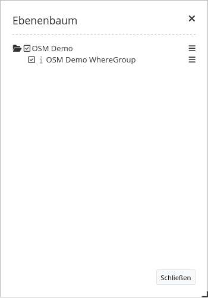
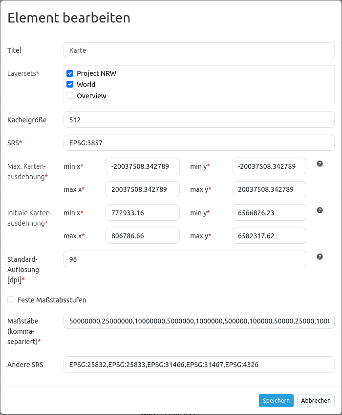

.. _layertree_de:

Layertree - Table of Content (Ebenenbaum)
*****************************************

Funktionen
==========

**Was kann der Layertree?**

* Anzeige von Layern
* Anzeige von Layergruppen
* Anzeige thematischer Layergruppen
* Aktivieren und Deaktivieren von Layern
* Aktivieren und Deaktivieren der Abfrage von Layern
* Verändern der Layerreihenfolge
* Zoom zum Kartenausschnitt eines Layers
* Abfrage der Metadaten eines Layers
* Zeitliche Dimension des Layers kontrollieren

           Einfacher Ebenenbaum im Dialogfenster zeigt Dienste mit Ebenen. Der Ebenenbaum wurde über einen Button eingebunden.

.. figure:: ../../../figures/layertree/layertree_example_sidepane.png
           :scale: 80
           :alt: Die Nutzung in der Seitenleiste ist möglich. Thematischer Ebenenbaum zeigt die Titel der Layersets in der Seitenleiste.

           Die Nutzung in der Seitenleiste ist möglich. Thematischer Ebenenbaum zeigt die Titel der Layersets in der Seitenleiste.

Zur Konfiguration des Layerbaums gibt es verschiedene Verknüpfungspunkte zu anderen Elementen, die beachtet werden müssen: 

* `Layersets <../backend/layerset.html>`_
* `Kartenelement <map.html>`_
* `Datenquellen <../backend/source.html>`_

Konfiguration
=============

Allgemeine Konfiguration
------------------------

**Was muss gemacht werden?**

Um die unterschiedlichen Layersets im Layertree nutzen zu können, sind verschiedene Anpassungen notwendig. Diese betreffen die:

#. Einrichtung verschiedener Layersets
#. Einrichtung in der Karte zur Anzeige der Layersets
#. Einrichtung des Layertrees selbst

Über die **Layersets** werden die gewünschten Layer in die Anwendung eingebunden. 
Die Instanzen sind die Referenzen auf die einzelnen WMS-Dienste. Über den Plus-Button **[1]** können neue Layersets erstellt werden. In die neuen Layersets können dann neue Layer über das Hinzufügen der bestehenden Instanzen **[2]** eingebunden werden. Das Layerset "overview" **[3]** wird – wie gehabt – für die Anzeige der Übersichtskarte verwendet. 
Eine genaue Dokumentation, wie die Dienste korrekt eingebunden werden können, findet sich unter der Dokumentation des `Layersets <../backend/layerset.html>`_ und der `Datenquellen <../backend/source.html>`_. 

.. figure:: ../../../figures/layertree/layertree_configuration_layerset.png
           :scale: 80
           :alt: Einrichtung verschiedener Layersets für die Einbindung in den Layertree.

           Einrichtung verschiedener Layersets für die Einbindung in den Layertree.

Damit die neu eingebundenen Layersets auch in der Anwendung erscheinen, müssen diese in dem `Kartenelement <map.html>`_ angegeben werden. 
Hier gibt man durch das Ankreuzen der Layersets an, welche Layersets in der Kartenansicht verwendet werden sollen. Das Layerset "overview" wird beispielsweise nicht in der Hauptkarte angezeigt.  
In diesem Schritt wird auch die Reihenfolge definiert, in der die Layersets im Layertree und in der Karte erscheinen sollen. Die erstellten Layersets können in der Auflistung per Drag & Drop verschoben werden. Bitte achten Sie darauf, dass die weiter oben definierten Themen die darunter liegenden Themen überdecken können.

.. figure:: ../../../figures/layertree/layertree_configuration_map_simple.png
           :scale: 80
           :alt: Einrichtung in der Karte (Map-Element) zur Anzeige der Layersets.

           Einrichtung in der Karte (Map-Element) zur Anzeige der Layersets.

Workflow einfacher Layertree
----------------------------

Im Folgenden gehen wir eine beispielhafte Konfiguration eines Layertrees mit Basisfunktionen in drei Schritten durch: 

#. Einrichtung eines Layersets
#. Einrichtung in der Karte zur Anzeige des Layersets
#. Einrichtung des Layertrees

**Einrichtung eines Layersets**

In dem folgenden Beispiel ist ein **Layerset** mit einer Instanz definiert:

* Layerset World: 
  * Instanz `OSM Demodienst <https://osm-demo.wheregroup.com/service?&REQUEST=GetCapabilities&SERVICE=WMS&VERSION=1.3.0>`_

Die Instanz des OSM-Demodienstes ist bei der Installation automatisch dabei. Diese muss nur noch über den Reiter Layersets in ein bestehendes Layerset eingebunden werden. In dem folgenden Beispiel wurde das Layerset "YAML-main" in "World" umbenannt. 
Bei Schwierigkeiten mit der Einbindung kann die Dokumentation der `Layersets <../backend/layerset.html>`_ weiterhelfen. 

.. figure:: ../../../figures/layertree/layertree_configuration_layerset_simple.png
           :scale: 80
           :alt: Einrichtung eines Layersets für die Einbindung in den einfachen Layertree.

           Einrichtung eines Layersets für die Einbindung in den einfachen Layertree.

**Einrichtung in der Karte zur Anzeige des Layersets**

Als nächstes erfolgt die Einrichtung des `Kartenelements <map.html>`_  zur Anzeige des Layersets in der **Karte**. Dazu wechseln wir in den Reiter "Layouts" und bearbeiten das Kartenelement über den Content-Bereich.
Wichtig ist nun, dass bei dem Bereich Layersets ein Häckchen bei dem Layerset World gesetzt ist, damit dieses Layerset später in der Anwendung angezeigt wird. 
Bei Fragen zur weiteren Konfiguration der Karte kann die Dokumentation des `Kartenelements <map.html>`_ weiterhelfen.

.. figure:: ../../../figures/layertree/layertree_configuration_map_simple.png
           :scale: 80 
           :alt: Einrichtung in dem Kartenelement zur Anzeige des Layersets.

           Einrichtung in dem Kartenelement zur Anzeige des Layersets.

**Einrichtung des Layertrees**

Als letzter Schritt erfolgt die Einrichtung des **Layertrees** selbst. 
Die in dem Kartenelement angegebenen Instanzen können im Layertree noch genauer definiert werden. Wenn eine vordefinierte Anwendung kopiert wurde, sollte der Layertree jetzt schon funktionieren. Bindet man das Element neu in die Anwendung ein, so kann dieses mit den Standardeinstellungen bereits genutzt werden, ohne dass weitere Anpassungen zwingend nötig sind.
Für das Verstehen der Funktionen und das eigene Erstellen eines Layertrees bearbeiten wir nun das Ebenenbaum-Element in dem Content-Bereich.

           Einrichtung des einfachen Layertrees im Content-Bereich.

Bei der Konfiguration der Layersets ist standardisiert das Häckchen Basesource aktiviert. Dieses ist wichtig für den `Themenwechsler <basesourceswitcher.html>`_, mit dem man zwischen vordefinierten Themen wechseln kann. Über das Häckchen bei **BaseSources anzeigen** werden Instanzen, die als Basesource in die Anwendung geladen wurden, auch in dem Layertree angezeigt. 

Wenn **Automatisches Öffnen** aktiv ist, ist der Layertree direkt beim Öffnen der Anwendung offen und muss nicht erst durch das Klicken auf einen Button oder das Aufklappen einer Seitenleiste aktiviert werden. Der **Titel** des Elements wird in der "Layouts"-Liste angezeigt und ermöglicht, mehrere Elemente voneinander zu unterscheiden. **Target** ist die ID des Kartenelements, auf das sich das Element bezieht.

Durch die Angabe eines **Type** kann die Anzeige des Layertrees in der Anwendung definiert werden. Bei der Angabe handelt es sich um ein Pflichtfeld. Dabei gibt es zwei Anzeigeoptionen:  

:Dialog: 
  Der Type *Dialog* muss gewählt werden, wenn der Layertree über einen Button eingebunden wird und sich das Konfigurations-Element im Content-Bereich befindet.
:Element:
  Für die Einbindung des Layertrees im Sidepane-Bereich muss der Type *Element* gewählt werden.

.. figure:: ../../../figures/layertree/layertree_type_map.png
           :scale: 80
           :alt: Position des Layertrees als Element und Dialog in der Anwendung.

           Position des Layertrees als Element und Dialog in der Anwendung.

Über **Menu** kann eine Auswahl von Buttons aktiviert werden, die dann dem Benutzer der Anwendung im Ebenenbaum zur Verfügung gestellt werden.

* *Remove layer* (Löschen von Layern aus der Anwendung erlauben)
* *Opacity* (Deckkraft der einzelnen Layer verändern)
* *Zoom to layer* (Layer zentriert in seiner vollen Ausdehnung anzeigen)
* *Metadata* (Metadaten des Layers anzeigen)
* *Dimension* (Dimension des Layers kontrollieren, bspw. Höhe oder Zeit - mehr unter `Dimensions handler <../misc/dimensions_handler.html>`_ )

.. figure:: ../../../figures/layertree/layertree_menu.png
           :scale: 80
           :alt: Konfiguration der Funktionen für das Kontextmenü.

           Konfiguration der Funktionen für das Kontextmenü.

Die einzelnen Funktionen können durch Klicken auf die Schaltfläche aktiviert werden. Alle aktiven Funktionen werden bunt hinterlegt und in der Anwendung erscheint im Layertree rechts neben jedem Layer ein Symbol für das Kontextmenü. Durch den Klick auf den Menü-Button rechts neben dem Layernamen klappt ein Fenster auf und die einzelnen Funktionen können genutzt werden. Durch den Klick auf den x-Button rechts oben kann das Menü wieder geschlossen werden.

.. figure:: ../../../figures/layertree/layertree_menu_map.png
           :scale: 80
           :alt: Kontextmenü der Layer im Layertree

           Kontextmenü der Layer im Layertree.

Der Slider im Layertree Menü erscheint durch die Funktion *Opacity*. Hierüber lässt sich durch das Verschieben des Kästchens die Deckkraft der einzelnen Layer bestimmen. Die prozentuale Deckkraft wird als ganze Zahl in dem Kästchen angezeigt.

Per Klick auf die Lupe kann auf die gesamte Ausdehnung der Ebene gezoomt werden.

Über einen Klick auf das Infoblatt im Layertree Menü können die Metadaten des Layers angezeigt werden. Falls der Dienst Metadaten enthält, werden diese in einem neuen Dialog dargestellt.

Der Klick auf das nebengeordnete "x" im Layertree Menü ermöglicht das Entfernen eines Layers aus der Anwendung für die Dauer der Sitzung. 

Die Funktion **Visibility bei Ordnern ausblenden** ermöglicht die Sicherung der Deckkraft. Bei aktiver Funktion wird die Deckkraft der einzelnen Ebenen nicht angezeigt und kann nicht verändert werden.

Die Checkbox **Info ausblenden** ermöglicht das Deaktivieren der Informationsabfrage. Die Einstellungen zur Informationsabfrage sind unabhängig von den Einstellungen im Layerset oder Dienst dann nicht mehr möglich.

Die Checkbox **Thematischer Layer** aktiviert die thematische Einteilung von Ebenen. Im nächsten Abschnitt erfolgt ein Anwendungsbeispiel zur Verdeutlichung.

Die Checkbox **Erlaubt sortieren im Layerbaum** steuert, ob ein freies Umsortieren von Ebenen per Drag & Drop im Ebenenbaum erfolgen darf.

           Einrichtung des einfachen Layertrees im Content-Bereich.

Durch einen Klick auf das Ordnersymbol des Layertrees links neben der Instanz können die eingebundenen Layer angezeigt werden. Alle Layer, die vorher bei dem Einbinden in das Layerset aktiviert wurden, erscheinen nun in der Liste.

.. figure:: ../../../figures/layertree/layertree_buttons.png
           :scale: 80
           :alt: Layertree Buttons.

           Layertree Buttons.

Die Checkbox neben dem jeweiligem Layernamen ermöglicht das An- und Ausschalten eines Layers. Ist das Häkchen gesetzt, erscheint der Layer in der Karte. Es werden jedoch weiterhin die im Layerset definierten Regeln beachtet, wie z.B. maßstabsabhängige Anzeigen.

Das "i"-Symbol neben einem Layernamen zeigt an, ob die Informationsabfrage aktiviert ist. Wenn das "i"-Symbol keine Umrandung hat, ist die Informationsabfrage nicht aktiv. Wird diese durch einen Klick aktiviert, so wird das Symbol durch eine kreisliche Umrandung hinterlegt und bei einer Informationsabfrage erscheinen die Informationen zu dem Layer. 

Workflow thematischer Layertree
-------------------------------

Im Folgenden gehen wir eine komplexe beispielhafte Konfiguration eines Layertrees mit erweiterten Funktionen, wie z.B. den thematischen Layersets, in drei Schritten durch: 

#. Einrichtung mehrerer Layersets
#. Einrichtung in der Karte zur Anzeige der Layersets
#. Einrichtung des thematischen Layertrees

**Einrichtung mehrerer Layersets**

In dem folgenden Beispiel sind zwei **Layersets** mit jeweils zwei Instanzen definiert:

* Layerset Project NRW:
  * Instanz `DTK50 NRW <https://www.wms.nrw.de/geobasis/wms_nw_dtk50?&REQUEST=GetCapabilities&SERVICE=WMS&VERSION=1.3.0>`_ 
  * Instanz `Wald NRW <http://www.wms.nrw.de/umwelt/waldNRW?&REQUEST=GetCapabilities&SERVICE=WMS&VERSION=1.3.0>`_
* Layerset World: 
  * Instanz `OSM Demodienst <http://osm-demo.wheregroup.com/service?&REQUEST=GetCapabilities&SERVICE=WMS&VERSION=1.3.0>`_ 
  * Instanz `GEBCO <https://www.gebco.net/data_and_products/gebco_web_services/web_map_service/mapserv?&REQUEST=GetCapabilities&SERVICE=WMS&VERSION=1.3.0>`_ 

Für die Einrichtung der Layersets wurden die vier oben genannten Dienste als Instanzen hinzugefügt (detaillierte Info s.o. oder in der Doku der `Layersets <../backend/layerset.html>`_ und `Dienste <../backend/source.html>`_).

Für dieses Beispiel wurden die oben genannten Schritte durchgeführt, um das Layerset "World" **[3]** mit der Instanz "osm" hinzuzufügen. Nun fügen wir in dieses Layerset noch die Instanz "GEBCO" hinzu. 
Um die thematische Gruppierung gut nutzen zu können, erstellen wir nun ein neues Layerset mit dem Namen "Project NRW" **[2]** und laden in dieses die beiden oben genannten Instanzen "DTK50 NRW" und "Wald NRW" ein.

.. figure:: ../../../figures/layertree/layertree_configuration_layerset_komplex.png
           :scale: 80
           :alt: Konfiguration der Layersets für den thematischen Layertree

           Konfiguration der Layersets für den thematischen Layertree.

Das Layerset sollte nun drei Layersets enthalten. Die **Overview** [1] für die Übersichtskarte, das **Project NRW** Layerset [2] mit den zwei regionalen Datensets aus NRW und das **World**-Layerset [3] mit den überregionalen Layern. 

**Einrichtung in der Karte zur Anzeige der Layersets**

Als nächstes erfolgt die Einrichtung des `Kartenelements <map.html>`_ zur Anzeige des Layersets in der Karte. Dazu wechseln wir in den Reiter "Layouts" und bearbeiten das Kartenelement in dem Content-Bereich.
Wichtig ist nun, dass bei dem Bereich Layersets ein Häckchen bei dem Layerset "World" UND dem Layerset "Project NRW" gesetzt ist, damit diese später in der Anwendung angezeigt werden. 
Bei Fragen zur weiteren Konfiguration der Karte kann die Dokumentation des `Kartenelements <map.html>`_ weiterhelfen.

           Konfiguration des Kartenelements für den thematischen Layertree.

**Einrichtung des thematischen Layertrees**

Als letzter Schritt erfolgt die Einrichtung des Layertrees selbst. 
Die in dem `Kartenelement <map.html>`_ angegebenen Instanzen können im Layertree noch genauer definiert werden. Die Erklärungen für den einfachen Ebenenbaum weiter oben können nützlich für das Verstehen der Funktionen und das eigene Erstellen eines Layertrees sein.

           Einrichtung des einfachen Layertrees im Content-Bereich.

Für den thematischen Layertree binden wir den Ebenenbaum in diesem Beispiel in die Seitenleiste ein. Für die Einbindung in dem Sidepane-Bereich muss daher der Type *Element* gewählt werden.

.. figure:: ../../../figures/layertree/layertree_type.png
           :scale: 80
           :alt: Einrichtung des Type Element.

           Einrichtung des Type Element.

Ist die Option **Thematischer Layer** ausgeschaltet, benutzt der Layertree nicht die konfigurierten Layersets und zeigt die einzelnen Instanzen ohne thematische Strukturierung in der Hauptebene an. Nun wollen wir jedoch die Layer über unsere thematischen Layersets anzeigen, daher aktivieren wir die Funktion **Thematischer Layer**. 
Da wir in dem `Kartenelement <map.html>`_ beide Layersets in die Anwendung eingebunden haben, werden diese nun unter dem **Themen**-Bereich angezeigt.

.. figure:: ../../../figures/layertree/layertree_configuration_2.png
           :scale: 80 
           :alt: Einrichtung des thematischen Layertrees im Content-Bereich.

           Einrichtung des thematischen Layertrees im Content-Bereich.

Damit die **Themen** in der Anwendung wie gewünscht angezeigt werden, gibt es verschiedene Einstellungsmöglichkeiten: 

.. figure:: ../../../figures/layertree/layertree_example_sidepane_config.png
           :scale: 80

:[1] Thema anzeigen:
  Ist diese Option gesetzt, wird das Layerset als zusätzliche Ebene angezeigt. Ist diese Option nicht gesetzt, werden die enthaltenen Layer-Instanzen in der Hauptebene angezeigt.
:[2] Thema offen oder geschlossen:
  Ist diese Option gesetzt (Symbol des geöffneten Ordners), ist das Thema im Layertree automatisch ausgeklappt.

Wenn wir nun bei dem Themenset "World" die Standardeinstellungen beibehalten und bei dem Themenset "Project NRW" die anderen Optionen aktivieren, sieht die Konfiguration des Elements so aus: 

.. figure:: ../../../figures/layertree/layertree_example_sidepane_config.png
           :scale: 80
           :alt: Einrichtung der thematischen Layersets im Content-Bereich.

           Einrichtung der thematischen Layersets im Content-Bereich.

Wir haben die Layersets somit als thematische Gruppen in den Ebenenbaum eingebunden. Durch die Konfiguration der thematischen Layer stellt sich der Layertree in der Anwendung nun wie folgt dar: 

.. figure:: ../../../figures/layertree/layertree_example_sidepane.png
           :scale: 80
           :alt: Aufbau des thematischen Layersets in der Seitenleiste.

           Aufbau des thematischen Layersets in der Seitenleiste.

Das Layerset "World" wird als Thema angezeigt, ist jedoch nicht geöffnet. Bei dem Layerset "Project NRW" wird das Thema beim Öffnen der Anwendung aufgeklappt gezeigt. Zusätzlich können alle Layer können über einen Button aktiviert werden.

YAML-Definition:
=================

Diese Vorlage kann genutzt werden, um das Element in einer YAML-Anwendung einzubinden.

   .. code-block:: yaml    

    title: layertree                                    # Titel des Layerbaums
    target: ~                                           # ID des Kartenelements  
    type: ~                                             # Typ des Layerbaums (Element oder Dialog)
    autoOpen: false                                     # Öffnet Layerbaum beim Start der Anwendung (Standard: false)
    showBaseSource: true                                # Zeigt den Basislayer an (Standard: true)
    showHeader: true                                    # Zeigt eine Überschrift, die die Anzahl der Services zählt (Standard: true)
    menu: [opacity,zoomtolayer,metadata,removelayer]    # Zeigt ein Kontextmenü für den Layer an (wie Transparenz, Zoom auf Layer, Anzeige des Metadatendialogs,                                                             Layer entfernen)
    hideInfo: null               
    hideSelect: null             
    allowReorder                 
    themes: {  }                    
