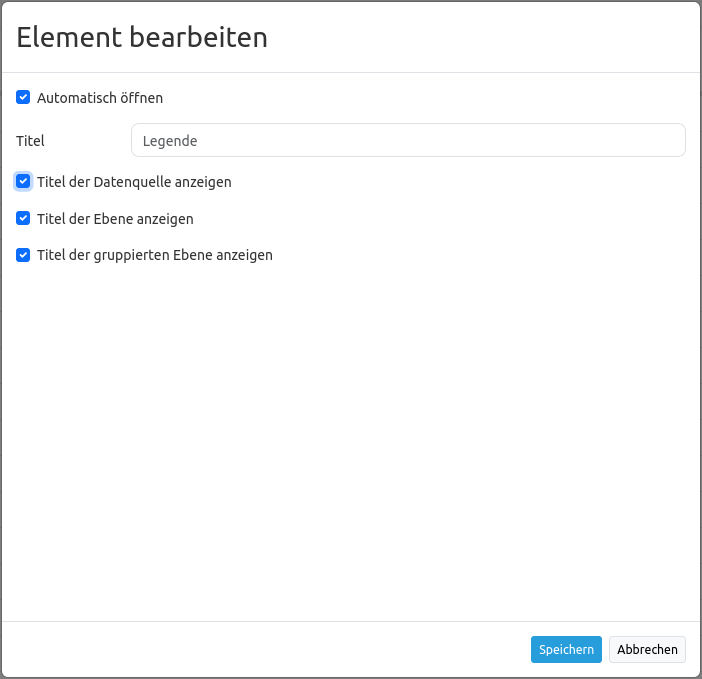
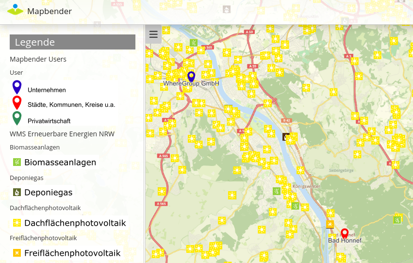
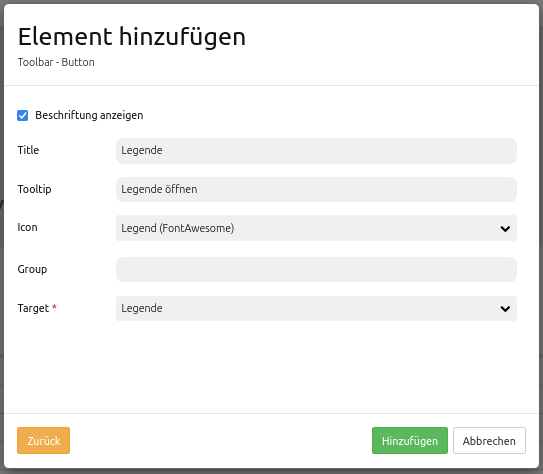

.. _legend:

Legende
************

Dieses Element zeigt eine Legende der Layer an, die in der Karte dargestellt werden. Dabei wird jeder einzelne Layer mit seinen Punkte, Flächen und Linien aufgelistet.

.. image:: ../../../figures/legend.png
     :scale: 80

Konfiguration
=============

* **Automatisches Öffnen:** true, wenn die Legende beim Start der Anwendung geöffnet werden soll, der Standardwert ist false.
* **Ebenen ohne Objekte ausblenden:** Layer wird nicht aufgelistet, wenn keine Legende erzeugt werden kann, der Standardwert ist true.
* **Title:** Titel des Elements. Dieser wird in der Layouts Liste angezeigt. Der Titel wird außerdem neben dem Button angezeigt, wenn "Beschriftung anzeigen" aktiviert ist.
* **Tooltip:** Text, der angezeigt wird, wenn der Mauszeiger eine längere Zeit über dem Element verweilt.
* **Element type:** Anzeige als Dialog- oder Blockelement, Standard ist Dialog.
* **Display type:** akkordeonartige Anzeige oder Liste. Standard ist Liste.
* **Target:** ID des Kartenelements, auf das sich das Element bezieht. 

* **Legenden-URL generieren:** generiert eine GetLegendGraphic-Url, wenn die Operation GetLegendGraphic unterstützt wird, der Standardwert ist false.
* **Titel der Datenquelle anzeigen:** zeigt den WMS Titel, der Standardwert ist true.
* **Titel der Ebene anzeigen:** zeigt den Layertitel, der Standardwert ist true.
* **Titel der gruppierten Ebenen anzeigen:** zeigt den Gruppenlayertitel für gruppierte Layer, der Standardwert ist true.

Für das Element wird ein Button oder die Sidepane verwendet. Zu der Konfiguration des Buttons besuchen sie die Dokumentationsseite unter `Button <../misc/button.html>`_.

Konfigurationsbeispiele
=======================
Legende in der Sidepane
-----------------------
Die Legende in der Sidepane wird über das ``+`` -Zeichen in der Anwendung unter Layouts, Sidepane eingebunden.

.. image:: ../../../figures/de/add_sidepane.png
     :scale: 80

Im Dialogfeld wird das Element "Legende" ausgewählt. Anschließend öffnet sich der Konfigurationsdialog "Element hinzufügen – Legende".

.. image:: ../../../figures/de/legend_example_sidepane_dialog.png
     :scale: 80

Das hier konfigurierte Element hat den Titel "Legende". Es entspricht dem *Element type* "blockelement", da es in der Sidepane fest eingebunden ist. Der *Display type* ist "list" und das *Target* die "Main Map". Die Legende öffnet sich automatisch (Häkchen bei *Automatisches Öffnen*) und blendet die Ebenen aus, in denen keine Objekte vorhanden sind (Häkchen bei *Ebenen ohne Objekte ausblenden*). Der Titel der Ebenen wird angezeigt sowie der Titel der gruppierten Ebenen (Häkchen bei *Titel der Ebene anzeigen* und *Titel der gruppierten Ebene anzeigen*). 

Diese Konfiguration ergibt folgendes Ergebnis in der Anwendung:

Es wird empfohlen, dass die Legende immer als "blockelement" eingebunden wird, wenn diese in der Sidepane angezeigt werden soll. Wird sie als *Element type* "dialog" eingebunden, öffnet sich ein Dialogfeld und die Legende wird nicht in der Sidepane angezeigt. Lediglich die Überschrift "Legende" ist zu sehen. Sofern dieser Dialog geschlossen wurde, ist dieser nicht mehr aufrufbar. Falls die Legende in der Toolbar eingebunden werden soll, empfiehlt es sich diese über einen Button zu konfigurieren und nicht über das Element Legende.

Legende in der Toolbar
-----------------------
Die Legende kann auch als Button in der Toolbar eingebunden werden. Hierfür muss zuerst das Element Legende in der Anwendung unter dem Reiter Layouts im Content integriert werden.

.. image:: ../../../figures/de/add_content.png
     :scale: 80
     
Für das Konfigurationsbeispiel wurden folgende Einstellungen gewählt:

.. image:: ../../../figures/de/legend_example_toolbar_dialog.png
     :scale: 80

Wichtig ist hier den *Element type* auf "dialog" einzustellen. Für das Konfigurationsbeispiel wurde das Häkchen bei *Automatisches Öffnen* entfernt, so dass sich die Legende nur bei aktivem Klicken auf den Button öffnet.
Sobald dieses Element im Content eingebunden wurde, muss ein Button in der Toolbar eingefügt werden. Die Konfiguration von Buttons wird in der Mapbender3-Dokumentation unter `Button <../misc/button.html>`_ beschrieben.

Die Konfiguration eines Buttons für die Legende kann wie folgt aussehen:

Mit diesen Einstellungen sieht das Ergebnis in der Anwendung wie folgt aus:

.. image:: ../../../figures/de/legend_example_toolbar.png
     :scale: 80
     
In der Toolbar ist der Button für das Legenden-Element zu sehen. Sobald auf den Button geklickt wird öffnet sich das Dialogfeld und zeigt die Legende an.

Inwiefern sich die Aktivierung bzw. Deaktivierung einzelner Haken auf die Legende auswirkt, ist hier zu sehen:

.. image:: ../../../figures/de/legend_example_toolbar_oOTDTETGE.png
     :scale: 80

.. image:: ../../../figures/de/legend_example_toolbar_TDTETGE.png
     :scale: 80
     
     
.. image:: ../../../figures/de/legend_example_toolbar_TETGE.png
     :scale: 80

YAML-Definition:
----------------

.. code-block:: yaml

   tooltip: 'Legend'                    # Text des Tooltips
   elementType: dialog                  # Anzeige als Dialog- oder Blockelement, Standard ist Dialog.
   autoOpen: true                       # true, wenn die Legende beim Start der Anwendung geöffnet werden soll, der Standardwert ist false.
   displayType: list                    # akkordeonartige Anzeige oder Liste. Standard ist Liste.
   target: ~                            # ID des Kartenelements
   hideEmptyLayer: true                 # true/false Layer wird versteckt, wenn keine Legende verfügbar ist, der Standardwert ist true
   generateGetLegendGraphicUrl: false   # true/false generiert eine GetLegendGraphic-Url, wenn die Operation GetLegendGraphic unterstützt wird, der Standardwert ist false
   showWmsTitle: true                   # true/false zeigt den WMS Titel, der Standardwert ist true
   showLayerTitle: true                 # true/false zeigt den Layertitel, der Standardwert ist true
   showGroupedLayerTitle: true          # true/false zeigt den Gruppentitel für gruppierte Layer, der Standardwert ist true

Class, Widget & Style
============================

* **Class:** Mapbender\\CoreBundle\\Element\\Legend
* **Widget:** mapbender.element.legend.js
* **Style:** mapbender.element.legend.css

HTTP Callbacks
==============

Keine.

JavaScript API
==============

open
----------

Zeigt die Legend.

JavaScript Signals
==================

Keine.
