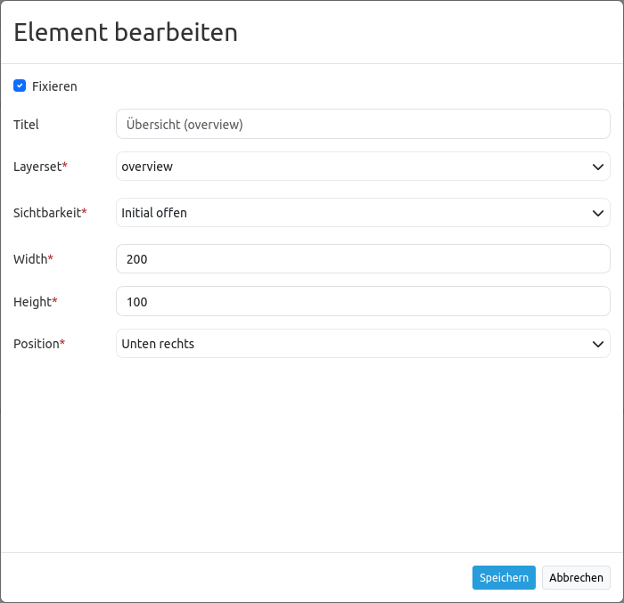

.. _overview_de:

Overview (Übersicht)
********************

Mapbender bietet neben der Hauptkarte auch eine Übersichtskarte an. Dieses Element kann in Größe, Position und Zoom-Verhalten individuell angepasst werden. Es bezieht sich auf ein bestimmtes Layerset und die darin definierten Instanz(en). 

.. image:: ../../../figures/overview.png
     :scale: 80

Konfiguration
=============

Der Konfigurationsdialog:

.. image:: ../../../figures/de/overview_configuration.png
     :scale: 80

* **Maximieren:** Definiert, ob der Kartenrahmen beim Start maximiert (ausgeklappt) oder minimiert (eingeklappt) ist (Standard: true).
* **Fixieren:** Definiert, ob die Übersichtskarte in ihrem Maßstab fixiert sein soll (Standard: false).
* **Title:** Titel des Elements, wird in der Layouts-Liste angezeigt.
* **Layerset:** Layerset, das im Kartenrahmen angezeigt werden soll.
* **Width/Height:** Breite und Höhe der Übersichtskarte.
* **Position:** Position des Übersichtskartenrahmens in der Anwendung; Auswahlmöglichkeiten: oben links, unten links, oben rechts, unten rechts.

Konfigurationsbeispiel
======================

Das Element bietet verschiedene Konfigurationsmöglichkeiten. Im Beispiel sind die Einstellungen *Maximieren* sowie *Fixieren* aktiviert. Dadurch wird das Element beim Öffnen der Anwendung direkt angezeigt (d.h. maximiert), zusätzlich ist die Ansicht der Karte fixiert. Ist die Übersicht nicht fixiert, dann passt sich die Übersichtskarte dem entsprechenden Kartenausschnitt der Hauptkarte an, sobald diese verschoben oder ihr Maßstab verändert wird. Als Startansicht beim Öffnen der Anwendung wird der Startextent angezeigt. Das Element hat im Beispiel den Standardtitel "Übersicht (overview)". Es ist außerdem notwendig, dass die Übersichtskarte mit einem Layerset verknüpft wird. In diesem Beispiel stehen folgende Layersets zur Auswahl:

.. image:: ../../../figures/de/map_example_layersets.png
     :scale: 80

Für die Übersicht wurde das Layerset "overview" gewählt. Breite (*Width*) sowie Höhe (*Height*) des Elements entsprechen der Standardeinstellung. Die Position ist als "Unten rechts" definiert. Das Element sieht in der Anwendung folgendermaßen aus:

.. image:: ../../../figures/de/overview_example_right-bottom_fixed.png
     :scale: 80

Bei Anpassung der folgenden Parameter (kein Haken bei *Fixieren*, *Position*: unten links, *Width* 400 und *Height* 200) in der Konfiguration sieht die Übersicht in der Anwendung nach Einklappen der Sidepane wie folgt aus:

.. image:: ../../../figures/de/overview_example_left-bottom.png
     :scale: 80

YAML-Definition:
----------------

.. code-block:: yaml

   tooltip: 'Overview'          # Text des Tooltips
   target: ~                    # ID des Kartenelements
   layerset: ~                  # vorher definiertes Layerset, das angezeigt werden soll.
   width: 200                   # Breite der Übersicht
   height: 100                  # Höhe der Übersicht
   anchor: 'right-top'          # Ausrichtung der Übersicht, Standard ist 'right-top' (rechts oben)
                                # Benutzen Sie inline z.B. für die Sidebar
                                # Optionen: 'inline', 'left-top', 'right-top', 'left-bottom', 'right-bottom'
   position: ['0px', '0px']     # Position der Übersicht in Relation zum Anker, Standard: x=0px, y=0px
   maximized: true              # true/false ob die Applikation beim Start maximiert ist, der Standardwert ist true
   fixed: true                  # true/false um den Übersichtsbereich zu fixieren, der Standardwert ist true

