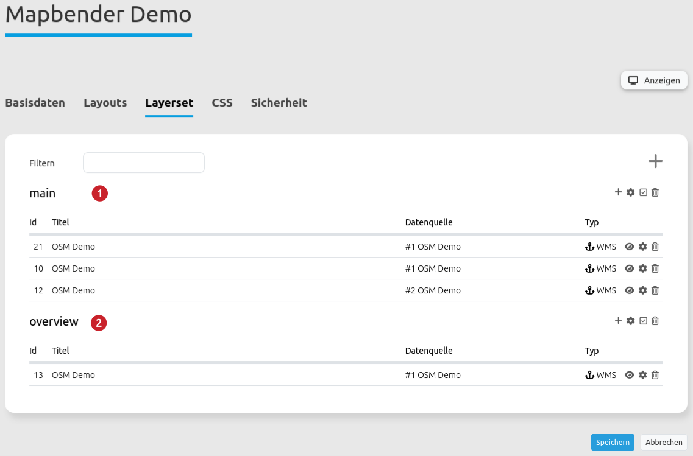

.. _overview_de:

Overview (Übersicht)
***********************

Mit diesem Element kann eine Übersichtskarte erstellt werden, ähnlich wie in OpenLayers. Es kann die Größe des Übersichtsfensters und die Position bestimmt werden. In der Übersicht wird ein vorher definiertes Layerset angezeigt. Die Übersichtskarte kann fixiert sein, oder sie ist zoomfähig, d.h. wenn in der Hauptkarte gezoomt wird, wird dies auch in der Übersicht angezeigt. Es kann auch definiert werden, ob die Übersichtskarte nach dem Öffnen der Applikation minimiert oder maximiert ist. Durch klicken innerhalb der Übersichtskarte kann die Anzeige der Hauptkarte zu einem bestimmten Punkt springen.

.. image:: ../../../figures/overview.png
     :scale: 80

Konfiguration
=============

Die Übersichtskarte muss in der Konfiguration unterhalb der Karte (map) platziert werden.

.. image:: ../../../figures/overview_configuration_dependency_map.png
   :scale: 80

Der Konfigurationsdialog:

.. image:: ../../../figures/de/overview_configuration.png
     :scale: 80

* **Maximieren:** definiert, ob die Applikation beim Start maximiert ist, der Standardwert ist true.
* **Fixieren:** Bereich der Übersichtskarte kann fixiert werden, der Standardwert ist true.
* **Title:** Titel des Elements. Dieser wird in der Layouts Liste angezeigt.
* **Tooltip:** Text, der angezeigt wird, wenn der Mauszeiger eine längere Zeit über dem Element verweilt.
* **Layerset:** vorher definiertes Layerset, das angezeigt werden soll.
* **Target:** ID des Kartenelements, auf das sich das Element bezieht.
* **Anchor:** Ausrichtung der Übersicht, Standard ist 'right-top' (rechts oben); Auswahlmöglichkeit: left-top (links-oben), left-bottom (links-unten), right-top (rechts-oben), right-bottom (rechts-unten).
* **Width/ Height:** Breite und Höhe der Übersichtskarte.

Konfigurationsbeispiel
======================
Für das Übersichtselement können unterschiedliche Einstellungen vorgenommen werden.

.. image:: ../../../figures/de/overview_example_dialog.png
     :scale: 80

Im Konfigurationsbeispiel wird das Element mit der Bezeichnung (*Title*) "Übersicht (overview)" eingebunden. Unter *Layerset* können alle Layersets ausgewählt werden, die vorher in der Anwendung unter Layerset eingebunden wurden. In diesem Beispiel stehen folgende zwei zur Auswahl:

Für die Übersicht wurde das Layerset overview gewählt. Als *Target* wird das Kartenelement gewählt, auf das sich das Element bezieht. *Anchor* gibt an, an welcher Stelle die Übersicht eingefügt werden soll. Zur Auswahl stehen left-top, left-bottom, right-top und right-bottom. Hier wurde right-bottom gewählt. *Width* und *Height* definieren die Größe des Fensters, in dem die Übersicht angezeigt wird. Per default sind hier 200 und 100 eingestellt. Neben den Feldern können bei den Einstellungen *Maximieren* und *Fixieren* Häkchen gesetzt werden. Für das Konfigurationsbeispiel sind beide Haken aktiv. Also wird die Übersicht beim Öffnen der Anwendung angezeigt, d.h. maximiert. Zusätzlich ist die Ansicht der Karte fixiert. Der Ausschnitt, der im Übersichtsfenster angezeigt wird, verändert sich nicht bei Verschieben der Karte und zeigt den Max. Extent an, der im  `Kartenelement <map.html>`_ definiert wurde.

.. image:: ../../../figures/de/overview_example_right-bottom_fixed.png
     :scale: 80

Ist die Übersicht nicht fixiert (kein Häkchen bei *Fixieren*), passt sich die Übersicht an, sobald die Karte verschoben oder der Maßstab verändert wird. Als Startansicht beim Öffnen der Anwendung wird der Startextent gezeigt.
Bei Anpassung der folgenden Parameter (kein Haken bei *Fixieren*, *Anchor*: left-bottom, *Width* 400 und *Height* 200) in der Konfiguration:

.. image:: ../../../figures/de/overview_example_dialog_left-bottom.png
     :scale: 80

Sieht die Übersicht in der Anwendung wie folgt aus:

.. image:: ../../../figures/de/overview_example_left-bottom.png
     :scale: 80

YAML-Definition:
----------------

.. code-block:: yaml

   tooltip: 'Overview'          # Text des Tooltips
   target: ~                    # ID des Kartenelements
   layerset: ~                  # vorher definiertes Layerset, das angezeigt werden soll.
   width: 200                   # Breite der Übersicht
   height: 100                  # Höhe der Übersicht
   anchor: 'right-top'          # Ausrichtung der Übersicht, Standard ist 'right-top' (rechts oben)
                                # Benutzen Sie inline z.B. für die Sidebar
                                # Optionen: 'inline', 'left-top', 'right-top', 'left-bottom', 'right-bottom'
   position: ['0px', '0px']     # Position der Übersicht in Relation zum Anker, Standard: x=0px, y=0px
   maximized: true              # true/false ob die Applikation beim Start maximiert ist, der Standardwert ist true
   fixed: true                  # true/false um den Übersichtsbereich zu fixieren, der Standardwert ist true

Class, Widget & Style
============================

* **Class:** Mapbender\\CoreBundle\\Element\\Overview
* **Widget:** mapbender.element.overview.js
* **Style:** mapbender.element.overview.css

HTTP Callbacks
==============

Keine.
