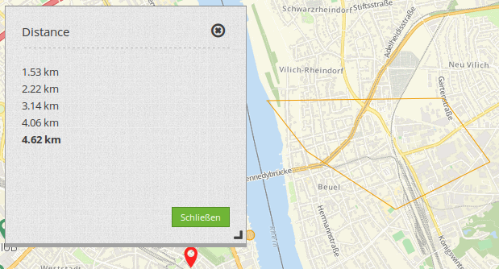
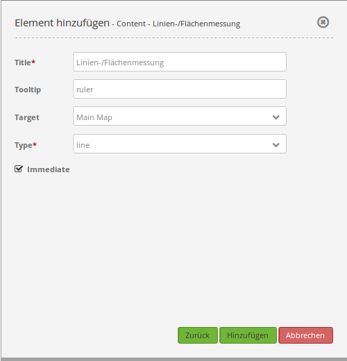

.. _ruler_de:

Linien-/Flächenmessung (Ruler)
******************************

Mit dem Lineal wird eine Linie oder eine Fläche gezeichnet, deren Länge oder Flächeninhalt berechnet wird. Für das Element wird ein Button verwendet. Die Konfiguration findet sich unter :ref:`button_de`.
Durch die Auswahl eines Typs wird bestimmt, ob das Element Linien oder Flächen misst. Jedes eingebundene Element kann nur entweder Linien oder Flächen messen. Für die Nutzung von beiden Funktionen (Flächen- und Linienmessung) in einer Anwendung werden zwei Buttons benötigt, die in einer gemeinsamen Gruppe sind.

Konfiguration
=============

* **Title:** Titel des Elements. Dieser wird im Backend in der Layouts Liste angezeigt. In der Anwendung selbst wird der Titel im Messfenster angezeigt.
* **Type:** Typ des Elements, entweder 'line' oder 'area' (misst nur einzelne Linien oder addiert diese zu einer Fläche).

YAML-Definition:
----------------

Diese Vorlage kann genutzt werden, um das Element in einer YAML-Applikation einzubinden.

.. code-block:: yaml

   title: mb.core.ruler.tag.line             # 'line', 'area' oder beliebigen Titel wählen
   class: Mapbender\CoreBundle\Element\Ruler # Element-Klasse
   target: map                               # ID des Kartenelements, z.B. 'map'
   type: line                                # Wählen Sie Typ 'line' oder 'area'

