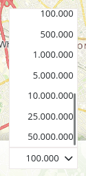
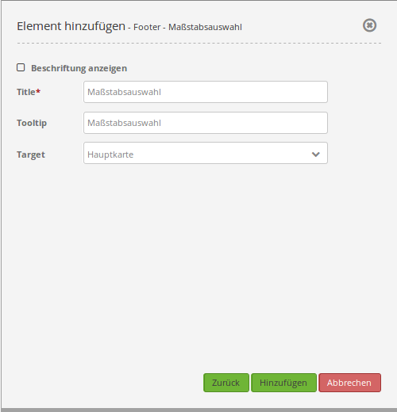

.. _scale_selector_de:

Scale Selector (Maßstabsauswahl)
********************************

Dieses Element zeigt eine Auswahlbox mit Maßstäben an. Der Kartenmaßstab ändert sich, wenn ein neuer Wert der Auswahlbox ausgewählt wird. Zudem ändert sich der Wert der Anzeige, wenn in die Karte hinein- oder herausgezoomt wird.
Beachten Sie: Die Auswahlbox zeigt nur Maßstäbe an, die vorher auch für das Map Element definiert wurden.

Konfiguration
=============

* **Beschriftung anzeigen:** True um die Maßstabsauswahl zu beschriften. Der Standardwert ist false.
* **Title:** Titel des Elements. Dieser wird unter dem Reiter Layouts angezeigt und ermöglicht, mehrere Button-Elemente voneinander zu unterscheiden. Der Titel wird außerdem neben der Auswahlbox angezeigt, wenn "Beschriftung anzeigen" aktiviert ist.
* **Tooltip:** Text, der angezeigt wird, wenn der Mauszeiger eine längere Zeit über dem Element verweilt.
* **Target:** ID des Kartenelements, auf das sich das Element bezieht.

YAML-Definition:
----------------

.. code-block:: yaml

   tooltip: "Maßstabsauswahl"  # Text des Tooltips
   target: ~         # ID des Kartenelements
   label: false      # false/true, um die Maßstabsauswahl zu beschriften. Der Standardwert ist false.

CSS-Styling
===========

Der Style des Elements (z.B. die Breite) kann mit folgendem CSS-Code überschrieben werden:

.. code-block:: css

                .mb-element-scaleselector.dropdown {
                    width: 200px;
                 }

