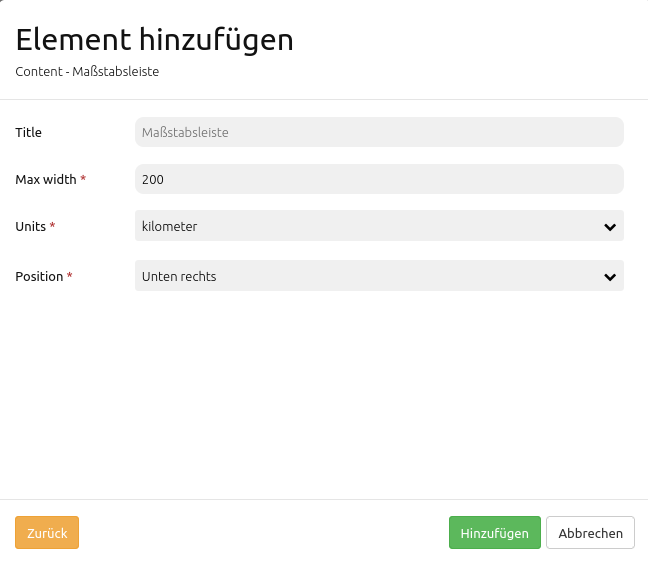

.. _scalebar_de:

ScaleBar (Maßstabsleiste)
**************************

Die ScaleBar ist eine schmale Linie, die den aktuellen Maßstab anzeigt.

.. image:: ../../../figures/scalebar.png
     :scale: 100

Konfiguration
=============

* **Title:** Titel des Elements. Dieser wird unter dem Reiter Layouts angezeigt.
* **Tooltip:** Text, der angezeigt wird, wenn der Mauszeiger eine längere Zeit über dem Element verweilt.
* **Target:** ID des Kartenelements, auf das sich die Scalebar bezieht.
* **MaxWidth:** Maximale Breite des Maßstabsbalkens, der Standardwert ist 200px.
* **Anchor:** Ausrichtung des Maßstabsbalkens, der Standardwert ist 'right-bottom' (rechts unten).
* **Units:** Einheiten des Maßstabsbalkens, 'kilometer' und/oder 'miles', der Standardwert ist 'kilometer'

YAML-Definition:
----------------

.. code-block:: yaml

   tooltip: 'Scale Bar'             # Text des Tooltips
   target: ~                        # ID des Kartenelements
   anchor: 'inline'/'left-top'/     # Ausrichtung des Maßstabsbalkens, der Standardwert ist 'right-bottom' (rechts unten)
     'left-bottom'/'right-top'/     # Benutzen Sie inline z.B. für die Sidebar
     'right-bottom'
   position: ['10px', '10px']       # Position des Maßstabsbalkens, der Standardwert ist: x=20px, y=20px
   maxWidth: 200                    # Maximale Breite des Maßstabsbalkens, der Standardwert ist 200
   units: ['km']                    # Einheiten des Maßstabsbalkens, 'kilometer' und/oder 'miles' (ml), Standard ist ['km']

Class, Widget & Style
============================

* **Class:** Mapbender\\CoreBundle\\Element\\ScaleBar
* **Widget:** mapbender.element.scalebar.js
* **Style:** mapbender.element.scalebar.css

