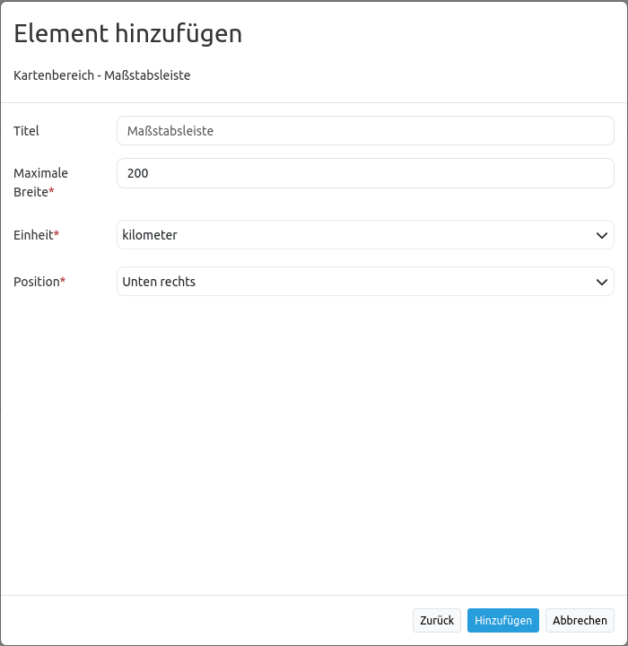

.. _scalebar_de:

Maßstabsleiste (ScaleBar)
*************************

Die Maßstabsleiste stellt den aktuellen Maßstab graphisch als Linie dar:

.. image:: ../../../figures/scalebar.png
     :scale: 100

Konfiguration
=============

* **Title:** Titel des Elements. Dieser wird unter dem Reiter Layouts angezeigt.
* **Max width:** Maximale Breite der Maßstabsleiste (Standardwert: 200px).
* **Units:** Die wählbaren Einheiten der Maßstabsleiste:'kilometer' oder 'miles' (Standardwert: kilometer)
* **Position:** Ausrichtung der Maßstabsleiste (Standardwert: Unten rechts).

YAML-Definition:
----------------

.. code-block:: yaml

   tooltip: 'Scale Bar'             # Text des Tooltips
   target: ~                        # ID des Kartenelements
   anchor: 'inline'/'left-top'/     # Ausrichtung des Maßstabsbalkens, der Standardwert ist 'right-bottom' (rechts unten)
     'left-bottom'/'right-top'/     # Benutzen Sie inline z.B. für die Sidebar
     'right-bottom'
   position: ['10px', '10px']       # Position des Maßstabsbalkens, der Standardwert ist: x=20px, y=20px
   maxWidth: 200                    # Maximale Breite des Maßstabsbalkens, der Standardwert ist 200
   units: ['km']                    # Einheiten des Maßstabsbalkens, 'kilometer' und/oder 'miles' (ml), Standard ist ['km']
