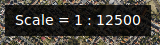
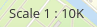
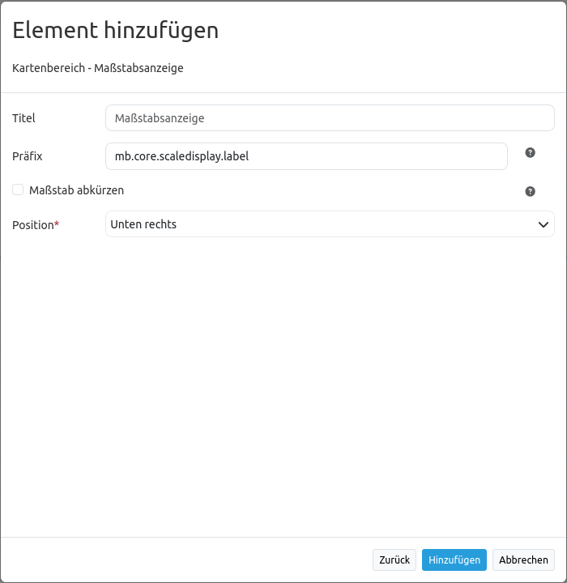

.. _scaledisplay_de:

ScaleDisplay (Maßstabsanzeige)
********************************

Das ScaleDisplay-Element zeigt den aktuellen Maßstab an (1:1K or 1: 1000).

Konfiguration
=============

* **Title:** Titel des Elements. Dieser wird in der Layouts Liste angezeigt und ermöglicht, mehrere Button-Elemente voneinander zu unterscheiden.
* **Tooltip:** Text, der angezeigt wird, wenn der Mauszeiger eine längere Zeit über dem Element verweilt.
* **Target:** ID des Kartenelements, auf das sich das ScaleDisplay-Element bezieht.
* **Scale prefix:** Bezeichnung, die vor der Maßstabsangabe steht, z.B. "Maßstab".
* **Unit prefix:** Wenn aktiviert, wird die Maßstabszahl nicht ausgeschrieben, sondern mit einem Präfix dargestellt, z.B. 1K für 1000. Der Standardwert ist false.
* **Anchor:** Ausrichtung des ScaleDisplay-Elements, der Standardwert ist 'right-bottom' (rechts unten).