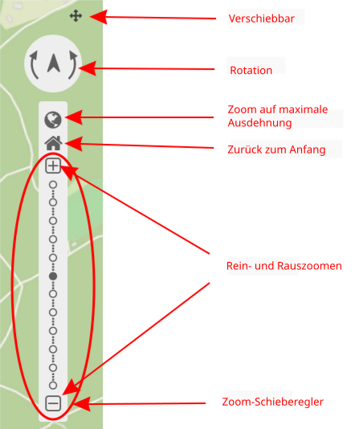

.. _zoom_bar_de:

Navigationswerkzeug (Navigation Toolbar)
****************************************

Das Element erleichtert die Navigation in der Karte durch Rotation und Zoom. Der Kartenmaßstab kann individuell über eine Leiste angesprungen oder über die Zoom in/out-Buttons abgeändert werden. Es besteht zudem die Möglichkeit, auf die maximale Kartenausdehnung zu zoomen oder zum Anfangszustand zurück zu navigieren. Das Navigationselement selbst ist verschiebbar.

.. image:: ../../../figures/de/zoom_bar.png
     :scale: 80

Konfiguration
=============

.. image:: ../../../figures/de/zoom_bar_configuration.png
     :scale: 80

* **Verschiebbar:** Navigationswerkzeug ist verschiebbar oder nicht (Standard: true).
* **Title:** Titel des Elements. Dieser wird in der Layouts Liste angezeigt.
* **Target:** ID des Kartenelements, auf das sich das Element bezieht.
* **Components:** Komponenten des Navigationswerkzeugs, standardmäßig wird alles selektiert; Auswahlmöglichkeiten: Rotation, zoom to max extent, Zurück zum Anfang, Zoom in/out und Zoom slider.
* **Zurück zum Anfang** Zurücksetzen von Dienstzuständen (Standard: false).
* **Position:** Ausrichtung des Navigationswerkzeugs (Standard: 'left-top'); Auswahlmöglichkeiten: inline (zum Einbinden in der Sidepane), left-top (oben links), left-bottom (unten links), right-top (oben rechts), right-bottom (unten rechts)

Komponenten des Navigationswerkzeugs:
--------------------------------------
Im Konfigurationsdialog können unterschiedliche Komponenten (*Components*), also Funktionen des Navigationswerkszeugs, eingebunden werden. Diese Komponenten bestehen aus:

*  Rotation
*  Zoom to max extent
*  Zurück zum Anfang
*  Zoom in/out
*  Zoom slider

Die Komponenten sehen in der Anwendung wie folgt aus:

Wenn das Häkchen bei **Verschiebbar** gesetzt wurde, dann erscheint in der Anwendung ein kleines Kreuzsymbol zur Verschiebung des Navigationselements.

Mit **Rotation** kann die Orientierung der Karte verändert werden. Die Abbildung zeigt den Kartenausschnitt nach einer (links) sowie zwei (rechts) Rotationen nach rechts. Durch Klick auf den Nordpfeil ist es möglich, die Standardrotation schnell wiederherzustellen.

.. image:: ../../../figures/de/navigationtoolbar_rotation.png
     :scale: 80

Es besteht die Möglichkeit, mit **Zoom to max extent** auf den kleinsten Maßstab zu zoomen. Dieser *Max Extent* wird vom Nutzer selbst innerhalb des `Kartenelements <map.html>`_ im Content-Bereich definiert.

.. image:: ../../../figures/de/navigationtoolbar_zoom_to_max.png
     :scale: 80

Nutzer können außerdem die anfänglichen Einstellungen von Maßstab, Koordinatenreferenzsystem, Rotation und Zentrierung mit **Zurück zum Anfang** wiederherstellen.

.. image:: ../../../figures/de/navigationtoolbar_zoom_to_start.png
     :scale: 80

**Zoom in/out** ermöglicht durch einen Klick auf das ``+`` -Zeichen ein Hineinzoomen, sowie durch Klick auf das ``–`` -Zeichen ein Hinauszoomen. Der Kartenausschnitt springt dabei immer zum jeweils nächstgrößeren bzw. -kleineren Maßstab. Je nach Definition im Kartenelement sind größere oder kleinere Zoomschritte möglich. Nutzer haben außerdem die Möglichkeit, feste Zoomstufen im Kartenelement zu deaktivieren.
Die Komponente **Zoom slider** beinhaltet automatisch die Komponente *Zoom in/out*, in welcher auch ``+`` und ``–`` -Zeichen zur Verfügung stehen. Zusätzlich besteht diese Komponente aus einer Leiste, die die möglichen Zoomstufen als auswählbare Punkte anzeigt.

.. image:: ../../../figures/de/navigationtoolbar_zoom_in_out.png
     :scale: 80

YAML-Definition:
----------------

Diese Vorlage kann genutzt werden, um das Element in einer YAML-Anwendung einzubinden.

.. code-block:: yaml

   tooltip: 'Navigation Toolbar'    # Text des Tooltips
   components: ["rotation",         # Komponenten des Navigationswerkzeugs, standardmäßig wird alles selektiert
   "zoom_max", "zoom_home",
   "zoom_in_out", "zoom_slider"]
   target: ~                        # ID des Kartenelements
   anchor: left-top                 # Ausrichtung des Navigationswerkzeugs (Standard: 'left-top')
                                    # Benutzen Sie inline z.B. für die Sidebar
                                    # Optionen: 'inline', 'left-top', 'left-bottom', 'right-top', 'right-bottom'
   draggable: true                  # das Navigationswerkzeug ist verschiebbar oder nicht (Standard: true)
   zoomHomeRestoresLayers: false    # Zurücksetzen von Dienstzuständen (Standard: false)

