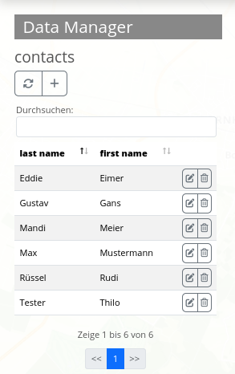

.. _datamanager_de:

Data Manager
************

Der Data Manager ähnelt in seiner Funktionalität dem `Digitizer <digitizer.html>`_. Der Data Manager speichert allerdings nur Sachdaten, er hinterlegt also keine Geometrieinformationen.

Konfigurationsbeispiel
----------------------

Der Data Manager kann beispielsweise genutzt werden, um Kontaktinformationen zu speichern.

In dem dargestellten Konfigurationsbeispiel öffnet sich eine Eingabevorlage nach Klick auf das ``+``-Zeichen.
   
.. image:: ../../../figures/de/data_manager_template.png
     :scale: 80
     
Einrichtung
-----------

Um den Data Manager zu nutzen, muss eine Datenbankverbindung konfiguriert werden. Genauere Informationen hierzu finden sich im Kapitel zur `Konfiguration einer Datenbank <../../customization/yaml.html>`_.

Das Element kann danach in die Seitenleiste eingebettet werden.
     
.. image:: ../../../figures/de/data_manager_add.png
     :scale: 80

YAML-Definition
---------------

Im Folgenden ist der YAML-Code des oben dargestellten Konfigurationsbeispiels hinterlegt:

.. code-block:: yaml

    Kontakte:
      dataStore:
        connection: geodata_db
        table: kontakte
        uniqueId: gid
      allowEdit: true
      allowCreate: true
      allowDelete: true
      allowRefresh: false
      popup:
        title: Kontakte
        width: 550px
      formItems:
        -
          type: form
          children:
            -
              type: fieldSet
              children:
                -
                  type: input
                  title: Name
                  placeholder: 'Bitte geben Sie einen Namen an.'
                  name: nachname
                  css:
                    width: 60%
                -
                  type: input
                  title: Vorname
                  name: vorname
                  css:
                    width: 40%
            -
              type: breakLine
            -
              type: fieldSet
              children:
                -
                  type: input
                  title: Straße
                  name: strasse
                  css:
                    width: 80%
                -
                  type: input
                  title: 'Hausnummer und Zusatz'
                  name: hausnr
                  css:
                    width: 20%
            -
              type: fieldSet
              children:
                -
                  type: input
                  title: PLZ
                  name: plz
                  css:
                    width: 20%
                -
                  type: input
                  title: Ort
                  name: ort
                  css:
                    width: 80%
            -
              type: breakLine
            -
              type: fieldSet
              children:
                -
                  type: input
                  title: Telefon
                  name: telefon
            -
              type: input
              title: E-Mail
              placeholder: 'Bitte geben Sie eine E-Mail Adresse an.'
              name: email
            -
              type: breakLine
            -
              type: textArea
              title: Bemerkung
              placeholder: 'Hier können Sie Bemerkungen verfassen.'
              name: bemerkung
      table:
        autoWidth: false
        columns:
          -
            data: nachname
            title: Name
          -
            data: vorname
            title: Vorname
        info: true
        lenghtChange: false
        ordering: true
        pageLength: 10
        paging: true
        processing: true
        searching: true    
