.. _digitizer_de:

Digitalisierung (Digitizer)
***************************

Das Digitizer-Element ermöglicht den Aufbau von Erfassungsoberflächen. Derzeit kann über eine YAML-Definition eine Erfassungsmaske für Punkte, Linien oder Flächen aufgebaut werden.

Dabei wird bisher PostgreSQL als Datenquelle unterstützt. Oracle und SpatiaLite sind experimentell verfügbar. Die Entwicklung wurde so durchgeführt, dass die Erfassung auch auf andere Datenquellen wie z.B. OGC WFS erweitert werden kann.

Das Digitizer-Element bietet komplexe Editierfunktionalitäten an:

* Verschieben von Objekten
* Einfügen von Stützpunkten (Linien, Flächen)
* Erfassung von Flächen mit Enklaven und/oder Exklaven sowie Kreisen und Ellipsen

In Zusammenhang mit der Digitalisierung können für die Erfassung von dazugehörigen Sachdaten sehr komplexe Formulare generiert werden.

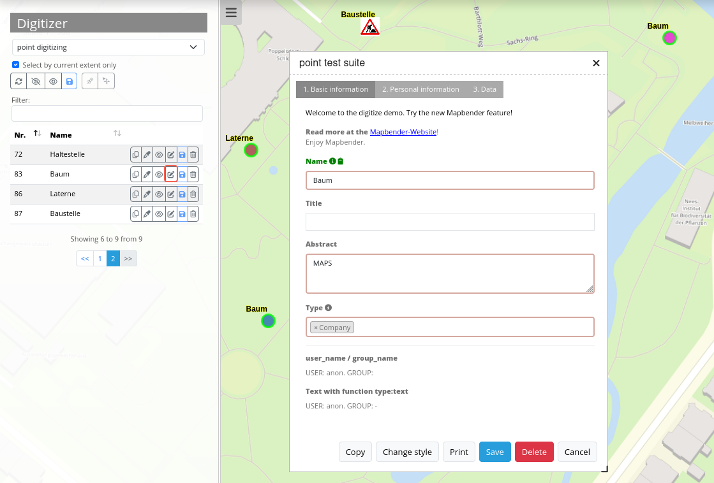

Folgende Optionen stehen für den Aufbau von Formularen zur Verfügung:

* Definition von mehreren Datenquellen und Geometrieformaten für die Erfassung. Die verschiedenen Quellen werden über eine Auswahlbox angeboten.
* Als Datenquelle wird eine Tabelle angesprochen, wobei auch nur eine Auswahl der Daten über einen Filter herangezogen werden kann
* Textfelder
* Textblöcke (mehrzeilige Textfelder)
* Selectboxen, Multiselectboxen (Füllen der Auswahlbox über eine feste Definition von Werten in der YAML-Definition oder über ein Select auf eine Tabelle)
* Radiobuttons und Checkboxen
* Datumsauswahl
* Dateiupload und Bildanzeige
* Definition von Reitern
* Definition von Trennlinien
* Definition von beschreibenden Texten zur Information
* Pflichtfelder, Definition von regulären Ausdrücken für die Formatvorgabe bestimmter Feldinhalte
* Hilfetexte

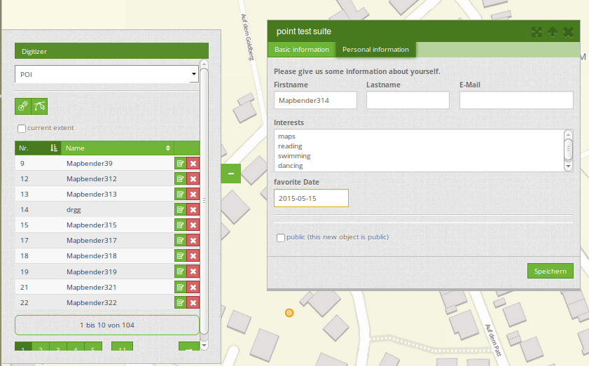

Einrichtung
===========

Das Element kann nur in der Sidepane eingebettet werden.

.. image:: ../../../figures/digitizer_configuration.png
     :scale: 80

* **Title:** Titel des Elements. Dieser wird in der Layouts Liste angezeigt und ermöglicht, mehrere Elemente voneinander zu unterscheiden.
* **Target:** Zielelement (Titel(ID)) der Karte.
* **Schemes:** YAML-Definition für das Element "digitizer"

Der Digitizer benötigt einen Zugriff auf die Datenbank, in der die zu editierenden Tabellen liegen. Sie müssen dazu einen Datenbankzugriff konfigurieren.
Mehr zu diesem Thema finden Sie unter `Konfiguration der Datenbank <../../customization/database.html>`_.

Die Definition des Digitizers wird in einer YAML-Syntax durchgeführt. Hier definieren Sie die Datenbankverbindung, die editierbaren Felder, das Formular für die Anzeige und andere Verhaltensweisen.
Bei fehlerhaften Angaben zur Datenbank, Feldern und Formularfehler erscheinen Fehlermeldungen. Über den normalen Aufruf und app.php kommt eine allgemeine Fehlermeldung.
Falls Sie den genauen Fehler reproduzieren möchten, sollten Sie die Seite über app_dev.php aufrufen. Hier tauchen ausführliche Fehlermeldungen zum Fehlerverhalten auf.

YAML-Definition für das Element digitizer in der Textarea unter schemes
-----------------------------------------------------------------------

In dem folgenden YAML-Block ist die beispielhafte Definition für drei Erfassungsoberflächen enthalten. Kopieren Sie den folgenden Block in Ihr Digitizer-Element, um die Erfassung von Punkten, Linien und Polygonen zu testen.
Vorher müssen Sie die Datenbankverbindung und die drei Demo-Tabellen anlegen. Die SQL-Befehle für das Anlegen der Tabellen finden Sie weiter unten.
Der Funktionsumfang der eingebauten Features und weitere Funktionen werden nach diesem Beispielaufbau genauer erläutert.

.. code-block:: yaml

    poi:
        label: point digitizing
        inlineSearch: true
        featureType:
            connection: search_db
            table: poi
            uniqueId: gid
            geomType: point
            geomField: geom
            srid: 4326
        openFormAfterEdit: true
        zoomScaleDenominator: 500
        allowEditData: true
        allowDelete: true
        allowDigitize: true
        useContextMenu: true
        toolset:
            - type: drawPoint
            - type: moveFeature
        popup:
            title: point test suite
            width: 500px
        searchType: currentExtent
        tableFields:
            gid: {label: Nr. , width: 20%}
            name: {label: Name , width: 80%}
        styles:
            default:
                strokeWidth: 2
                strokeColor: '#0e6a9e'
                fillColor: '#1289CD'
                fillOpacity: 1
                fillWidth: 2
                pointRadius: 10
            select:
                strokeWidth: 3
                strokeColor: '#0e6a9e'
                fillOpacity: 0.7
                pointRadius: 10
        formItems:
           - type: tabs
             children:
               - type: form
                 title: Basic information
                 css: {padding: 10px}
                 children:
                     - type: label
                       title: Welcome to the digitize demo. Try the new Mapbender feature!
                     - type: input
                       title: Name
                       mandatory: true
                       name: name
                       mandatoryText: Please give a name to the poi.
                       infoText: "Help: Please give a name to the new object."
                     - type: input
                       title: Title
                       mandatory: false
                       name: title
                       mandatoryText: Please give a title to the poi.
                     - type: textArea
                       name: abstract
                       title: Abstract
                       placeholder: 'please edit this field'
                     - type: select
                       title: Type
                       name: type
                       options: {A: A, B: B, C: C, D: D, E: E}
                     - type: breakLine
               - type: form
                 title: Personal information
                 css: {padding: 10px}
                 children:
                     - type: label
                       title: Please give us some information about yourself.
                     - type: fieldSet
                       children:
                           - type: input
                             title: Firstname
                             name: firstname
                             css: {width: 30%}
                           - type: input
                             title: Lastname
                             name: lastname
                             css: {width: 30%}
                           - type: input
                             title: E-Mail
                             name: email
                             css: {width: 40%}
                     - type: select
                       multiple: false
                       title: Interests
                       name: interests
                       options: {maps: maps, reading: reading, swimming: swimming, dancing: dancing, beer: beer, flowers: flowers}
                     - type: date
                       title: favorite Date
                       name: date_favorite                     
                       mandatory: true                                  
                       css: {width: 25%}
                     - type: breakLine
                     - type: breakLine
                     - type: checkbox
                       name: public
                       value: true
                       title: public (this new object is public)
    line:
        label: line digitizing
        inlineSearch: true
        featureType:
            connection: search_db
            table: lines
            uniqueId: gid
            geomType: line
            geomField: geom
            srid: 4326
        openFormAfterEdit: true
        allowDelete: true
        useContextMenu: true
        toolset:
            - type: drawLine
            - type: modifyFeature
            - type: moveFeature
        popup:
            title: line test suite
            width: 500px
        searchType: currentExtent
        tableFields:
            gid: {label: Nr. , width: 20%}
            name: {label: Name , width: 80%}
        styles:
            default:
                strokeWidth: 2
                strokeColor: '#0e6a9e'
                fillColor: '#1289CD'
                fillOpacity: 1
                fillWidth: 2
                pointRadius: 10
            select:
                strokeWidth: 3
                strokeColor: '#0e6a9e'
                fillOpacity: 0.7
                pointRadius: 10
        formItems:
           - type: form
             title: Basic information
             css: {padding: 10px}
             children:
                 - type: label
                   title: Welcome to the digitize demo. Try the new Mapbender feature!
                 - type: input
                   title: Name
                   name: name
                   mandatory: true
                   mandatoryText: Please give a name to the new object.
                   infoText: "Help: Please give a name to the new object."
                 - type: select
                   title: Type
                   name: type
                   options: {A: A, B: B, C: C, D: D, E: E}
    polygon:
        label: polygon digitizing
        inlineSearch: true
        featureType:
            connection: search_db
            table: polygons
            uniqueId: gid
            geomType: polygon
            geomField: geom
            srid: 4326
        openFormAfterEdit: true
        allowDelete: false
        useContextMenu: true
        toolset:
            - type: drawPolygon
            - type: drawRectangle
            - type: drawDonut
            - type: drawEllipse
            - type: drawCircle
            - type: modifyFeature
            - type: moveFeature
        popup:
            title: polygon test suite
            width: 500px
        searchType: currentExtent
        tableFields:
            gid: {label: Nr. , width: 20%}
            name: {label: Name , width: 80%}
        styles:
            default:
                strokeWidth: 2
                strokeColor: '#0e6a9e'
                fillColor: '#1289CD'
                fillOpacity: 1
                fillWidth: 2
                pointRadius: 10
            select:
                strokeWidth: 3
                strokeColor: '#0e6a9e'
                fillOpacity: 0.7
                pointRadius: 10
        formItems:
           - type: form
             title: Basic information
             css: {padding: 10px}
             children:
                 - type: label
                   title: Welcome to the digitize demo. Try the new Mapbender feature!
                 - type: input
                   title: Name
                   mandatory: true
                   name: name
                   mandatoryText: Please give a name to the new object.
                   infoText: "Help: Please give a name to the new object."
                 - type: select
                   title: Type
                   name: type
                   options: {A: A, B: B, C: C, D: D, E: E}

SQL für die Demo-Tabellen
-------------------------

Die folgenden SQL-Befehle müssen in Ihrer Datenbank ausgeführt werden. Sie legen drei Demo-Tabellen an, damit mit der oben gezeigte YAML-Definition die einzelnen Funktionen getestet werden können. Die PostGIS Extension muss aktiviert sein.

.. code-block:: postgres

    create table public.poi (
        gid serial PRIMARY KEY,
        name varchar,
        type varchar,
        abstract varchar,
        public boolean,
        date_favorite date,
        title varchar,
        firstname varchar,
        lastname varchar,
        email varchar,
        interests varchar,
        user_name varchar,
        group_name varchar,
        modification_date date,
        my_type varchar,
        file_reference varchar,
        x float,
        y float,
        geom geometry(point,4326)
    );

.. code-block:: postgres

    create table public.lines (
        gid serial PRIMARY KEY,
        name varchar,
        type varchar,
        abstract varchar,
        public boolean,
        date_favorite date,
        title varchar,
        firstname varchar,
        lastname varchar,
        email varchar,
        interests varchar,
        length float,
        category varchar,
        user_name varchar,
        group_name varchar,
        modification_date date,
        my_type varchar,
        file_reference varchar,
        x float,
        y float,
        geom geometry(linestring,4326)
    );

.. code-block:: postgres

    create table public.polygons (
        gid serial PRIMARY KEY,
        name varchar,
        type varchar,
        abstract varchar,
        public boolean,
        date_favorite date,
        title varchar,
        firstname varchar,
        lastname varchar,
        email varchar,
        interests varchar,
        area float,
        category varchar,
        user_name varchar,
        group_name varchar,
        modification_date date,
        my_type varchar,
        file_reference varchar,
        x float,
        y float,
        geom geometry(polygon,4326)
    );

Nutzung
=======

Allgemein
---------

Der Digitizer ermöglicht das Editieren von FeatureTypes. Diese basieren auf Punkt, Linien oder Polygongeometrien und ihren Sachdaten. Die Sachdaten werden in dem Formular des Digitizers angezeigt. Das Editieren der Geometrien geschieht über die Karte.

Geometrien erstellen
--------------------

Jeder FeatureType kann unterschiedliche `Toolsets <#definition-der-zur-verfugung-stehenden-werkzeuge-toolset-type>`_ freischalten, die dann in der Schaltflächenleiste des Digitizers sichtbar sind.

In dem FeatureType "poi" wird mit dem "drawPoint" Toolset beispielsweise die Schaltfläche zum Erstellen eines neuen Punktes freigeschaltet, mit dem Toolset "modifyFeature" die Verschieben-Schaltfläche eingeblendet.

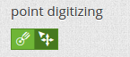

Speichern, Löschen, Abbrechen
-----------------------------

Es stehen drei Schaltflächen im Dialog zur Verfügung: Speichern, Löschen, Abbrechen.

Das *Speichern* der Änderungen geschieht erst, wenn die Schaltfläche "Speichern" im Attributdialog gedrückt worden ist. Ein Verschieben einer Geometrie alleine speichert das Feature also nicht sofort (um unnötige Änderungen in der Datenbank zu verhindern). Es ist bislang noch notwendig, den Attributdialog zu öffnen und Speichern zu klicken.

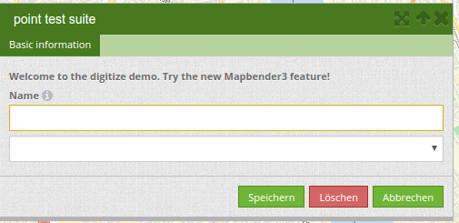

* **Speichern:** Speichert die Geometrie und die Attributdaten in die Datenbank.
* **Löschen:** Löscht die Daten.
* **Abbrechen:** Speichert und löscht die Daten nicht, behält die Geometrie aber für eine weitere Bearbeitung im internen Speicher. Sie ist weiterhin in der Karte zu sehen und kann angepasst werden (z.B. bei Polygonen). Attributdaten werden nicht vorgehalten.

Es gibt mehrere Optionen in den `Basisdefinitionen <#basisdefinition>`_, die das Verhalten bestimmen:

* allowEditData: Speichern Schaltfläche anzeigen.
* allowDelete: Löschen Schaltfläche anzeigen.
* allowCancelButton: Abbrechen Schaltfläche anzeigen.
* allowDeleteByCancelNewGeometry: Verhalten des Abbrechen Knopfes.

Das *Löschen* eines Features kann sowohl über den Dialog, als auch die Tabelle geschehen.

Vertices
--------

Das Bearbeiten von Polygonen und Linien erlaubt das Erstellen, Verschieben und Löschen von Vertices. Die Schaltfläche zum Editieren von Vertices erwartet, dass man ein Polygon selektiert. Dieses wird dann mit den Stützpunkten angezeigt.

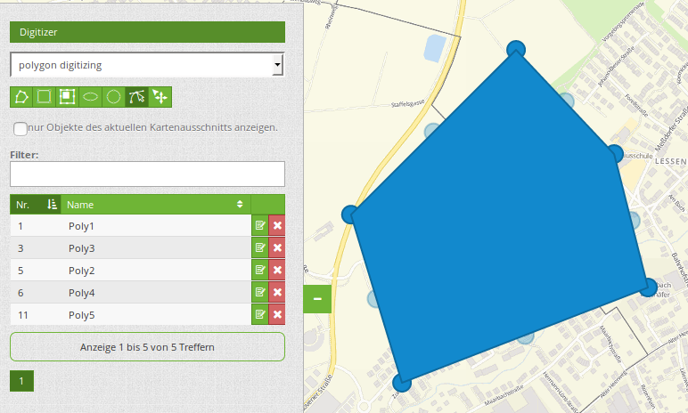

Die vorhandenen Stützpunkte werden deckend dargestellt, mögliche neue Stützpunkte befinden sich immer in der Mitte einer Kante, sind leicht transparent dargestellt und können per Klick auf diesen Punkt hinzugefügt werden.

Vorhandene Vertices werden mit der Entfernentaste auf dem Keyboard gelöscht. Dafür bewegt man sich mit dem Mauszeiger über einen Stützpunkt und drückt die Entf-Taste. *Anmerkung*: Falls das Löschen einen Stützpunktes nicht reagiert, hilft ein Klick mit der rechten Maustaste auf die Karte. Speziell mit dem aktivierten Kontextmenü können sich z.Z. noch Events verhaken.

Konfiguration
=============

Im Folgenden werden die einzelnen Bestandteile des Digitizers erklärt, die die Grundstruktur ausmachen und die in dem Formular eingebettet werden können.

Basisdefinition
---------------

Eine Basisdefinition, hier am Beispiel der poi, sieht folgendermaßen aus:

.. code-block:: yaml

    poi:
        label: point digitizing
        minScale: 5000
        featureType:
            connection: search_db
            table: poi
            uniqueId: gid
            geomType: point
            geomField: geom
            srid: 4326
            filter: interests = 'maps'
        openFormAfterEdit: true
        zoomScaleDenominator: 500
        allowEditData: true
        allowDelete: true
        allowDigitize: true
        [...]
        popup:
            [...]

Die möglichen Optionen sind:

* **label:** Beschriftung mit dem Namen der Erfassungsoberfläche
* **minScale:** Minimaler Maßstab, ab dem die Features in der Karte angezeigt werden (z.B. minscale: 5000 = Anzeige ab einem Maßstab über 1:5000, beim rauszoomen)
* **featureType:** Verbindung zur Datenbank

  * connection: Name der Datenbank-Verbindung aus der parameters/config.yml
  * table: Name der Tabelle, in der das FeatureType gespeichert wird
  * uniqueId: Name der Spalte mit dem eindeutigen Identifier, default bei keiner Angabe ist [id]
  * geomType: Geometrietyp
  * geomField: Attributspalte, in der die Geometrie liegt.
  * srid: Koordinatensystem im EPSG-Code
  * filter: Datenfilter über Werte in einer definierten Spalte, z.B. filter: interests = 'maps'

* **openFormAfterEdit:** Nach der Erfassung einer Geometrie öffnet sich das Erfassungsformular. [true/false] Standard ist true.
* **zoomScaleDenominator:** Zoomstufen, die für das Zoomen auf das Objekt gewählt wird.Standardwert ist 100
* **allowEditData:** Daten dürfen editiert und gespeichert werden [true/false]. Es erscheint immer eine Speichern Schaltfläche.
* **allowDigitize:** Daten dürfen gespeichert werden. [true/false]
* **allowDelete:** Daten dürfen gelöscht werden. [true/false]. Es erscheint eine Löschen Schaltfläche.
* **allowDigitize:** Daten dürfen verändert und neu erstellt werden. [true/false]. Es erscheint immer die Digitalisierungs-Schaltflächen (neuer Punkt, verschieben, etc.). Das Speichern ist jedoch nicht möglich.
* **useContextMenu:** Anzeige des Kontextmenü eines Features durch Rechtsklick auf der Karte. [true/false]
* **allowCancelButton:** Zeigt die Abbrechen Schaltfläche. [true/false]. Siehe `Speichern, Löschen, Abbrechen <#speichern-loschen-abbrechen>`_.
* **allowDeleteByCancelNewGeometry:** Wenn auf true gestellt: Beim Neuanlegen eines Features verhält sich der Abbrechen Knopf wie der Löschen Knopf: Das Feature wird aus der Karte und der Tabelle entfernt. Dies gilt nicht bei dem Ändern eines vorhandenen Features. [true/false]
* **displayOnInactive:** Der aktuellen FeatureType wird weiterhin auf der Karte angezeigt, auch wenn der Digitizer in der Sidepane (Accordion, Tabs) nicht mehr aktiviert ist. [true/false]. Die Option ist, wenn angeschaltet, ein wenig tricky, da auch die einzelnen Digitizer Events noch aktiviert sind, für erfahrene Anwendern aber durchaus hilfreich.
* **allowLocate:** Navigation zu einem Feature hin über die Bedienung mit der Tabs-Taste, sinvoll für die Bedienung ohne Maus. [true/false]. Es erscheint eine extra "ZoomTo" Schaltfläche zu jeden Feature.

   .. image:: ../../../figures/digitizer/allowlocate.png
              :scale: 80

* **allowChangeVisibility:** Ändern der Sichtbarkeit von einem Treffer in der Karte (sichtbar/nicht sichtbar). [true/false]. Es wird ein Auge-Symbol zu jedem Feature eingeblendet, mit dem dieses explizit aus- und wieder eingeblendet werden kann.

   .. image:: ../../../figures/digitizer/allowchangevisibility.png
              :scale: 80

* **showVisibilityNavigation:** Ändern der Sichtbarkeit von allen Treffern in der Karte (sichtbar/nicht sichtbar). [true/false]

   .. image:: ../../../figures/digitizer/showvisibilitynavigation.png
              :scale: 80

.. * **displayPermanent:** FeatureTypes werden dauerhaft angezeigt. [true/false] Standardwert ist false.

Experimentell:

* **allowCustomerStyle:** Erlauben benutzerspezifischer Styles für Elemente in der Karte. [true/false]. Dieses Feature ist noch experimentell: Zu jedem Feature können über ein Symbol die einzelnen Styles verändert werden.

 .. image:: ../../../figures/digitizer/showvisibilitynavigation.png
              :scale: 80

 Es erscheint ein Style-Manager, mit dem man die einzelnen Features anpassen kann.

 .. image:: ../../../figures/digitizer/stylemanager.png
              :scale: 80

Definition Popup
----------------

.. code-block:: yaml

        popup:                                                          # Definition des Formularfensters als PopUp-Fenster. Weitere experimentelle Anpassungsmöglichkeiten unter http://api.jqueryui.com/dialog/
            title: POI                                                  # Definition des Titels vom Formularfensters
            height: 400                                                 # Höhe des Formularfensters
            width: 500                                                  # Breite des Formularfensters

            #modal: true                                                # Alles außer dem Formularfensters wird ausgegraut und die Position und Größe des Fensters ist für die Dauer der Datenaufnahme fixiert
            #position: {at: "left+20px",  my: "left top-460px"}         # Positionierung des Formularfensters im Browserbereich

Definition der Objekttabelle
----------------------------

Der Digitizer stellt eine Objekttabelle bereit. Über diese kann auf die Objekte gezoomt werden und das Bearbeitsformular kann geöffnet werden. Die Objekttabelle ist sortierbar. Die Breite der einzelnen Spalten kann optional in Prozent oder Pixeln angegeben werden.

* **tableFields:** Definition der Spalten für die Objekttabelle.
   * Definition einer Spalte: [Tabellenspalte]: {label: [Beschriftung], width: [css-Angabe z.B. Angabe der Breite]}  # Definition einer Spalte
* **searchType:** Suchbereich in der Karte, Anzeige aller Objekttreffer in der Tabelle oder nur aller Objekttreffer in dem derzeitigen Kartenausschnitt [all / currentExtent], default currentExtent
* **showExtendSearchSwitch:** Anzeige der searchType Selectbox zur Suche im Kartenausschnitt aktivieren oder deaktivieren [true/false]
* **view:** Einstellungen zu der Objekttabelle
   * Detaillierte Informationen zu möglichen Angaben unter https://datatables.net/reference/option/
   * **type**: Templatename [table]
   * **settings**: Einstellungen zum Funktionsumfang der Objekttabelle *(neu hinzugefügt, noch nicht vollst. dokumentiert!)*

.. code-block:: yaml

        searchType: currentExtent
        showExtendSearchSwitch: true
        tableFields:
            gid: {label: Nr. , width: 20%}
            name: {label: Name , width: 80%}
        view:
            type: table
            settings:
                info: true
                processing: false
                ordering: true
                paging: true
                selectable: false
                autoWidth: false
                order: [[1, "asc"]]          # Spalte 1 | 2 vorsortieren

Dateireiter (type tabs)
-----------------------

Die Formularelemente können in verschiedenen Reitern dargestellt werden. Dazu dient das formItem type "tabs".

.. code-block:: yaml

        formItems:
           - type: tabs                      # Type tabs erzeugt Reiter im Erfassungsformular
             children:                       # Die Reiter werden als Unterobjekte (children) vom Type form definiert.
               - type: form
                 title: Basic information    # Titel des Reiters
                 css: {padding: 10px}
                 children:                   # Durch mehrere Unterobjekte in Gruppen können Angaben im Formular nebeneinander angeordnet werden.
                     - type: label
                       title: Welcome to the digitize demo. Try the new Mapbender3 feature!
                       ...

Bei jedem Eingabefeld können unabhängig vom Typ Verhaltensparameter per Event und Stylingangaben per CSS vergeben werden. Damit kann man beispielsweise wichtige Felder hervorheben oder auch ein Attributfeld in Abhängigkeit zu einem anderen Feld füllen.

Verhaltensparameter:

* load, focus, blur
* input, change, paste
* click, dblclick, contextmenu
* keydown, keypress, keyup
* dragstart, ondrag, dragover, drop
* mousedown, mouseenter, mouseleave, mousemove, mouseout, mouseover, mouseup
* touchstart, touchmove, touchend, touchcancel

.. code-block:: yaml

        formItems:
           - type: tabs
             children:
               - type: form
                 [...]
                     - type: input
                       name: firstname
                       title: Firstname
                       css: {width: 30%}
                       input: |
                            var inputField = el;
                            var form = inputField.closest(".modal-body");
                            var datenkennungField = form.find("[name='datenkennung']");
                            datenkennungField.val(inputField.val());
                       focus: |
                            var inputField = el;
                            var form = inputField.closest(".modal-body");
                            form.css("background-color","#ffc0c0");
                       blur: |
                            var inputField = el;
                            var form = inputField.closest(".modal-body");
                            form.css("background-color","transparent");
                     - type: date
                       name: date
                       title: Datum
                       css: {width: 30%}
                       # Hervorhebung des Jahres bei Änderung des Datum-Feldes und autom. Füllen des Jahres aus dem Datum
                       change: |
                            var inputField = el;
                            var form = inputField.closest(".modal-body");
                            var yearField = form.find("[name='year']");
                            var year = inputField.val().match(/\d+$/)[0];
                            yearField.val(year);
                            yearField.css("background-color","#ffc0c0");

Textfelder (type input)
-----------------------

.. code-block:: yaml

                                                 - type: input                                        # Typ Textfeld
                                                   title: Title for the field                         # Beschriftung mit dem Titel des Feldes (optional)
                                                   name: column_name                                  # Referenz zur Tabellenspalte
                                                   mandatory: true                                    # Angabe ob Pflichtfeld (optional)
                                                   mandatoryText: You have to provide information.    # Text sofern Pflichtfeld nicht gefüllt ist
                                                   infoText: 'Bitte geben Sie einen Wert an'          # Definition eines Informationstextes
                                                   value: 'default Text'                              # Definition eines Standard-Wertes  (optional)
                                                   placeholder: 'please edit this field'              # Platzhalter, der vor der Eingabe erscheint (optional)

Auswahlboxen (selectbox oder multiselect [type select])
-------------------------------------------------------

Durch die Definition einer Auswahlbox können vordefinierte Werte im Formular genutzt werden.
Hier wird in eine Auswahlbox mit einem wählbaren Eintrag (type select) und einer Auswahlbox mit mehreren auswählbaren Einträgen (type multiselect) unterschieden.

**(1) select - ein Eintrag kann ausgewählt werden**

.. code-block:: yaml

                                                 - type: select                                       # Typ Auswahlbox
                                                   title: select some types                           # Beschriftung mit dem Titel des Feldes (optional)
                                                   name: my_type                                      # Referenz zur Tabellenspalte
                                                   multiple: false                                    # Definition einer Mehrfachauswahl (multiselect), Standard ist false
                                                   options:                                           # Definition der Optionen (key: value)
                                                       1: pub
                                                       2: bar
                                                       3: pool
                                                       4: garden
                                                       5: playground

**(2) multiselect - mehrere Einträge können ausgewählt werden**

Multiselect-Box wird durch das attribute `multiple: true` aktiviert. Es können mehrere Einträge ausgewählt werden. Die Nutzung und die Voraussetzungen der Datenbank können da variieren. Bei dem oben beschriebenen Beispiel können die Interessen in den POI als Multiobjekte abgespeichert werden. Das Datenbankfeld ist weiterhin  ein character varying.

.. code-block:: yaml

                -
                  type: select
                  multiple: true
                  title: Interests
                  name: interests
                  options:
                    maps: maps
                    reading: reading
                    swimming: swimming
                    dancing: dancing
                    beer: beer
                    flowers: flowers

**Anmerkungen:** Ab Digitizer 1.2 wird für die Mehrfachauswahl eine vereinfachte Auswahlmöglichkeit genutzt, die auch die Suche innerhalb der Drop-Down-Liste ermöglicht. Die Navigation durch die Liste ist mit der Tastatur möglich. Mögliche Einträge werden beim Eintippen hevorgehoben. Eine vorhandene Auswahl kann über das kleine "x" Symbol wieder deaktiviert werden.
Aktuell wird beim Mapbender der Digitizer 1.0.x mitgeliefert. Weitere Versionen findet man unter: https://github.com/mapbender/mapbender-digitizer

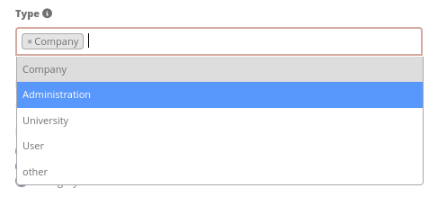

Das SQL (wenn maps und reading abgespeichert wurden):

.. code-block:: postgres

                gisdb=> select interests from poi where gid=3;
                interests
                --------------
                maps,reading
                (1 row)

Beim Abspeichern von Einträgen werden die Schlüsselwörter in der Datenbank abgelegt (Bsp.: "dancing: Tanzen" und "flowers: Blumen" speichert "dancing,flowers").

.. code-block:: yaml

                                                 - type: select                       # Typ Auswahlbox
                                                   title: Wählen Sie einen Typ aus    # Beschriftung mit dem Titel des Feldes (optional)
                                                   name: my_type                      # Referenz zur Tabellenspalte
                                                   multiple: true                     # Definition einer Mehrfachauswahl (multiselect), Standard ist false
                                                   options:
                                                     a: a                             # Definition der Optionen (key: value)
                                                     b: b
                                                     c: c

**Füllen der Auswahlboxen über eine SQL Abfrage**

Mit einer SQL Abfrage können die Werte direkt aus der Datenbank gezogen werden. Dabei ist zu beachten, dass die key-value zuordnungen wegfallen und nur noch die Indizes abgespeichert werden.

.. code-block:: yaml

                                                 - type: select                       # Typ Auswahlbox
                                                   title: select some types           # Beschriftung (optional)
                                                   name: my_type                      # Referenz zu Tabellenspalte
                                                   connection: connectionName         # Definition einer Datenbankverbindung (connection)
                                                   sql: 'SELECT DISTINCT key, value FROM tableName order by value' # Definition SQL, Abfrage der Werte key und value

Texte/Label (type label)
------------------------

.. code-block:: yaml

                                                 - type: label                                     # Typ Label schreibt einen nicht bearbeitbaren Text in das Formularfenster.
                                                   title: 'Please give information about the poi.' # Definition eines nicht bearbeitbaren Textes.

Texte (type text)
-----------------

Im Formular können Texte definiert werden. Hierbei kann auf Felder der Datenquelle zugegriffen werden, dazu wird JavaScript verwendet.

.. code-block:: yaml

                                                - type: text                     # Typ text zur Generierung von dynamischen Texten aus der Datenbank
                                                  title:       Name              # Beschriftung (optional)
                                                  name:        name              # Referenz zu Tabellenspalte, dessen Inhalt angezeigt werden soll
                                                  css:         {width: 80%}      # CSS Definition (optional)
                                                  text: data.gid + ': ' + data.name
                                                  # Text Definition in JavaScript
                                                  # data - Angabe, dass Datenbankfeld aus der Tabelle angesprochen wird.
                                                  # z.B.: data.gid --> Anzeige der ID der Geometrie im Textfeld

Textbereiche (type textArea)
----------------------------

Ähnlich zum Textfeld über type input (siehe oben) können hier Textbereiche erzeugt werden, die bei type textArea mehrere Zeilen umfassen können.

.. code-block:: yaml

                                                 - type: textArea                    # Typ textArea erzeugt einen Textbereich
                                                   rows: 4                           # Anzahl der Zeilen für den Textbereich, die beim Öffnen des Formulars erscheinen. Feld kann per Maus im Formular größer gezogen werden.
                                                   name: beschreibung                # Tabellenspalte
                                                   title: Bestandsaufnahme Bemerkung # Beschriftung (optional)

Trennlinien (type breakline)
----------------------------

.. code-block:: yaml

                                                 - type: breakline      # fügt eine einfache Trennlinie ein

Checkboxen (type checkbox)
--------------------------

.. code-block:: yaml

                                                 - type:  checkbox        # Typ checkbox erzeugt eine Checkbox. Beim Aktivieren wird in die Datenbank der angegebene Value (hier 'TRUE') geschrieben.
                                                   title: Is this true?   # Beschriftung (optional)
                                                   name:  public          # Referenz zu Tabellenspalte
                                                   value: true            # angegebener Parameter beim Aktivieren der Checkbox wird in DB gespeichert (hier 'TRUE').
                                                   checked: false         # Definiert, ob die Checkbox vordefiniert angehakt sein soll (true oder false). Standard ist false

Pflichtfelder
-------------

Die Hinweise für ein Pflichtfeld erscheinen über dem jeweiligen Feldern. Bei einer fehlenden Angabe in einem definierten Pflichtfeld wird dieses rot umrandet und (wenn vorher definiert) erscheinen Hinweise. Das Objekt kann nicht gespeichert werden, wenn Pflichtangaben fehlen.

.. note:: Hinweis: Bei der Nutzung von mehreren Reitern in dem Formular kann es sein, dass der Erfasser bei einem Pflichtfeld auf einem nicht sichtbaren Reiter eine Angabe falsch setzt und das Abspeichern daher nicht funktioniert. Hier erscheint keine Fehlermeldung außerhalb des Formulars. Der Erfasser muss die Angaben in dem Formular überprüfen (Kennzeichen: rote Umrandung/ Sprechblase mit Hinweis), bevor diese korrekt abgespeichert werden können.

.. code-block:: yaml

                                                 - type:  [Angabe zum Feldtyp]              # jedes Feld kann zum Pflichtfeld gemacht werden

                                                   mandatory: true                          # true - Das Feld muss gefüllt werden. Ansonsten kann der Datensatz nicht gespeichert werden. Bei der Definition sind auch reguläre Ausdrücke möglich.
                                                   mandatorytitle: Pflichtfeld füllen!      # Text der im Feld angezeigt wird, wenn das Feld nicht gefüllt wird oder mit einem ungültigen Wert gefüllt wird.
                                                   mandatoryText: Bitte eine Zahl eingeben! # Text der in einer Sprechblase über dem Feld angezeigt wird, wenn das Feld beim Speichern nicht gefüllt ist oder mit einem ungültigen Wert gefüllt ist.
                                                   mandatory: /^\w+$/gi                     # Es können auch reguläre Ausdrücke angegeben werden, um die Eingabe zu überprüfen (z.B. Email oder numbers) Weitere Informationen unter: http://wiki.selfhtml.org/wiki/JavaScript/Objekte/RegExp

                                                   # Prüfung, ob die Eingabe eine Zahl ist
                                                   mandatory: /^[0-9]+$/
                                                   mandatoryText: Bitte eine Zahl eingeben!

Datumsauswahl (type date)
-------------------------

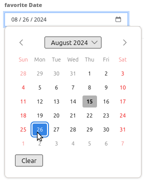

.. code-block:: yaml

                     - type: date                                       # Textfeld, das eine Datumsauswahl bereitstellt
                       title: favorite Date                             # Beschriftung (optional)
                       name: date_favorite                              # Referenz zu Tabellenspalt
                       mandatory: true                                  # Pflichtfeld

Hilfetexten zu den Eingabefeldern (Attribut infoText)
-----------------------------------------------------

Anders als bei Hifetexten zu den Pflichtfeldern kann der Infotext über jedem Feld erscheinen, unabhängig davon, ob dieses ein Pflichtfeld ist oder nicht. Bei der Angabe infotext: [Text] erscheint ein Info-Button über dem jeweiligen Feld.
Der Klick auf diesen Button öffnet den angegebenen Informationstext.

.. code-block:: yaml

                                                 - type:  [Angabe zum Feldtyp]                                   # jedes Feld kann einen Infotext nutzen

                                                   infoText: In dieses Feld dürfen nur Zahlen eingegeben werden  # Hinweistext, der angezeigt wird über i-Symbol.

Gruppierungen (type: fieldSet)
------------------------------

Elemente können in einer Zeile gruppiert werden, um logische Einheiten zu bilden oder um Platz zu sparen. Hierbei muss ein fieldSet definiert werden. Anschließend können die Elemente der Gruppe unter children angegeben werden.
Für jedes Gruppenelement kann eine Breite über CSS angegeben werden, um die Aufteilung der Zeile für die angegebenen Elemente zu kontrollieren.

.. code-block:: yaml

                     - type: fieldSet            # Gruppierung von Feldern, unabhängig vom Feldtyp
                       children:                 # Angabe der Gruppenelemente unter children
                           - type: input
                             title: Vorname
                             name: firstname
                             css: {width: 30%}   # Angabe der Breite des Gruppenelements. Zusammen sollten die Elemente 100% ergeben.
                           - type: input
                             title: Nachname
                             name: lastname
                             css: {width: 30%}
                           - type: input
                             title: E-Mail
                             name: email
                             css: {width: 40%}

Koordinaten (type coordinates)
------------------------------

Um ein visuelles Feedback zu erhalten, Koordinaten manuell eingeben zu können oder diese manuell nachzubessern, kann für Punkt-Geometrien das *coordinates* Element eingebunden werden.

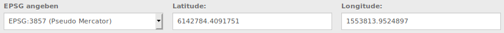

.. code-block:: yaml

                     - type: coordinates
                       title_epsg: 'EPSG angeben'
                       title_longitude: 'Longitude'
                       title_latitude: 'Latitude'
                       coordinatesFieldsOrder: ['epsg','x','y']
                       title: ''
                       css: {width: 100% }
                       epsgCodes: [['EPSG:3857', 'EPSG:3857 (Pseudo Mercator)'], ['EPSG:4326', 'EPSG:4326 (WGS84)']]

Die verfügbaren Parameter sind:

* **title_epsg**: die Beschriftung für das Feld zur Auswahl des Koordinatensystems der Koordinaten
* **title_longitude**: die Beschriftung für das logitude Feld
* **title_latitude**: die Beschriftung für das latitude Feld
* **coordinatesFieldsOrder**: eine Liste aus Strings, die die Reihenfolge der drei Eingabefelder (Koordinatensystemauswahl, Longitude, Latitude) definiert
* **epsgCodes**: eine Liste aus Tupeln, die jeweils einen EPSG Code und dessen Beschriftung im Formular definieren

Dateiupload (type file)
-----------------------

Über den Dateiupload können Dateien durch die Angabe in einer Datenbankspalte im Formular verknüpft werden. Dazu werden die hochgeladenen Dateien im Mapbender gespeichert und der Pfad in der Spalte vermerkt.

Der Speicherpfad und der Name der abgespeicherten Dateien kann bis jetzt nicht verändert werden. Der Dateiupload speichert immer in das gleiche Verzeichnis und baut sich aus den Parametern:

* Tabellenname
* Spaltenname
* Dateiname

auf.

Das Verzeichnis ist:

* <mapbender>/web/uploads/featureTypes/[tabellenname]/[spaltenname]/[dateiname].png

Die in der Datenbank verlinkte URL ist:

* http://localhost/mapbender/uploads/featureTypes/[tabellenname]/[spaltenname]/[dateiname].png

.. code-block:: yaml

                    - type: file                        # Typ file für das Hochladen von Dateien
                      title: Dateiupload                # Beschriftung (optional)
                      text: Laden Sie ein Bild hoch.    # Informationstext zum Feld (optional)
                      name: file_reference              # Angabe der Datenbankspalte, in die der Speicher-Pfad geschrieben wird

                      # Experimentelle Parameter:
                      #accept: image/*                  # Vorauswahl von Elementen im Image-Format (Fenster für Dateiupload öffnet sich mit Einschränkungsfilter)
                                                        # Es können jedoch weiterhin auch andere Dateiformate hochgeladen werden.

**Anmerkungen:** Es wird momentan noch ein "thumbnail" Verzeichnis angelegt, dass eine kleinere Version der Bilder beinhaltet. Dieses wird in weiteren Entwicklungsphasen noch verändert.

Für die Ansicht von hochgeladenen Bildern kann die Bildanzeige dazugenommen werden.

Bildanzeige (type image)
------------------------

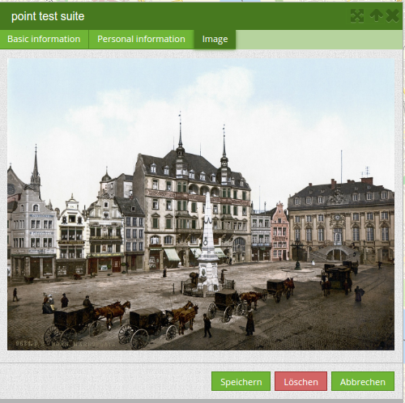

Für die Ansicht eines Bildes im Formular kann das Bild-Element genutzt werden. Durch die Angabe einer URL in einem Datenbankfeld oder einer URL über den src-Parameter können Bilder angezeigt werden.

Bilder, die durch das Element Dateiupload in einer Tabellenspalte vermerkt sind können somit auch direkt eingebunden und angezeigt werden.

Das Bild lässt sich durch die Angabe von den beiden Parametern src und name angeben.

* **src**: Url-Pfad oder Dateipfad (kann relativer Pfad sein)
* **name**: Url-Pfad oder Dateipfad wird aus der Tabellenspalte übernommen (kann kein relativer Pfad sein)
* Angabe von **name** und **src** zusammen: Der Inhalt der Datenbankspalte aus name wird genommen. Falls die Spalte leer ist wird die src-Angabe genutzt.

.. code-block:: yaml

                    - type: image                                         # Type image für das Anzeigen von Bildern
                      name: file_reference                                # Referenz zur Datenbankspalte. Wenn definiert, wird der Pfad oder die URL in dem Feld ermittelt und "src" Option ersetzt
                      src: "../bundles/mapbendercore/image/logo_mb3.png"  # Angabe eines Pfades oder URL zu einem Bild. Falls der relative Pfad genutzt wird, muss relative: true stehen.
                      enlargeImage: true                                  # Bild wird beim Klick auf das Vorschaubild auf Originalgröße/maximale Auflösung vergrößert. Es wird nicht auf die Bildschirmgröße skaliert.

                      # Experimentelle Angaben zum Styling
                      imageCss:
                        width: 100%                                       # Image CSS Style: Skaliert das Vorschaubild in dem Formular, abweichend von der Originalgröße in Prozent.

**Achtung**: Wenn nur name und nicht name und src angegeben wird, erscheint bei leeren Spalteneinträgen ein Bild aus dem vorherigen Dateneintrag.

Dynamische Pfade (z.B. "bundles/mapbendercore/image/[nr].png" oder 'bundles/mapbendercore/image/' + data.image_reference) können nicht angegeben werden.

Eine Möglichkeit, das zu umgehen, wäre ein Trigger, der in die Datenbankspalte beim Insert den Pfad und den Inhalt eines Tabellenfeldes als Name zusammenführt.

Definition der zur Verfügung stehenden Werkzeuge (Toolset Type)
---------------------------------------------------------------

Werkzeugliste:

* **drawPoint** - Punkt erstellen
* **drawLine** - Line erstellen
* **drawPolygon** - Polygone erstellen
* **drawRectangle** - Rechteck erstellen
* **drawCircle** - Circle erstellen
* **drawEllipse** - Ellipse erstellen
* **drawDonut** - Donut erstellen oder die bestehende Geometrien editieren
* **modifyFeature** - einzelne Knotenpunkte bei Geometrien verschieben
* **moveFeature** - Geometrien verschieben
* **selectFeature** - Geometrien de-/selektieren (experimentell). Es findet noch keine Interaktion mit der Tabelle statt und die zur Verfügung stehenden Workflows beschränken sich auf das Löschen.
* **removeSelected** - die selektierten Geometrien löschen (experimentell). Löscht alle in der Karte selektierten Objekte.
* **removeAll** - Vorsicht: alle Geometrien aus der Tabelle löschen

Definition der für die Erfassung verwendeten Toolset Typen:

.. code-block:: yaml

    polygon:
        [...]
        toolset:
            - type: drawPolygon
            - type: drawRectangle
            - type: drawDonut
            - type: removeSelected

Suche in den Tabellen (inline Search)
-------------------------------------

Über die Suche können Begriffe in der Tabelle gesucht werden.
Die aktivierte Sucheleiste erscheint über der Tabelle und nach der Eingabe eines Suchbegriffs werden alle Spalten dieser Tabelle durchsucht und deren Ergebnisse angezeigt.

.. code-block:: yaml

  poi:
      ...
      inlineSearch: true      # Suche in den Tabellenspalten, Standard ist true
      ...

Kontextmenü
-----------

Über das Kontextmenü kann ein Objekt auf der Karte näher betrachtet werden.
Nach der Aktivierung kann man über den rechten Mausklick auf einem Objekt ein Kontextmenü öffnen.

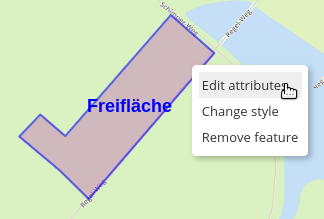

Elemente des Kontextmenüs:

* **Heranzoomen:** Auf den Kartenausschnitt des Objekts zoomen.
* **Bearbeiten:** Informationen zu dem Objekt verändern. Klick öffnet die Digitalisieroberfläche.
* **Löschen:** Löscht das ausgewählte Objekt.

Ist die korrespondierende `Basisdefinition <#basisdefinition>`_ (allowEditData, allowDelete) nicht definiert, stehen diese auch im Kontextmenü nicht zur Verfügung. In dem oben stehenden Beispiel steht für die Polygone die Löschen-Funktion nicht zur Verfügung.

.. code-block:: yaml

  poi:
      ...
      useContextMenu: true
      ...

Clustering (experimentell)
--------------------------

Über das Clustering können die Objekte auf der Karte zusammengefasst werden.
Abhängig von der definerten Distanz und Zoomstufe werden unterschiedlich viele Objekte zusammengeführt.

Durch die Komplexität des Clusterings können sich in zukünftigen Versionen noch Änderungen an der Funktion und der Syntax ergeben, so dass wir dieses Feature bislang als experimentell kennzeichnen. Abhängigkeiten existieren zu der Anzeige der Features für den aktuellen Ausschnitt/den gesamten Bereich und den unterschiedlichen Geometrietypen.

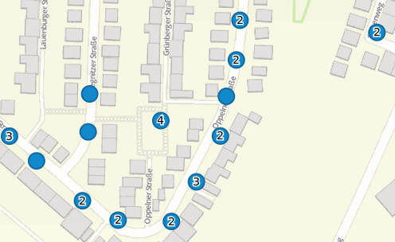

Definition der Clusterelemente:

* **scale:** Zoomstufe.
* **distance:** Distanz zwischen einzelne Features in Metern, die zusammengefügt werden.
* **disable:** Schaltet Clustering für die Zoomstufe ab.

.. code-block:: yaml

  poi:
      [...]
      clustering:
          -
              scale: 10000        # Zoomstufe
              distance: 60        # Distanz zwischen einzelne Features in Metern, die zusammengefügt werden
          -
              scale: 2500
              distance: 40
          -
              scale: 1000
              distance: 20
          -
              scale: 500
              distance: 1
              disable: true       # Schaltet Clustering für die Zoomstufe ab
      [...]

Karten-Refresh nach Speichern
-----------------------------

Nach dem Speichern eines Objekts kann ein Refresh der Karte über die Option ``refreshLayersAfterFeatureSave`` aktiviert werden. Über diesen Parameter werden die definierten Layer-Instanzen aus dem Map-Element neu geladen. Damit werden Änderungen in WMS-Diensten direkt in der Karte sichtbar. Dieses Event wird nur gestartet, wenn der Speichern Knopf aus dem Attributdialog verwendet wird.

Wenn YAML-Anwendungen unter /application genutzt werden, kann die Angabe per eindeutigen Name oder per Instance-ID erfolgen. Wenn die Anwendungen über die graphische Oberfläche im Backend mit dem Digitizer-Element bearbeitet wird, kann nur die Angabe per Instance-ID erfolgen.

.. image:: ../../../figures/digitizer/layerinstance_id.png
     :scale: 80

.. code-block:: yaml

  poi:
      [...]
       allowEditData: true
       refreshLayersAfterFeatureSave:  # bei keiner Angabe in diesem Bereich erfolgt kein Karten-Refresh nach Speichern
         - 17
         - 18
         - osm                         # Namensangabe nur bei Anwendungen unter app/config/application möglich
      [...]
      
**Anmerkungen**: Karten-Refresh nach dem Speichern ist ab Version 1.2 möglich. Aktuell wird beim Mapbender der Digitizer 1.0.x mitgeliefert. Weitere Versionen findet man unter: https://github.com/mapbender/mapbender-digitizer
 

Duplizieren von Objekten
------------------------

Bereits erfasste Objekt können dupliziert werden. Dies geht über einen Duplizieren-Button innerhalb des Erfassungsfensters des aktuellen selektierten bereits vorhandenen Features, über das Context-Menu und die Treffertabelle.
Damit das neue Objekt in der Karte besser erkannt werden kann ist hier eine farbliche Hervorhebung definierbar.

Der Duplizieren-Button kann in Abhängigkeit von einem bestimmten Attribut-Wert aktiviert werden. Dies bedeutet, dass nur wenn das entsprechende Attribut einen bestimmten Wert hat (date > 0), erscheint die Duplizieren-Funktion.

* **data**: Angabe von Standardwerten für Attributfelder
* **rules**: regelbasiertes Duplizieren (nur wenn die Regel zutrifft darf das Objekt dupliziert werden).
* **style**: Styling des kopierten Objekts (mehr dazu s.u. unter dem Bereich Darstellung)
* **on**: Events beim Duplizieren

.. code-block:: yaml

  poi:
      [...]
       copy: # bei keiner Angabe in diesem Bereich können keine Objekte dupliziert werden
         enable: true
         data:
           date: 2017
         rules:
           - feature.attributes.id > 10
         style:
           label: "Dupliziertes Objekt"
           fillColor: "#ff0000"
           fillOpacity: 1
           strokeWidth: 4
           strokeColor: "#660033"
         on:
           success: widget._openFeatureEditDialog(feature)
           error: console.error(feature)

Events
------

Es gibt mehrere Events, die zu einem Feature zugeordnet werden können, um Attribute vor oder nach der Aktion zu manipulieren.

* **onBeforeSave**: Event vor dem Speichern von neuen/ veränderten Informationen
* **onAfterSave**: Event nach dem Speichern von neuen/ veränderten Informationen

* **onBeforeUpdate**: Event vor der Aktualisierung von veränderten Informationen
* **onAfterUpdate**: Event nach der Aktualisierung von veränderten Informationen

* **onBeforeSearch**: Event vor dem Suchen in SearchField des Digitizers
* **onAfterSearch**: Event nach dem Suchen in SearchField des Digitizers

* **onBeforeRemove**: Event vor dem Löschen von Daten
* **onAfterRemove**: Event nach dem Löschen von Daten

Im Unterschied zu den Save-Events arbeiten die Update-Events nur bei einer Aktualisierung der Daten, nicht bei einer Erstellung.

**Anmerkung:** Die Events sind noch in der Entwicklung und sollten mit Voraussicht eingebunden werden.
Die korrekte Abstimmung der Events aufeinander und ihre Abhängigkeiten sind noch nicht vollständig fertiggestellt und können sich in zukünftigen Versionen ändern.

Im folgenden einige Anwendungsbeispiele. Falls mehrere Parameter in einem Event gesetzt werden sollen können diese durch ein Simikolon getrennt hintereinander aufgelistet werden, z.B. 

.. code-block:: yaml

                events:
                  onBeforeSave: $feature->setAttribute('interests', 'maps'); $feature->setAttribute('name', 'test');

**Speichern von festen Sachdaten in zusätzlichen Attributspalte:**

Das folgende Beispiel zeigt, wie Daten beim Speichern in eine zusätzliche Attributspalte geschrieben werde können. Hier geschieht das mit der Spalte "interests" und dem festen Wert "maps". Beim Speichern wird der feste Wert in die Tabelle gespeichert und kann z.B. über einen Filter für die selektierte Anzeige genutzt werden. 

.. code-block:: yaml

                events:
                  onBeforeSave: $feature->setAttribute('interests', 'maps');

**Speichern von Gruppenrollen in zusätzlichen Attributspalte:**

Das folgende Beispiel zeigt, wie Mapbender-Benutzerdaten beim Speichern in eine zusätzliche Attributspalte geschrieben werde können. Hier geschieht das mit der Spalte "group" und der Füllung mit den jeweiligen Gruppenrollen des Benutzers (userRoles)

.. code-block:: yaml

                events:
                  onBeforeSave: $feature->setAttribute('group', implode(',', $userRoles));

**Speichern von Sachdaten in zusätzlichen Attributspalten:**

Das folgende Beispiel zeigt, wie Daten beim Speichern in eine zusätzliche Attributspalte geschrieben werde können. Hier geschieht das mit den Spalten "geom" und "geom2". Beim Speichern sollen die Daten von geom in das Feld geom2 geschrieben werden.

Man kann das Event je nach Anwendungsfall bei onBeforeInsert oder onBeforeUpdate eintragen.

Da zum Zeitpunkt des Editierens die Geometrie noch nicht persistent in der Datenbank ist, kann man auf sie nicht als Feature zugreifen, sondern nur über das jeweilige "item", eine interne Digitizer Speicherstruktur. Diese "item" orientieren sich am Formular und den dort angegebenen Attributen.

.. code-block:: yaml

                events:
                  onBeforeInsert: $item['geom2'] = $item['geom'];
                  onBeforeUpdate: $item['geom2'] = $item['geom'];

Bei dem Event wird der Wert des Feldes "geom2" mit dem Wert des Feldes "geom" überschrieben.

**Speichern unterschiedlicher Geometrietypen:**

Dieses Szenario kann man zu einem konsturierten Beispiel erweitern, in dem gleichzeitig unterschiedliche Geometrietypen geschrieben werden. Mithilfe von PostGIS können Linien in Punkte interpoliert werden. Im Digitizer kann ein Event genutzt werden, um das richtige SQL Statement abzuschicken.

.. code-block:: postgres

                events:
                  onBeforeInsert: |
                    $sql = "SELECT
                    ST_Line_Interpolate_Point('".$item['geomline']."'::geometry, 1) as geom";
                    $stmnt = $this->getConnection()->prepare($sql);
                    $stmnt->execute();
                    $result  = $stmnt->fetchAll();
                    $item['geompoi'] = $result[0]['geom'];

Hier wird das onBeforeInsert-Event genommen. Der Längsstrich '|' hinter dem Event zeigt einen mehrzeiligen Block an. Dieser Block besteht aus PHP-Code, der ein SQL-Statement weiterleitet. Das SQL Statement ruft die ST_Line_Interpolate_Point Funktion auf und übergibt die Geometrie der gezeichneten Linie. Da diese noch nicht persistent ist, greift man über das "item" auf die Geometrie (geomline). Die restlichen Zeilen bauen das SQL Statement zusammen und schicken es an die im FeatureType angegebene SQL-Connection. In der letzten Zeile wird der resultierende Punkt (geompoi) in die Punktgeometrie geschrieben.

Buttons
-------

Für die Erfassungsformulare können weitere Buttons definiert werden. Die Events beim Klick auf den Button können frei per JavaScript definiert werden. Somit können beispielsweise mailto-Angaben für die Einbindung einer Mail generiert werden.

.. code-block:: yaml

  poi:
      ...
        popup:
            title: polygon test suite
            buttons:
              - text: Nachricht an Bearbeiter
                click: |
                  var body = encodeURI("Sehr geehrter Herr/Frau xx,"+"\nLink:"+location.href);
                  location.href = "mailto:vorname.nachname@mail.com?subject=Neue Bearbeitung im WebGIS&body=Mail an den Bearbeiter für die die weitere Bearbeitung.";
              - text: Nachricht an Kontrolle
                click: |
                 location.href = "mailto:vorname.nachname@mail.com&subject=WebGIS&body=really?";

Darstellung (Styles)
--------------------

Über die Angabe eines Styles kann definiert werden, wie die Objekte angezeigt werden.

* **default**: Definiert die normale Darstellung der Objekte auf der Karte
* **select**: Darstellung der ausgewählten Objekte beim Mouseover
* **selected**: Darstellung der ausgewählten Objekte nach dem Klick Event

.. code-block:: yaml

  poi:
      ...
      styles:
          default:
              graphic: true
              strokeWidth: 5
              strokeColor: "transparent"
              fillColor:  '#c0c0c0'
              fillOpacity: 1
              fillWidth: 2
              # label: ${name} ${type}
              # labelOutlineColor: '#eeeeee'
              pointRadius: 10
          select:
              strokeWidth: 1
              strokeColor: "#0e6a9e"
              fillOpacity: 0.7
              fillColor: "#0e6a9e"
              label: ${name} ${type}
              pointRadius: 10
          selected:
              strokeWidth: 4
              strokeColor: "#648296"
              fillOpacity: 1
              fillColor: "#eeeeee"
              label: ${name} ${type}
              pointRadius: 10
      ...

* **strokeColor:** Farbe der Umrandungslinie [Farbwert/transparent]
* **strokeWidth:** Breite der Umrandungslinie [numeric]
* **strokeOpacity:** Transparenz der Umrandungslinie [0-1]
* **fillColor:** Farbe der Füllung [Farbwert/transparent]
* **fillWidth:** Breite der Füllung [numeric]
* **fillOpacity:** Transparenz der Füllung [0-1]
* **pointRadius:** Radius um den Mittelpunkt [numeric]
* **label:** Beschriftung des Objekts mit festen Werten und/oder DB-Feldern, z.B. "ID ${nummmer}"
* **labelOutlineColor:** Farbe der Umrandung von der Beschriftung [Farbwert/transparent]

YAML-Definition für das Element "digitizer" in der Sidepane in der mapbender.yml
================================================================================

Dieser Codeabschnitt zeigt, wie das Digitizer Element in eine auf einer
YAML-Datei basierende Anwendung eingebaut werden kann.

.. code-block:: yaml

                sidepane:
                    digitizer:
                        class: Mapbender\DigitizerBundle\Element\Digitizer
                        title: Digitalisation
                        target: map
                        schemes:
                            ...

Class, Widget & Style
=====================

* Class: Mapbender\\DigitizerBundle\\Element\\Digitizer
* Widget: mapbender.element.digitizer.js
* Style: sass\\element\\digitizer.scss
