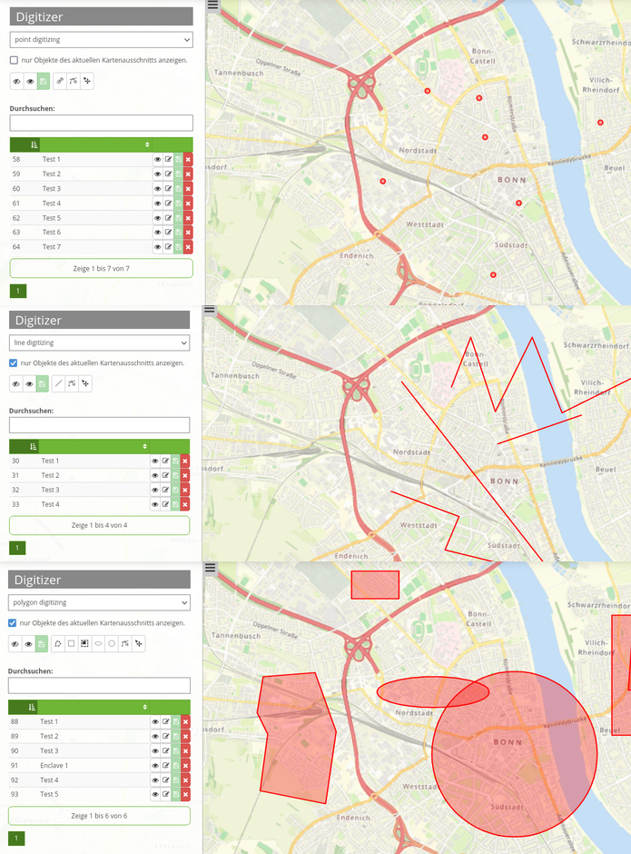
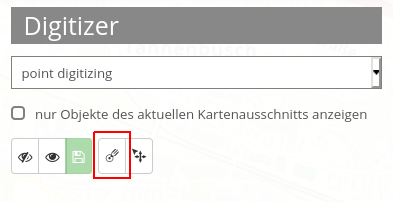
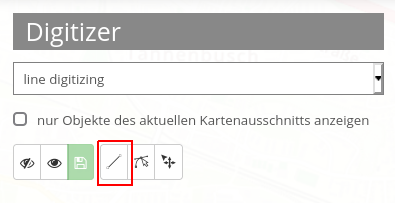
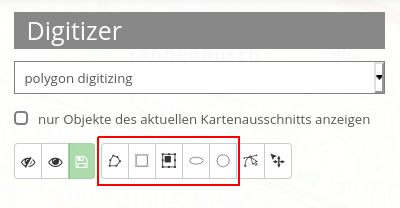
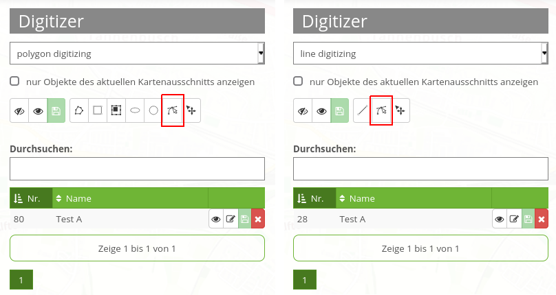

.. _digitizer_functionality_de:

Funktionen des Digitizers
*************************

Der Digitizer ermöglicht das Editieren von FeatureTypes. Diese basieren auf Punkt-, Linien- oder Polygongeometrien und ihren Sachdaten. Letztere werden in dem Formular des Digitizers angezeigt. Das Editieren der Geometrien geschieht über die Karte. Der Digitizer ermöglicht eine Vielzahl von Funktionen zur Erstellung und Bearbeitung von Geometrien:

* Erstellen von Punkten, Linien und Polygonen (Quadrate, Rechtecke, Kreise und Ellipsen)
* Verschieben von Geometrieobjekten
* Einfügen von Stützpunkten (bei Linien und Polygonen)
* Erfassung von Polygonen mit Enklaven

Die folgenden Abschnitte stellen die Arbeit mit Digitizer gemäß der Standardkonfiguration genauer vor.

Geometrien erstellen
--------------------

In der Standardkonfiguration kann der Nutzer über ein Dropdown-Menü zwischen drei verschiedenen Geometrietypen wählen: Punkt, Linie und Polygon.

**Punkte**

Durch einen Klick auf den Button *"Punkt erstellen"* wird die Funktion aktiviert/deaktiviert.

**Linien**

Durch einen Klick auf den Button *"Linie erstellen"* wird die Funktion aktiviert/deaktiviert.

**Polygone**

Es können unterschiedliche Arten von Polygonen erstellt werden. Dies ist über eine Aktivierung des jeweiligen Buttons für Flächen, Rechtecke, Enklaven, Ellipsen oder Kreise möglich.

Mithilfe der Maus kann nun die zuvor ausgewählte Geometrieart in der Karte erstellt werden. Anschließend öffnet sich ein Pop-up Fenster, welches das vordefinierte Sachdatenformular gemäß der Yaml-Konfiguration ausgibt und die Erfassung dieser zulässt.

Geometrien bearbeiten, speichern oder löschen
---------------------------------------------

Die Speicherung der Geometrien erfolgt in der jeweils definierten Datenbanktabelle. Zusätzlich werden Geometrien im Digitizer-Element in Form einer Tabelle aufgelistet. Dies erleichtert die Verwaltung der Geometrien. In der Tabelle werden Nummer (ID wird automatisch erzeugt) sowie Name jedes Objekts angezeigt. Es besteht die Möglichkeit, ihre Reihenfolge zu verändern sowie nach bestimmten Geometrien zu suchen.

In der Auflistung können nur Objekte des aktuellen Kartenausschnitts angezeigt werden  **1**. Weiterhin besteht die Option, alle Objekte auszublenden **2** oder einzublenden **3**. Änderungen können für alle Objekte gespeichert werden **4**. Eine Bearbeitung wäre z.B. die Verschiebung von Objekten **5**. Nach Aktivierung dieses Buttons können Geometrien mithilfe des Cursors über die Karte bewegt werden. 

Es besteht weiterhin die Möglichkeit, nur einzelne Objekte auszublenden **6** sowie deren Modifikationen individuell abzuspeichern **8**. Veränderungen der Sachdaten sind ebenfalls möglich **7**. Zuletzt kann jedes Objekt innerhalb des Digitizer-Elements wieder aus der Datenbank gelöscht werden **9**.

.. image:: ../../../../../figures/de/Digitizer_edit.png
     :scale: 80

Die zuvor beschriebenen Funktionen sind identisch bei allen Geometrien. Es gibt außerdem noch die Option, Linien und Polygone zu modifizieren. Mit dieser Funktion können Stützpunkte eingefügt oder Eckpunkte verschoben werden. Durch Klick auf den Button *"Bearbeiten"* wird die Funktion aktiviert. Um ein Objekt nun zu modifizieren, muss dieses nun individuell durch einen Klick ausgewählt werden. 

