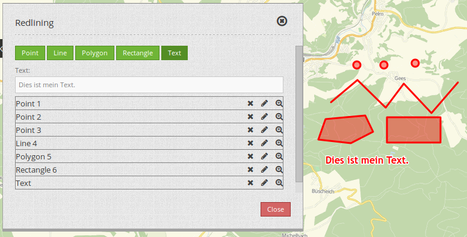
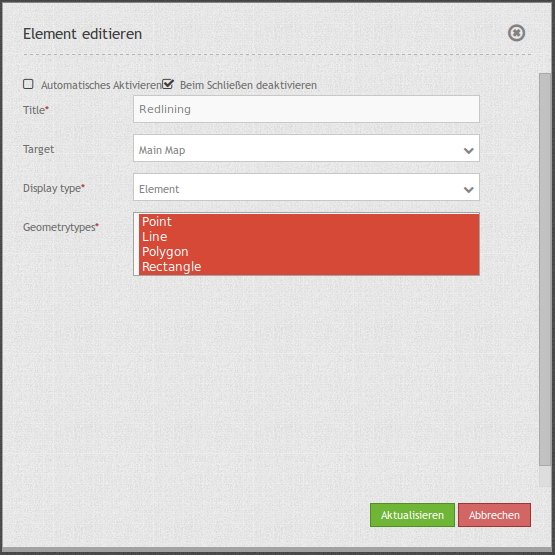
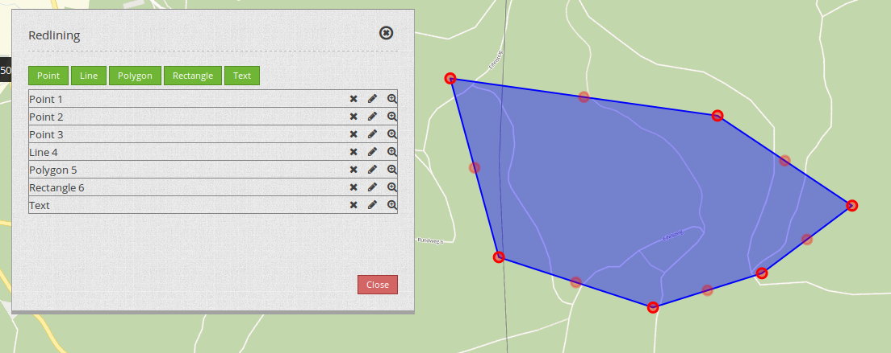
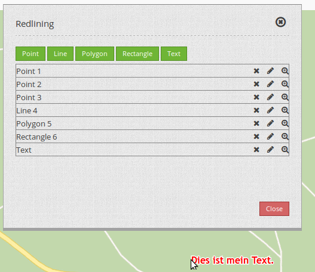

.. _redlining:

Redlining
*********

Mit dem Element Redlining können temporär verfügbaren Geometrien in der Karte erstellt werden. Temporär bedeutet, dass die Objekte nicht in einer Datenbank gespeichert werden und beim Neustart der Anwendung verloren gehen.

Die gezeichneten Geometrien werden in das Druckbild übernommen. Die Objekte in der Karte können weiter editiert werden. 

Die möglichen Geometrietypen sind:

* Punkte
* Linien
* Polygonen
* Rechtecke
* Texte (Annotations)

Konfiguration
=============

* **Title:** Titel des Elements. Dieser wird von der Schaltfläche referenziert, die das Element öffnen soll.

* **Target:** ID des Kartenelements, auf das sich das Redlining bezieht.

* **Geometrytypes:** Die Geometrietypen, die das Redlining unterstützen soll. Sie können mit der Maus die einzelnen Zeilen auswählen: Punkt, Linie, Polygon, Rechteck, Text.

Als Dialog
----------

Setzen Sie den Display type auf "Dialog". Sie benötigen eine Schaltfläche, um das Redlining als Dialog zu öffnen. Wählen Sie z.B. das Sketch Symbol als Toolbar-Icon aus und setzen Sie als Target den Namen des Elements.

In der Sidepane
---------------

Sie können das Redlining auch in die Sidepane positionieren. Setzen Sie **Display** type auf "Element".

Nutzung
=======

Objekte setzen
--------------

Punkte: Wählen Sie die Schaltfläche "Punkt" und setzen Sie einen Punkt in der Karte.

Linie: Wählen Sie die Schaltfläche "Linie" und zeichnen Sie die einzelnen Liniensegmente in der Karte. Mit einem Doppelklick schließen Sie das Zeichnen ab.

Polygon: Wählen Sie die Schaltfläche "Polygon" und zeichnen Sie die einzelnen Stützpunkte in der Karte. Mit einem Doppelklick schließen Sie das Zeichnen ab.

Rechteck: Wählen Sie die Schaltfläche "Rechteck" und ziehen Sie einfach ein Rechteck mit der Maus auf.

Text: Wählen Sie die Schaltfläche "Text". Im Dialog erscheint ein Textfeld zur Texteingabe. Danach klicken Sie einfach in die Karte. Am Klickpunkt erscheint der eingegebene Text.

Sobald Sie die Schaltfläche eines Geometrietyps geklickt haben, ist die Schaltfläche aktiv und Sie können Objekte in die Karte zeichnen. Wenn Sie den Zeichen-Modus verlassen wollen, klicken Sie wieder auf diese Schaltfläche.

Objekte löschen
---------------

Mit dem X-Symbol können Sie das jeweilige Objekt aus der Karte löschen.

Objekte verändern
-----------------

Mit dem Stift-Symbol können Sie das jeweilige Objekt verschieben oder verändern. Das jeweilige Objekt wird hervorgehoben. Mit einem Klick in die Karte schließen Sie das Verändern ab.

Punkte und Texte können verschoben werden, Linien und Polygone nicht.

.. image:: ../../../figures/de/redlining/redlining_modify_point.png
     :scale: 80

Bei Linien und Polygonen können Sie neue Stützpunkte hinzufügen, wenn Sie den Stützpunkt in der Mitte der Kanten-Linie verschieben (der leicht transparent dargestellte Vertex). Stützpunkte können durch anklicken und anschließendes drücken der Entf-Taste entfernt werden.

Texte können verschoben werden. Der Ankerpunkt eines Textes befindet sich an der unteren linken Ecke des ersten Buchstabens. Zum Verschieben klicken Sie einfach auf diese Region und verschieben den Text in der Karte. Der Text kann im Nachhinein nicht mehr verändert werden. Bitte löschen Sie den alten Text und setzen Sie einen neuen.

Zu Objekten zoomen
------------------

Mit dem Lupen-Symbol können Sie zu dem jeweiligen Objekt zoomen.

Den Zeichnen-Modus verlassen
----------------------------

Wenn Sie mit dem Zeichnen fertig sind, klicken Sie wieder auf die Schaltfläche des Geometrietyps, den Sie gezeichnet haben. Die Schaltfläche wird inaktiv und bei einem Klick auf der Karte wird wieder das normale Verhalten ausgeführt.

YAML-Definition
===============

.. code-block:: yaml

 "auto_activate": false, # true/false
 "deactivate_on_close": true, # true/false
 "display_type": "element", # element/dialog
 "geometrytypes": [
   "point",
   "line",
   "polygon",
   "text",
   "rectangle"
 ],
 "target": ~
 

Class, Widget & Style
=====================

* **Class:** Mapbender/CoreBundle/Element/Redlining
* **Widget:** Mapbender/CoreBundle/Resources/public/mapbender.element.redlining.js
* **Scss:** Mapbender/CoreBundle/Resources/public/sass/element/redlining.scss
* **Twig:** Mapbender/CoreBundle/Resources/views/Element/redlining.html.twig
* **Json:** Mapbender/CoreBundle/Resources/views/Element/redlining.json.twig
* **AdminType:** /Mapbender/CoreBundle/Element/Type/RedliningAdminType.php
* **Admin:** Mapbender/CoreBundle/Resources/views/ElementAdmin/redlining.html.twig
