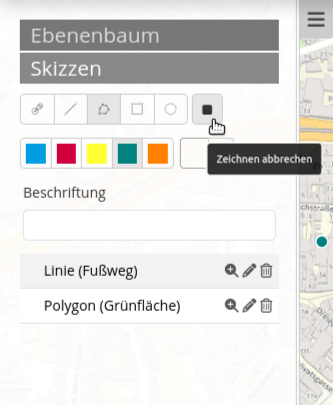

.. _sketch_de:

Sketch
******

Mit dem Skizzen (Sketch) Element können temporär verfügbare Geometrien in der Karte erstellt werden. Temporär bedeutet, dass die Objekte nicht in einer Datenbank gespeichert werden und beim Neustart der Anwendung verloren gehen. Skizzen werden auch in das Druckbild übernommen.

Mit Skizzen Element können folgende Geometrietypen erstellt werden:

* Punkt
* Linie
* Polygon
* Rechteck
* Kreis
* Text 

Konfiguration
================

.. image:: ../../../figures/de/sketch_configuration.png
     :scale: 80

* **Automatisches Aktivieren** Das Element wird automatisch aktiviert.
* **Beim Schließen deaktivieren** Skizzen werden nach Schließung des Elements deaktiviert, d.h. nicht mehr in der Karte angezeigt.
* **Title:** Titel des Elements. Dieser wird in der Layouts Liste angezeigt und ermöglicht, mehrere Button-Elemente voneinander zu unterscheiden. Der Titel wird außerdem neben dem Button angezeigt, wenn “Beschriftung anzeigen” aktiviert ist.
* **Target:** ID des Kartenelements, auf das sich das Element bezieht.
* **Geometrytypes:** Liste der unterstützten Geometrietypen 

Geometrien erstellen
--------------------

Die Punktzeichnung wird über den Button "Punkt" aktiviert/deaktiviert. Punkte werden über einen Einfachklick in die Karte definiert.

.. image:: ../../../figures/de/sketch_create_points.png
     :scale: 80

Die Linienzeichnung wird über den Button "Linie" aktiviert/deaktiviert. Liniensegmente werden mit einem Einfachklick definiert. Das Abschließen der Zeichnung erfolgt mit einem Doppelklick. 

.. image:: ../../../figures/de/sketch_create_lines.png
     :scale: 80

Die Polygonzeichnung wird über den Button "Polygon" aktiviert/deaktiviert. Eckpunkte werden mit einem Einfachklick definiert. Das Abschließen der Zeichnung erfolgt mit einem Doppelklick. 

.. image:: ../../../figures/de/sketch_create_polygons.png
     :scale: 80   

Die Rechteckzeichnung wird über den Button "Rechteck" aktiviert/deaktiviert. Rechtecke werden nach einem Einfachklick mit der Maus aufgezogen.

.. image:: ../../../figures/de/sketch_create_rectangles.png
     :scale: 80

Die Kreiszeichnung wird über den Button "Kreis" aktiviert/deaktiviert. Kreise werden nach einem Einfachklick mit der Maus aufgezogen.

.. image:: ../../../figures/de/sketch_create_circles.png
     :scale: 80     

Die Textsetzung wird über den Button "Text" aktiviert/deaktiviert. Damit eine Textsetzung erfolgen kann, muss der Text zunächst unter "Beschriftung" definiert werden. 

.. image:: ../../../figures/de/sketch_create_texts.png
     :scale: 80

Löschen, Bearbeiten und Zoomen
------------------------------

Gezeichnete Skizzen können individuell gelöscht [1] und bearbeitet [2] werden. Es besteht außerdem die Möglichkeit, auf einzelne Geometrien zu zoomen [3].

.. image:: ../../../figures/de/sketch_delete_edit_zoom.png
     :scale: 80

Zeichenmodus verlassen
----------------------

Der Zeichenmodus wird über den Button "Zeichnen beenden" deaktiviert.

YAML-Definition:
----------------

Diese Vorlage kann genutzt werden, um das Element in einer YAML-Applikation einzubinden.

.. code-block:: yaml

   tooltip: 'Sketch'                # Text des Tooltips
   target: ~                        # ID des Kartenelements
   auto_activate: false             # (Standard: false).
   deactivate_on_close: true        # Gezeichnete Geometrien werden durch Schließen des Elements deaktiviert (Standard: true).
   geometrytypes: 'point', 'line'   # Liste der unterstützten Geometrietypen 
   'polygon', 'rectangle', "circle"

