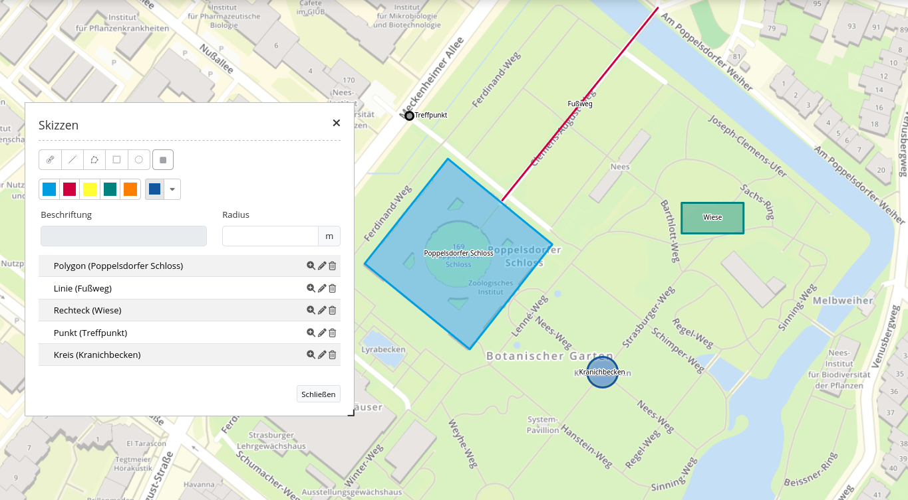

.. _sketch_de:

Sketch
***********************

Das Skizzen (Sketch) Element fügt einen Vektorlayer in der Karte hinzu, wodurch Geometrieobjekte temporär gezeichnet werden.

Konfiguration
================

.. image:: ../../../figures/de/sketch_configuration.png
     :scale: 80

* **Title:** Titel des Elements. Dieser wird in der Layouts Liste angezeigt und ermöglicht, mehrere Button-Elemente voneinander zu unterscheiden. Der Titel wird außerdem neben dem Button angezeigt, wenn “Beschriftung anzeigen” aktiviert ist.
* **Target:** ID des Kartenelements, auf das sich das Element bezieht.
* **Default:** Zeichenart der Skizze (s. Parameter 'types')
* **Types:** Liste der unterstützten Zeichenarten 

YAML-Definition:
----------------

.. code-block:: yaml

   tooltip: 'Sketch'                # Text des Tooltips
   target: ~                        # ID des Kartenelements
   types: 'circle'                  # Liste der unterstützten Zeichenarten 
   defaultType: 'circle'            # Zeichenart der Skizze (s. Parameter 'types')

Für das Element wird ein Button verwendet. Zu der Konfiguration des Buttons besuchen sie die Dokumentationsseite unter :ref:`button_de`.

Class, Widget & Style
============================

* **Class:** Mapbender\\CoreBundle\\Element\\Sketch
* **Widget:** mapbender.element.sketch.js

HTTP Callbacks
=====================

Keine.
