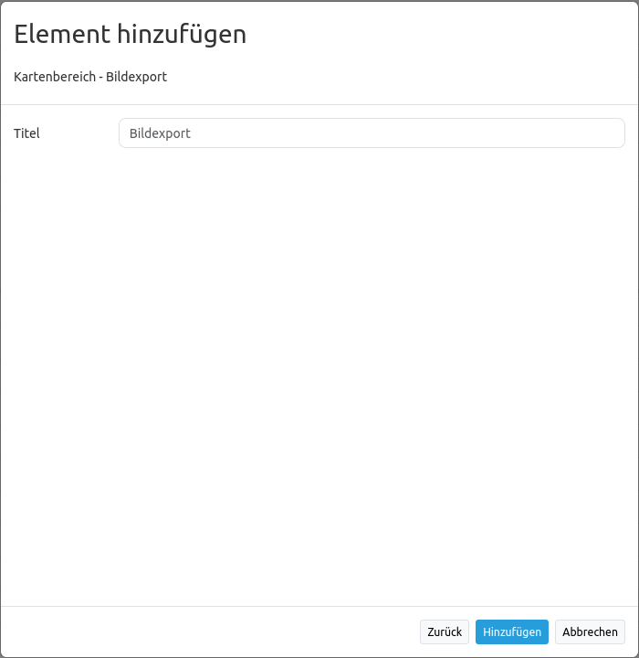

.. _imageexport_de:

ImageExport (Bildexport)
************************

Mit dem ImageExport kann die aktuelle Kartenansicht exportiert werden. Das Bild kann als .png oder .jpeg abgespeichert werden.

Konfiguration
=============

* **Title:** Titel des Elements. Dieser wird in der "Layout" Liste angezeigt und ermöglicht mehrere Button-Elemente voneinander zu unterscheiden. Der Titel wird außerdem neben dem Button angezeigt, wenn "Beschriftung anzeigen" aktiviert ist.

YAML-Definition:
----------------

Diese Vorlage kann genutzt werden, um das Element in einer YAML-Anwendung einzubinden.

.. code-block:: yaml

   class: Mapbender\PrintBundle\Element\ImageExport
   target: map                       # ID des Kartenelements (z.B. map)

Für das Element wird ein Button verwendet. Zu der Konfiguration des Buttons besuchen Sie die Dokumentationsseite unter :ref:`button_de`.

