.. _printclient_de:

Druck (PrintClient)
*******************

Das Druckelement ermöglicht den Druck eines auswählbaren Kartenbereichs. Im Folgenden wird zunächst der allgemeine Aufbau und die Konfiguration des PrintClients erklärt. Danach folgt eine Einführung in die Erstellung individueller Druckvorlagen. Im letzten Teil wird auf den Druckvorgang selbst eingegangen und wie dieser konfiguriert werden kann. 

Allgemeines
===========

Mit dem PrintClient können folgende Druckeinstellungen beeinflusst werden:

 * Druckvorlage,
 * Qualität,
 * Maßstab,
 * Drehung des Ausschnitts,
 * Titel,
 * Aktivierung/Deaktivierung einer Legende,
 * Optional können Textfelder definiert werden (z.B. Titel, Kommentar, Bemerkung), die mit in den Druck übergeben werden.

.. image:: ../../../figures/de/print_client.png
     :scale: 80
     
Das Element kann über einen Button aufgerufen oder in der Sidepane als Element eingebunden werden. Sobald der PrintClient angesteuert wird, erscheint auf der Karte ein Druckrahmen. Dieser bestimmt den zu druckenden Bereich der Karte und kann vom Anwender beliebig ausgerichtet werden. Nach dem Druck muss der Druckrahmen wieder deaktiviert werden, damit die Karte wie gehabt genutzt werden kann (im Dialog geschieht dies alles durch das Öffnen und Schließen des Dialogfensters).

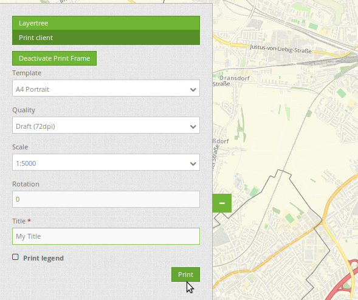
     
Konfiguration des PrintClients
------------------------------

Der PrintClient kann im Backend konfiguriert werden. Er greift dabei auf Druckvorlagen (Templates) zurück. Diese LibreOffice Draw Dateien liegen in den Formaten A4 bis A0 vor. In ihnen können Bereiche für Datum, Maßstab, Nordpfeil, Übersichtskarte und dynamische Bild- und Textbereiche definiert werden.

.. image:: ../../../figures/de/print_client_configuration.png
     :scale: 80

* **Titel**: Titel des Elements. Dieser wird in der Layouts Liste angezeigt und ermöglicht, mehrere Button-Elemente voneinander zu unterscheiden. Der Titel wird außerdem neben dem Button angezeigt, wenn "Beschriftung anzeigen" aktiviert ist.
* **Maßstabsstufen (Scales)**: Maßstäbe, die in der Selectbox ausgewählt werden können. Wenn keine Maßstäbe angegeben werden, muss ein beliebiger Maßstab hinzugefügt werden.
* **Drehbar**: definiert, ob der Ausdruck gedreht werden kann (Standard: true).
* **Legende drucken**: fügt eine Checkbox hinzu, die den Druck der Kartenlegende ermöglicht (Standard: false).
* **Legenden Checkbox aktiv**: definiert, ob die "Legende drucken" - Checkbox bei Anwendungsstart aktiv ist
* **File prefix**: Anpassung des Dateinamens für das PDF. Dieser setzt sich aus dem definierbarem Prefix und der Datums- und Uhrzeitangabe des Drucks zusammen.
* **Qualitätsstufen**: Qualität in dpi-Werten definieren und die dazugehörige Beschriftung angegeben
* **Template**: Verweis auf die Druckvorlage (z.B. a4portrait). Löschen und Hinzufügen von Vorlagen ist über die "+"- bzw. "x"-Symbole möglich.
* **Beschriftung (Label)**: Bezeichnung der Druckvorlagen im Frontend (z.B. Portrait A4).

* **Optionale Felder (optional fields)**:

Über die Konfiguration folgender Werte können optionale Felder im Druckdialog ermöglicht werden. Eine Beispielkonfiguration mit vier Feldern (Titel, zwei Kommentarfelder, Bearbeiter) gibt die YAML-Definition.

  * **title**: Name des optionalen Feldes, der Standardwert ist null (keine optionalen Felder sind definiert).
  * **label**: Beschriftung des optionalen Feldes.
  * **options**: { required: true } : Typ des optionalen Feldes, muss true oder false sein.

* **Zeige Pflichtfelder zuerst (Display required fields first)**: Ist diese Checkbox aktiv, erscheinen Pflichtfelder im Druckdialog ganz oben.

* **Replace pattern**: Verändert den Kartenaufruf, Standardwert ist null. Angaben können hinzugefügt oder verändert werden, wie beispielsweise map_resolution (für MapServer).

Im Backend finden Sie die Formularfelder im unteren Teil des Druckdialogs (ein ausführliches und kommentiertes Beispiel steht weiter unten im Abschnitt YAML-Definition).

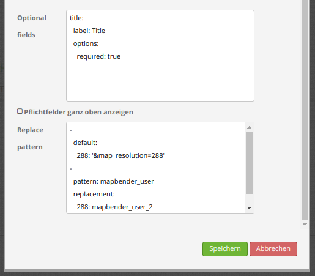
     

YAML-Definition
---------------

Diese Vorlage kann genutzt werden, um das Element in einer YAML-Anwendung einzubinden.

.. code-block:: yaml

    target: map                                              # ID des Kartenelements
    type: dialog                                             # element oder dialog, default ist dialog
    templates:
        - { template: a4portrait, label: A4 Portrait}	     # Vorlagen (template): Vorlagename, Vorlagedateiname ohne Dateierweiterung (Mapbender sucht die Datei a4portrait.odg und a4portrait.pdf), die Vorlagedateien befinden sich in app/Resources/MapbenderPrintBundle
        - { template: a4landscape, label: A4 Landscape}      # Vorlagebeschriftung im Druckdialog
    scales: [5000, 10000, 25000]                             # Maßstäbe definieren, die in der Selectbox ausgewählt werden können. Wenn keine Maßstäbe angegeben werden, kann ein beliebiger Maßstab in einem Textfeld definiert werden.
    quality_levels:                                          # die Qualität in dpi definieren und die dazugehörige Beschriftung angegeben
        - { dpi: 72 , label: Draft (72dpi)}                  # die erste Angabe ist der dpi Wert, die zweite Angabe ist die Beschriftung
        - { dpi: 288,  label: Document (288dpi)}             # es können weitere dpi-Werte angegeben werden
    rotatable: true                                          # true/false, ob der Ausdruck gedreht werden kann (Standard: true).
    legend: true                                             # true/false, ob die Legende mitgedruckt werden soll (Standard: false).
    legend_default_behaviour: false                          # true/false, Legenden Checkbox standardmäßig ausgewählt
    file_prefix: mapbender                                   # Definition des Dateinames für das PDF (wird zusammengesetzt zu file_prefix_date.pdf)
    optional_fields:                                         # es können optional weitere Felder definiert werden (z.B. Titel-Feld)
        title:                                               # Name des optionalen Feldes, der Standardwert ist null (keine optionalen Felder sind definiert)
            label: Titel                                     # Beschriftung des optionalen Feldes
            type: text                                       # Typ des optionalen Feldes
            options:
                required: true                               # erforderlich: true or false
        comment1:
            label: Kommentar 1
            options: { required: false }
        comment2:
            label: Kommentar 2
            options: { required: false }
        bearbeiter:
            label: Bearbeiter
            options: { required: true }
    replace_pattern:                                         # Für den Druck kann der Kartenaufruf verändert werden.
            -                                                # Es können zusätzliche Parameter hinzugefügt werden (wie map_resolution für MapServer).
                default: { 288: '&map_resolution=288' }
            -
                pattern: 'stadtplan.xml'                     # oder es können für den Druck optimierte Dienste angefordert werden.
                replacement: { 288: 'stadtplan_4.xml' }

Verzeichnisse
-------------

**Der Nordpfeil:**
* Das Bild des Nordpfeils befindet sich unter **app/Resources/MapbenderPrintBundle/images/**. Er kann durch ein anderes Bild ersetzt werden.

**Die Print Templates:**
* Die Vorlagen befinden sich unter **app/Resources/MapbenderPrintBundle/templates/**. Es können eigene Druckvorlagen erstellt und hinzugefügt werden.

**Die Druckdateien:**
* Die Druckdateien werden in dem Standard-Downloadordner Ihres Webbrowsers abgelegt. Mapbender speichert die Dateien des Warteschleifendrucks hingegen standardmäßig unter **web/prints/**.

Erstellen einer individuellen Vorlage
=====================================

Um eine individuelle Druckvorlage zu erstellen, kann eine vorhandene Druckvorlage (ODG-Datei, LibreOffice Draw) kopiert und anschließend bearbeitet werden. Die Vorlage kann feste Objekte wie ein Logo, Copyright oder Druckinformationen beinhalten. Zusätzlich muss eine dynamische Ebene für die dynamisch erzeugten Elemente (wie die Karte, die Übersichtskarte, den Nordpfeil, den Maßstab, das Datum und optionale Felder) erstellt werden. Die dynamische Ebene ist eine zusätzliche nicht druckbare Ebene. Eine Ebene in LibreOffice Draw kann folgendermaßen hinzugefügt werden: **Menü: Einfügen -> Ebene... -> Namen für die Ebene definieren und Checkbox "druckbar" deaktivieren**. Die Zuordnung von Elementen zu einer Ebene erfolgt über Drag & Drop.

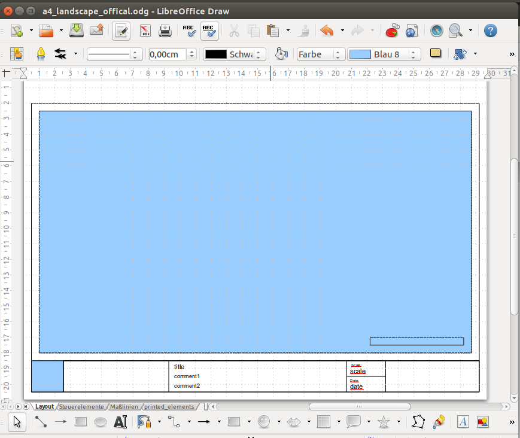

Die folgenden Bereiche liegen standardmäßig in Mapbender vor:

* map (Karte)
* overview (Übersichtskarte)
* scale (Maßstabsangabe in der Form 1:1000)
* scalebar (Maßstabsleiste)
* date (Datum in der Form 10.10.2014)
* northarrow (Nordpfeil)
* extent_ur_y, extent_ur_x, extent_ll_x, extent_ll_y (Koordinaten des Druckbereichs)
* dynamic_image (dynamisches Bild - gekoppelt an die Gruppe)
* dynamic_text (dynamischer Text - gekoppelt an die Gruppe)

Optionale Felder (z.B. Titel, Kommentar, Bearbeiter) können über die Element-Konfiguration definiert werden. Diese müssen im nicht druckbaren Bereich einfügt werden, sodass sie nicht in der Vorlage-PDF ausgegeben werden.

Bei der Erstellung dynamischer Texte müssen die jeweiligen Objekte den passenden Namen haben, z.B. das Kommentarfeld **comment1** muss auch in der Vorlage **comment1** heißen. Zum Benennen der Objektfelder reicht es nicht den Textinhalt anzupassen. Die Felder müssen selektiert und über **Menü: Format --> Name...** angepasst werden.

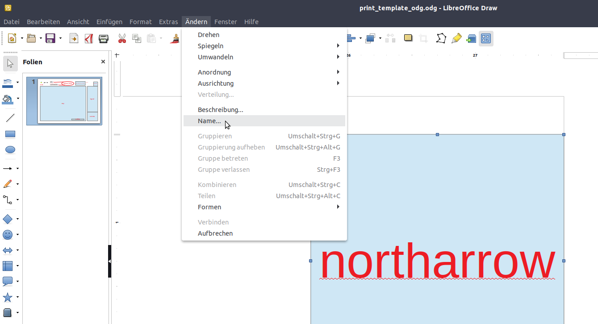

Die Vorlage muss als PDF unter dem gleichen Namen wie die ODG-Datei exportiert werden. Namen werden ohne Dateierweiterung in der YML-Druck-Definition verwendet.

Das Druck-Skript liest die Informationen (Position, Größe, Schriftgröße, Ausrichtung) aus der ODG-Datei aus und verwendet ebenfalls das PDF-Dokument mit den festen Objekten. Aus beiden Dateien und den aktuellen Karten wird eine PDF-Druckdatei erstellt.

Druck von Elementen vor dem Kartenbild
--------------------------------------

Damit beim Druck der Kartenbereich möglichst groß ist und wenig Platz durch weiße oder leere Bereiche verloren geht, können Elemente vor das Kartenbild gelegt werden. Besonders hilfreich ist dies vor allem bei großen Druckformaten wie DIN A1, die einen verhältnismäßig breiten weißen Rand aufweisen.

Für die Nutzung dieser Funktion müssen die Templates angepasst und transparente PDF-Vorlagen erzeugt werden.

Templates anpassen:

* Elemente neu anordnen, am besten vor weißem Hintergrund

  - Anordnung der Elemente im Vordergrund

    + Rechtsklick Anordnung -> Ganz nach vorn

  - Anordnung Karte = ganz nach hinten

    + Rechtsklick Anordnung -> Ganz nach hinten

* Alles selektieren

  - STRG + A drücken

* Selektion als PDF drucken

  - Exportieren als PDF

  - Bereich Auswahl statt Alle

Legende auf der ersten Seite
----------------------------

Neben dem Kartenbereich kann die Legende auf der ersten Seite der Druckvorlage integriert werden. Standardmäßig ist dieser Bereich nicht in den Druckvorlagen vorhanden. Für die Integration der Legende wird die LibreOffice Draw-Druckvorlage angepasst. Hierfür wird ein neues dynamisches Feld mit dem Namen "legend" auf der nicht druckbaren Ebene eingefügt. Die Bezeichnung des Feldes zu "legend" wird über **Menü: Format -> Name…** verändert. Sobald das Element platziert und benannt wurde, wird im Druck die Legende angezeigt. Abschließend muss die ODG-Datei als PDF exportiert und im gleichen Ordner abspeichert werden. Die Legende auf der ersten Seite kann wie folgt aussehen:

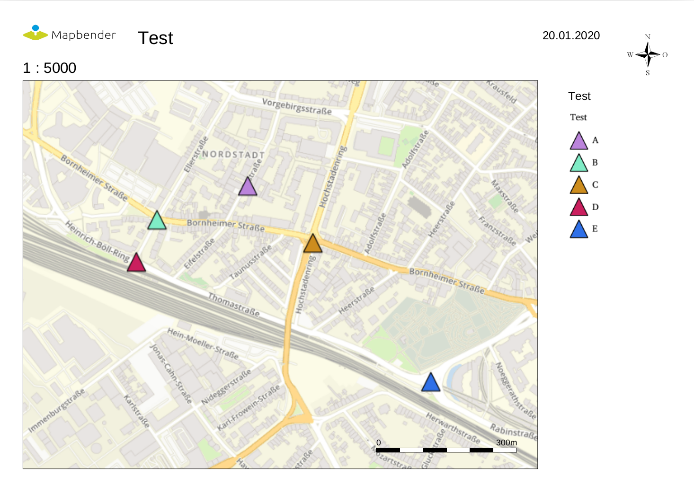

Logo auf der Legendenseite
--------------------------

Sofern die Legende weiterhin auf einer zusätzlichen Seite erzeugt werden soll, kann auf der zweiten Seite ebenfalls ein Logo eingebunden werden. Dies erfolgt über das dynamische Element "legendpage_image". Hierfür wird ein neues Feld in der nicht druckbaren Ebene eingefügt, über **Menü: Format -> Name...** in "legendpage_image" umbenannt und an gewünschter Stelle platziert. Das Logo oder Bild wird im Ordner **app/Resources/MapbenderPrintBundle/images/** unter dem Namen "legendpage_image.png" abgespeichert.
Das erzeugte PDF kann beispielsweise aus folgenden beiden Seiten bestehen:

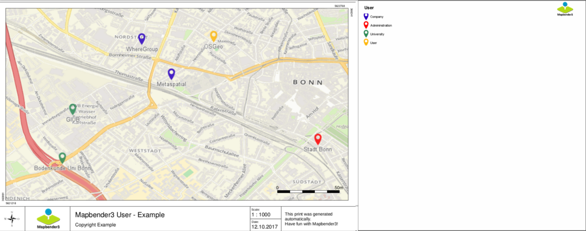

Auf der zweiten Seite erscheint das eingefügte Logo.

Farbige Texte
-------------

Der Text der Druckvorlage kann vielfältig angepasst werden. Neben der Schriftgröße besteht die Möglichkeit, die Farbe des Textes zu verändern. Hierfür wird ein Textfeld erzeugt **Menü: Einfügen -> Textfeld**. Soll der Text als dynamisches Element eingebunden werden, wird dieser auf der vorher festgelegten nicht druckbaren Ebene eingefügt und benannt. Hier wurde als Beispiel das dynamische Element "title" gewählt. Um den Text oder den Platzhalter zu färben, Text innerhalb des Textfeldes (hier: "title") markieren. Die Änderung der Farbe kann rechts neben der Vorlage unterhalb des Reiters **Eigenschaften -> Zeichen** vorgenommen werden.

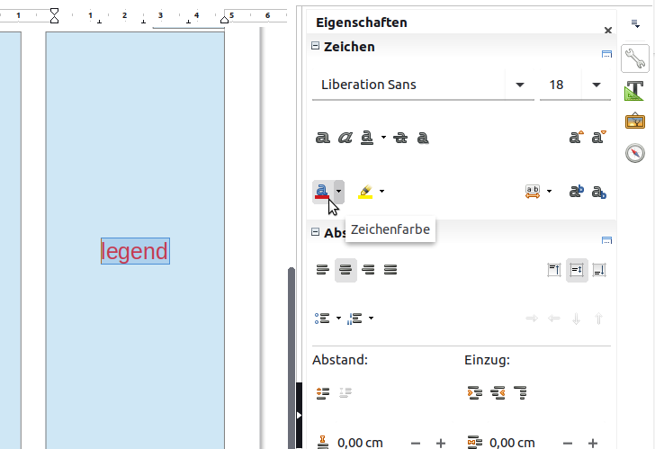

Alternativ kann über **Rechtsklick auf den markierten Text -> Zeichen ...** unter **Schrifteffekte -> Schriftfarbe** die Farbe verändert werden.

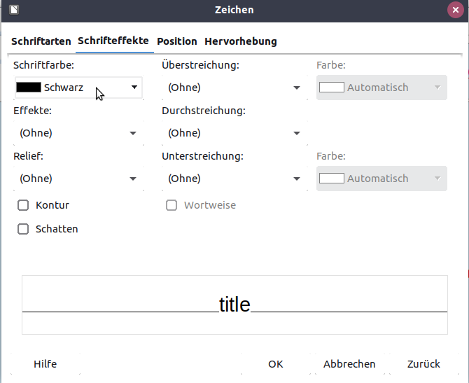

Die Veränderung der Farbe des dynamischen Feldes "title" in blau kann im Druck wie folgt aussehen:

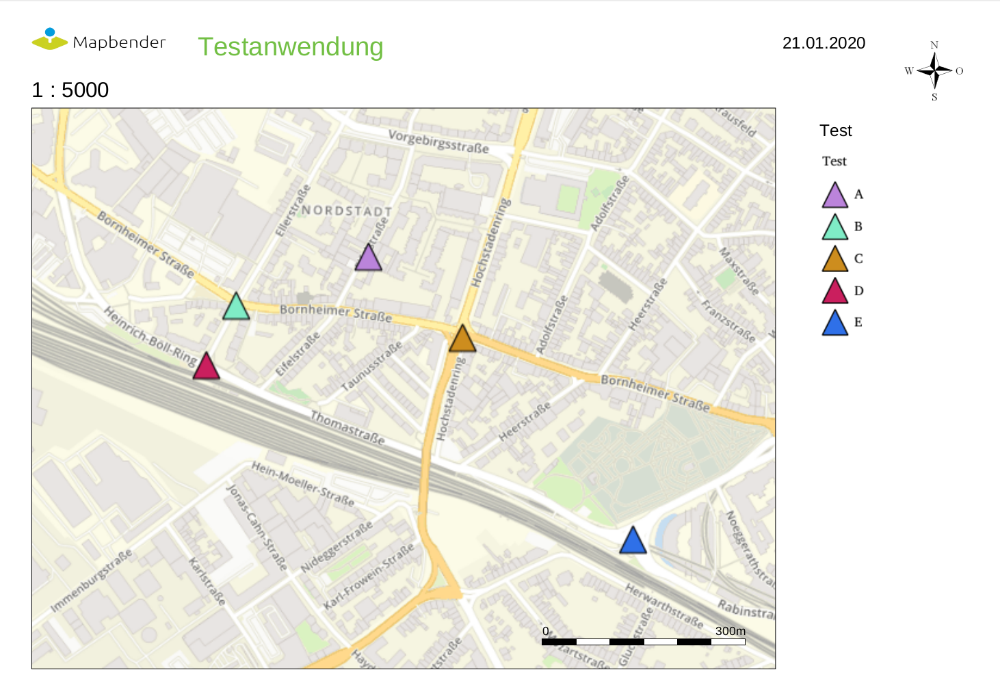

Analog zu der Veränderung der Schriftfarbe wird auch die Veränderung der Schriftgröße durchgeführt.

Dynamische Bilder und dynamische Texte
--------------------------------------

Gruppenabhängig können in der Druckausgabe unterschiedliche Bilder oder Beschreibungen (z.B. Logo und Bezeichnung der Gemeinde) ausgegeben werden. Hierzu gibt es die Platzhalter "dynamic_image" und "dynamic_text". Beide Elemente können in der ODG-Druckvorlage in die nicht druckbare Ebene eingefügt, umbenannt (**Menü: Format -> Name... bzw. Kontextmenü des Elements -> Name...**) und entsprechend platziert werden.

**Hinweis:** Es kann immer nur ein Gruppenbild und eine Gruppenbeschreibung ausgegeben werden. Mapbender zeigt immer die zuerst aufgeführte Gruppe an. Ist der Benutzer in der Gruppe "intern" und "Gruppe 1", dann wird "intern.png" als Bild genommen und die Gruppenbeschreibung der Gruppe "intern" als dynamischer Text ausgegeben.

Ein gruppenabhängiger Druck könnte bei einer Gruppe namens "Gruppe 1" wie folgt aussehen:

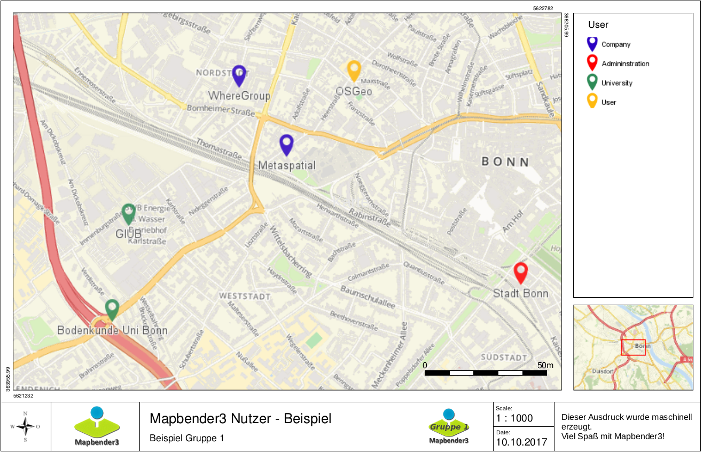

Zur Nutzung dieser Funktion müssen Gruppen mit Benutzern erstellt und den Anwendungen die jeweiligen Gruppen zugewiesen werden. Weitere Informationen zur Funktionsweise der Gruppen- und Benutzerverwaltung unter `Mapbender Quickstart <../../quickstart.html>`_.

*Dynamisches Bild*
------------------

Sobald "dynamic_image" im Drucklayout vorliegt, wird nach einem Bild mit dem Namen der ersten zugewiesenen Gruppe gesucht und dieses im Bereich des Elements "dynamic_image" ausgegeben. Hierbei wird die Höhe zur Orientierung verwendet und die Breite entsprechend angepasst. Die verschiedenen Bilder je Gruppe werden im Ordner **app/Resources/MapbenderPrintBundle/images/** unter dem jeweiligen Namen der Gruppe abgelegt (z.B. Gruppenname ist "Gruppe 1", dann lautet der Name des Bildes Gruppe 1.png).

*Dynamischer Text*
------------------

Über das Element "dynamic_text" wird die Gruppenbeschreibung der ersten zugewiesenen Gruppe im Ausdruck eingetragen. Das Textfeld verhält sich genauso wie andere Textfelder und kann beliebig viele Zeichen enthalten. Sie können den dynamischen Text unabhängig von dem dynamischen Bild einbinden und bspw. für Copyright-Hinweise nutzen.

Außerdem kann der Name des eingeloggten Nutzers ausgedruckt werden. Dafür muss der Platzhalter **user_name** an der gewünschten Stelle im Template eingefügt werden. Wenn kein Nutzer eingeloggt ist, dann bleibt beim Druck dieser Bereich frei.

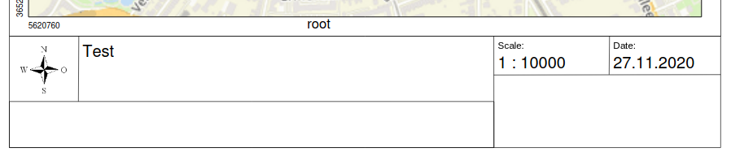
 

Der Druckvorgang
================

Druck von Information für ein ausgewähltes Objekt
-------------------------------------------------

Es können Informationen zu einem ausgewählten Objekt ausgedruckt werden. Ein Objekt kann über die Digitalisierung (Digitizer) oder die Informationsabfrage (FeatureInfo) selektiert werden.

Der feature_type-name und die selektierte object-id wird an den Druck weitergeleitet. Dadurch erhält Mapbender alle Informationen, um zu den selektierten Objekten die Sachdaten zu ermitteln und in Feldern im Drucktemplate auszugeben. Im Drucktemplate wurde festgelegt, welche Daten ausgegeben werden sollen.

Im Folgenden wird beschrieben, wie dieses Verhalten konfiguriert werden kann. Die Dokumentation bezieht sich auf die poi-Tabelle, die im digitizer-Beispiel verwendet wird.

Sie finden die Konfiguration und ein Beispiel-Drucktemplate im  Workshop/DemoBundle unter https://github.com/mapbender/mapbender-workshop

Die folgenden Schritte müssen durchgeführt werden:

1. Erzeugen eines Drucktemplates, das auf die Objektspalten verweist
2. Definition eines featureTypes und Verweis auf das neue Drucktemplate in der config.yml
3. Druck über die Informationsabfrage aufrufen
4. Alternativ: Aufruf des Drucks über die Digitalisierung

*1. Erzeugen einer Druckvorlage, die auf die Objektspalten verweist*
--------------------------------------------------------------------

Im Drucktemplate ein Textfeld für die Informationen definieren, die für das selektierte Objekt ausdruckt werden sollen. Der Textfeldname hat immer den Prefix *feature.* gefolgt vom Namen der Spalte.

.. code-block:: yaml

  feature.name for column name of table poi

*2. Definition eines featureTypes und Verweis auf das neue Drucktemplate in der config.yml*
-------------------------------------------------------------------------------------------

.. code-block:: yaml

 parameters:
   featureTypes:
     feature_demo:
       connection: search_db   # Name der Datenbankverbindung von der config.yml
       table: public.poi       # Tabellenname, in der sich die Objekte befinden
       uniqueId: a_gid         # Spaltennname mit der eindeutigen ID
       geomType: point         # Geometrietyp
       geomField: geom         # Spaltenname, in der die Geometrie gespeichert ist
       srid: 4326              # EPSG-Code der Daten
       print:                  # Drucktemplate für den Druck selektierter Objekte
         templates:
          - template: a4_portrait_official_feature_data_demo
            label: Demo with feature information print (portrait)
          - template: a4_landscape_official_feature_data_demo
            label: Demo with feature information print (landscape)

*3. Aufruf des Drucks über die Informationsabfrage*
---------------------------------------------------

Bemerkung: Die Informationsabfrage (FeatureInfo) ist die Ausgabe von Informationen von einem OGC WMS Service. Sie gibt Informationen zu Objekten an einer Klickposition aus.

Beim Konfigurieren eines WMS, muss ein Link mit der folgenden Referenz generiert werden, die den Druck mit Objektinformationen anstößt.

Der folgende Code ist ein Beispiel für ein MapServer FeatureInfo-Template.

.. code-block:: yaml

 <table>
 
 <tr>
 <td class="th_quer">Drucken</td>
 <td><a href="" onclick="parent.$('.mb-element-map').data('mapQuery').olMap.setCenter([[x],[y]]);parent.$('.mb-element-printclient:parent').data('mapbenderMbPrintClient').printDigitizerFeature('feature_demo',[gid]);parent.$('.mb-element-featureinfo:parent').data('mapbenderMbFeatureInfo').deactivate();return false">print feature information</a>
 </td>
 </tr>
 </table>

Die Informationsabfrage (FeatureInfo) öffnet einen Dialog mit dem Link *print feature information*. Mit Klick auf den Link, öffnet sich ein Druckdialog, der das Drucktemplate für das selektierte Objekt anbietet.

Das gewünschte Gebiet kann auswählt und ein PDF erzeugt werden. Das PDF beinhaltet die Informationen für das selektierte Objekt.

*4. Alternativ: Aufruf des Drucks über die Digitalisierung*
-----------------------------------------------------------

Die Funktion kann auch in die Digitalisierung eingebunden werden. Im Digitalisierungsdialog wird dann ein neuer Button *Drucken* angeboten.

Zum Aktivieren der Funktion müssen die folgenden Parameter zur Digitalisierungskonfiguration hinzugefügt werden.

.. code-block:: yaml

    printable: true

Mit Klick auf den Druckbutton, öffnet sich ein Druckdialog, der das definierte Drucktemplate für das selektierte Objekt zur Verfügung stellt.

Das gewünschte Gebiet kann auswählt werden und ein PDF erzeugt. Das PDF beinhaltet die Informationen für das selektierte Objekt.

Bemerkung: Die Flexibilität, den Druckrahmen zu verschieben, hindert den Anwender nicht daran, den Rahmen in einen Bereich zu verschieben, der nicht das ausgewählte Objekt enthält. Die ausgedruckte Objektinformation passt dann nicht zur Darstellung in der Karte.

Warteschleifendruck
-------------------

Der Warteschleifendruck ist ein Druckfeature in Mapbender, welches einen erweiterten Hintergrunddruck erlaubt. Dieses experimentelle Feature ist seit Mapbender 3.0.8 implementiert. Es ist standardmäßig nicht aktiviert, da bei komplexeren Systemen Probleme mit der Cache-Speicher-Regeneration auftreten können. Sobald aktiviert, kann das Feature entweder händisch über die Kommandozeile angestoßen oder über einen Cronjob automatisiert werden. Der Warteschleifendruck hilft dabei, ressourcenintensive Druckjobs mit langen Ausführungszeiten zu verbessern, indem diese in eine Warteschleife, die im Hintergrund abgearbeitet wird, ausgelagert werden. Währenddessen können Sie mit Mapbender anderweitig weiterarbeiten.

*Warteschleifendruck: Konfiguration*
------------------------------------

Um den Warteschleifendruck zu aktivieren, muss die parameters.yml-Datei wie folgt ergänzt werden:

.. code-block:: yaml

    mapbender.print.queueable: true

Dabei muss "Modus" auf die Option "Warteschleife" gesetzt werden, da sonst standardmäßig [der] Direktdruck (["Modus"] "direkt") eingestellt ist.

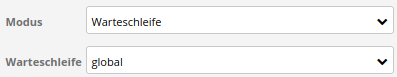

*Warteschleifendruck: Kommandozeilenbefehle*
--------------------------------------------

Nach Initialisierung des Warteschleifendrucks stehen die folgenden Funktionen über die Kommandozeile zur Ausführung des Drucks zur Verfügung[:]

.. code-block:: yaml

    mapbender:print:queue:clean
    mapbender:print:queue:dumpjob
    mapbender:print:queue:gcfiles
    mapbender:print:queue:next
    mapbender:print:queue:repair
    mapbender:print:queue:rerun
    mapbender:print:runJob

Bemerkung: Zur Ausführung der Befehle muss sich der Benutzer im application-Verzeichnis befinden und app/console den jeweiligen Befehlen voranstellen, also bspw.: app/console mapbender:print:queue:clean. Zur genauen Vorgehensweise siehe die Informationen auf der Seite `app/console Befehle <../../customization/commands.html>`_.

*Warteschleifendruck: Durchführung*
-----------------------------------

Der Tab „Einstellungen“ bietet die vom Direktdruck gewohnten Druckoptionen. Nachdem der Warteschleifendruck eingerichtet wurde, kann neben dem Tab „Einstellungen“ über einen Button die neu erscheinende Funktion „Druckaufträge“ angewählt werden. Hier finden sich chronologisch alle Druckaufträge aufgelistet, die der User über das Mapbender-Interface wie gewohnt erstellt.

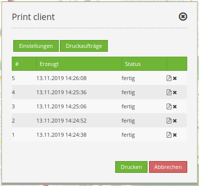

Neu ist, dass die Druckaufträge im Hintergrund erst nach Start des Prozesses

.. code-block:: yaml

    app/console mapbender:print:queue:next --max-jobs=0 --max-time=0

in der Kommandozeile ausgeführt werden. Er bewirkt, dass nach dem Klick auf den Drucken-Button der Druck entsprechend seiner Position in der Warteliste über die Kommandozeile durchführt wird. Der Prozess wird über die Tastenkombination "Strg+C" beendet. Nach abgeschlossener Generierung der Dateien (erkennbar über den Status "fertig" in der Liste der Druckaufträge) können diese über den PDF-Button geöffnet werden können.

Speicherbegrenzungen
--------------------

*Warteschleifendruck*
---------------------

Da der Warteschleifendruck möglicherweise speicherintensiver sein kann als anfangs in Ihren PHP-Einstellungen festgelegt, kann der benötigte Speicher durch manuelle Konfiguration erhöht werden. Dies ist für Anwender, die mit größeren Ausdrucken arbeiten möchten, besonders von Vorteil.
Der Parameter `mapbender.print.queue.memory_limit` (string; Standard: 1G) muss angepasst werden, um die Speicherbegrenzung speziell für den Warteschleifendruck zu erhöhen. Vorsicht: Dieser Parameter erlaubt keine "null"-Werte.

.. note:: Bemerkung: Reduzieren Sie die Speicherbegrenzung nicht.

*Direktdruck*
-------------

Über den Parameter `mapbender.print.memory_limit` (string or null; Standard: null) kann das Speicherlimit auch für den Direktdruck angepasst werden (mögliche Werte sind bspw. 512M, 2G, 2048M, etc.).
Ist der Parameter "null" eingestellt, passt sich der Druck an die vorgegebene php.ini-Begrenzung an, der Wert "-1" steht für unbegrenzte Speichernutzung.

WMS-Kachelgröße begrenzen
-------------------------

Sofern der Druck einen WMS-Dienst nicht erfolgreich in die PDF-Datei exportieren sollte, muss in der parameters.yml-Datei eine Ergänzung vorgenommen werden.
Das hat damit zu tun, dass unter bestimmten Umständen die angeforderte Pixelausdehnung für den WMS zu groß ist, sodass der Dienst keine Bilder mehr liefert.

.. code-block:: yaml

    mapbender.imaageexport.renderer.wms.max_getmap_size: 8192

Durch diese Begrenzung werden die größtmöglichen WIDTH=- und HEIGHT=-Werte für die Exportanfrage festgelegt. Im GetCapabilities-Request des jeweiligen Dienstes wird die maximale Auflösung unter ``MaxWidth`` bzw. ``MaxHeight`` definiert, sodass der getCapabilities-Request das Limit bereits vorgibt - bei `8192` handelt es sich um den Standardwert, der eventuell weiter angepasst werden muss.
Die oben genannten Parameter können auch unabhängig voneinander definiert werden. Verwenden Sie ``mapbender.imaageexport.renderer.wms.max_getmap_size.x`` für den **WIDTH=**- und ``mapbender.imaageexport.renderer.wms.max_getmap_size.y`` für den **HEIGHT=**-Parameter.