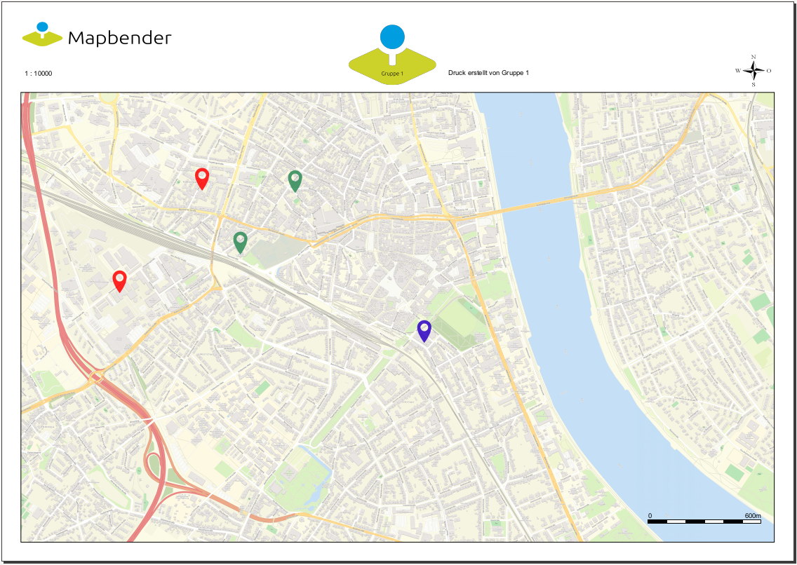

.. _printclient_de:

PrintClient (Druck)
*******************

Mapbender bietet einen PDF Druck, der einen definierten Bereich der Karte ausdruckt. Hierbei stehen im Client verschiedene Auswahlmöglichkeiten zur Verfügung:

 * Auswahl Druckvorlage,
 * Auswahl Qualität,
 * Auswahl Maßstab,
 * Drehung des Ausschnitts,
 * Ausdruck Legende
 * Optional können Textfelder definiert werden (z.B. Titel, Kommentar, Bemerkung), die mit in den Druck übergeben werden.

Der Druck greift auf Druckvorlagen zu, die individuell angepasst werden können. In den Druckvorlagen können Bereiche für Datum, Maßstab, Nordpfeil, Übersichtskarte und dynamische Bild- und Textbereiche definiert werden.

Mapbender bringt bereits eine Kollektion von Druckvorlagen (LibreOffice Draw Dateien in den Formaten A4 bis A0) mit, die individuell angepasst werden können.

.. image:: ../../../figures/de/print_client.png
     :scale: 80

Der PrintClient kann sowohl als Dialog als auch als Element in der Sidebar verwendet werden. Wenn er sich in der Sidebar befindet, müssen Sie zuerst den Druckrahmen aktivieren, um den Druck starten zu können. Wenn Sie fertig sind, müssen Sie den Druckrahmen wieder deaktivieren, damit die Karte wieder wie gehabt genutzt werden kann (im Dialog geschieht dies alles durch das Öffnen und Schließen des Dialogfensters).

.. image:: ../../../figures/de/print_client_sidebar.png
     :scale: 80

             
Konfiguration
=============

.. image:: ../../../figures/print_client_configuration.png
     :scale: 80

Das Element kann über einen Button aufgerufen werden oder in der Sidepane (Seitenleiste) verwendet werden. Siehe unter :ref:`button` zur detaillierten Beschreibung der Button-Funktion.

* **Titel**: Titel des Elements. Dieser wird in der Layouts Liste angezeigt und ermöglicht, mehrere Button-Elemente voneinander zu unterscheiden. Der Titel wird außerdem neben dem Button angezeigt, wenn "Beschriftung anzeigen" aktiviert ist.
* **Target**: Zielelement (ID des Kartenelements). 
* **Type**: element oder dialog, default ist dialog
* **Maßstabsstufen (Scales)**: Maßstäbe, die in der Selectbox ausgewählt werden können. Wenn keine Maßstäbe angegeben werden, muss ein beliebiger Maßstab hinzugefügt werden.
* **Drehbar**: definiert, ob der Ausdruck gedreht werden kann, der Standardwert ist true
* **Legende drucken**: fügt eine Checkbox hinzu, die den Druck der Kartenlegende ermöglicht, der Standardwert ist false
* **Legenden Checkbox aktiv**: definiert, ob die "Legende drucken" - Checkbox bei Anwendungsstart aktiv ist
* **File prefix**: Anpassung des Dateinamens für das PDF. Dieser setzt sich aus dem definierbarem Prefix und der Datums- und Uhrzeitangabe des Drucks zusammen.
* **Qualitätsstufen**: Qualität in dpi-Werten definieren und die dazugehörige Beschriftung angegeben
* **Template**: Verweis auf die Druckvorlage (z.B. a4portrait). Löschen und Hinzufügen von Vorlagen ist über die "+"- bzw. "x"-Symbole möglich.
* **Beschriftung (Label)**: Bezeichnung der Druckvorlagen im Frontend (z.B. Portrait A4).

* **Optionale Felder (optional fields)**:
  
Über die Konfiguration folgender Werte können optionale Felder im Druckdialog ermöglicht werden. Eine Beispielkonfiguration mit vier Feldern (Titel, zwei Kommentarfelder, Bearbeiter) gibt die YAML-Definition.

  * **title**: Name des optionalen Feldes, der Standardwert ist null (keine optionalen Felder sind definiert).
  * **label**: Beschriftung des optionalen Feldes.
  * **options**: { required: true } : Typ des optionalen Feldes, muss true oder false sein.
  
* **Zeige Pflichtfelder zuerst (Display required fields first)**: Ist diese Checkbox aktiv, erscheinen Pflichtfelder im Druckdialog ganz oben.
    
* **Replace pattern**: Verändert den Kartenaufruf, Standardwert ist null. Angaben können hinzugefügt oder verändert werden, wie beispielsweise map_resolution (für MapServer) - ein Beispiel gibt der Abschnitt YAML-Definition.

Verzeichnisse
=============

* **northarrow:** Das Bild des Nordpfeils befindet sich unter **app/Resources/MapbenderPrintBundle/images/**. Sie können das Bild des Nordpfeils auch durch ein anderes Bild ersetzen.

* **print templates:** Die Vorlagen befinden sich unter **app/Resources/MapbenderPrintBundle/templates/**. Sie können eigene Druckvorlagen erstellen.

Erstellen einer individuellen Vorlage
=====================================
Um eine individuelle Druckvorlage zu erstellen, kopieren Sie eine vorhandene Druckvorlage (ODG-Datei) und bearbeiten diese. Sie können auch eine neue LibreOffice Draw-Datei erzeugen. Die Vorlage kann feste Objekte wie ein Logo, ein Copyright oder Druckinformationen beinhalten. Zusätzlich muss eine dynamische Ebene für die dynamisch erzeugten Elemente (wie die Karte, die Übersichtskarte, den Nordpfeil, den Maßstab, das Datum und optionale Felder) erstellt werden. Die dynamische Ebene ist eine zusätzliche nicht druckbare Ebene in der LibreOffice Draw-Datei. Fügen Sie diese Ebene in LibreOffice Draw folgendermaßen hinzu: **Menü: Einfügen -> Ebene... -> definieren Sie einen Namen für die Ebene und deaktivieren Sie die Checkbox "druckbar"**.

.. image:: ../../../figures/print_template_odg.png
     :scale: 80

Definieren Sie nach Bedarf Bereiche für die Karte, den Nordpfeil, den Maßstab, das Datum und mehr sowie für optionale Felder. 

Die folgenden Bereiche liegen standardmäßig in Mapbender vor:

* map (Karte)
* overview (Übersichtskarte)
* scale (Maßstabsangabe in der Form 1:1000)
* scalebar (Maßstabsleiste)
* date (Datum in der Form 10.10.2014)
* northarrow (Nordpfeil)
* extent_ur_y, extent_ur_x, extent_ll_x, extent_ll_y (Koordinaten des Druckbereichs)
* dynamic_image (dynamisches Bild - gekoppelt an die Gruppe)
* dynamic_text (dynamischer Text - gekoppelt an die Gruppe)

Sie können optionale Felder über die Element-Konfiguration definieren (wie Titel, Kommentar, Bearbeiter). Diese müssen Sie dann auch in die OpenOffice Draw Datei in den nicht druckbaren Bereich einfügen, sodass Sie nicht im Vorlage-PDF ausgegeben werden.

Bei der Erstellung dynamischer Texte müssen die jeweiligen Objekte den passenden Namen haben, z.B. das Kommentarfeld **comment1** muss auch in der Vorlage **comment1** heißen. Zum Benennen der Objektfelder reicht es nicht den Textinhalt anzupassen. Die Felder müssen selektiert und über **Menü: Format --> Name...** angepasst werden. 

.. image:: ../../../figures/de/print_template_name.png
    :scale: 80

Exportieren Sie die Vorlage als PDF unter dem gleichen Namen wie die ODG-Datei. Verwenden Sie den Namen ohne Dateierweiterung in der Druck YML-Definition.

Das Druck-Skript liest die Informationen (Position, Größe, Schriftgröße, Ausrichtung) aus der ODG-Datei aus und verwendet ebenfalls das PDF-Dokument mit den festen Objekten. Aus beiden Dateien und den aktuellen Karten wird eine PDF-Druckdatei erstellt.

Druck von Elementen vor dem Kartenbild
======================================

Damit beim Druck der Kartenbereich möglichst groß ist und wenig Platz durch weiße oder leere Bereiche verloren geht, können Elemente vor das Kartenbild gelegt werden. Besonders hilfreich ist dies vor allem bei großen Druckformaten wie DIN A1, die einen verhältnismäßig breiten weißen Rand aufweisen. 

Für die Nutzung dieser Funktion müssen die Templates angepasst und transparente PDF-Vorlagen erzeugt werden. 

Templates anpassen:

* Elemente neu anordnen, am besten vor weißem Hintergrund

  - Anordnung der Elemente im Vordergrund

    + Rechtsklick Anordnung -> Ganz nach vorn

  - Anordnung Karte = ganz nach hinten

    + Rechtsklick Anordnung -> Ganz nach hinten

* Alles selektieren

  - STRG + A drücken

* Selektion als PDF drucken

  - Exportieren als PDF

  - Bereich Auswahl statt Alle

Legende auf der ersten Seite
============================

Neben dem Kartenbereich kann die Legende auf der ersten Seite der Druckvorlage integriert werden. Standardmäßig ist dieser Bereich nicht in den Druckvorlagen vorhanden. Für die Integration der Legende wird die LibreOffice Draw-Druckvorlage angepasst. Fügen Sie ein neues dynamisches Feld mit dem Namen "legend" auf der nicht druckbaren Ebene ein und platzieren Sie es an der gewünschten Stelle. Die Bezeichnung des Feldes zu "legend" wird über **Menü: Format -> Name…** verändert. Sobald das Element platziert und benannt wurde, wird Ihnen an dieser Stelle im Druck die Legende angezeigt. Abschließend müssen Sie die ODG-Datei als PDF exportieren und im gleichen Ordner abspeichern. Die Legende auf der ersten Seite kann wie folgt aussehen:

.. image:: ../../../figures/de/print_client_example_legend.png
     :scale: 80

Logo auf der Legendenseite
==========================

Sofern die Legende weiterhin auf einer zusätzlichen Seite erzeugt werden soll, können Sie auf dieser zweiten Seite ebenfalls ein Logo einbinden. Dies erfolgt über das dynamische Element "legendpage_image". Hierfür fügen Sie ein neues Feld in der nicht druckbaren Ebene ein, das Sie über **Menü: Format -> Name...** in "legendpage_image" umbenennen und an gewünschter Stelle platzieren. Das Logo oder Bild, welches Sie dort einfügen möchten, speichern Sie im Ordner **app/Resources/MapbenderPrintBundle/images/** unter dem Namen "legendpage_image.png" ab.
Das erzeugte PDF kann beispielsweise aus folgenden beiden Seiten bestehen:

.. image:: ../../../figures/de/print_client_example_legendpage_image.png
     :scale: 80

Auf der zweiten Seite erscheint das eingefügte Logo.

Farbige Texte
=============

Der Text der Druckvorlage kann vielfältig angepasst werden. Neben der Schriftgröße besteht die Möglichkeit die Farbe des Textes zu verändern. Erzeugen Sie hierfür ein Textfeld über **Menü: Einfügen -> Textfeld**. Tragen Sie den gewünschten Text ein. Möchten Sie diesen Text als dynamisches Element einbinden, fügen Sie dieses auf Ihrer vorher festgelegten nicht druckbaren Ebene ein und benennen es entsprechend. Hier wurde als Beispiel das dynamische Element "title" gewählt. Um den Text oder den Platzhalter zu färben, markieren Sie den Text innerhalb des Textfeldes (hier: "title"). Die Änderung der Farbe können Sie entweder rechts neben Ihrer Vorlage unterhalb des Reiters **Eigenschaften -> Zeichen** vornehmen.

.. image:: ../../../figures/de/print_client_example_colour_nav.png
     :scale: 80   

Alternativ öffnen Sie über **Rechtsklick auf den markierten Text -> Zeichen ...** das Dialogfeld Zeichen und verändern die Farbe unter **Schrifteffekte -> Schriftfarbe**.

.. image:: ../../../figures/de/print_client_example_colour_dialog.png
     :scale: 80

Die Veränderung der Farbe des dynamischen Feldes "title" in blau kann im Druck wie folgt aussehen:

.. image:: ../../../figures/de/print_client_example_colour.png
     :scale: 80

Analog zu der Veränderung der Schriftfarbe wird auch die Veränderung der Schriftgröße durchgeführt.

Dynamische Bilder und dynamische Texte
======================================

Gruppenabhängig können in der Druckausgabe unterschiedliche Bilder oder Beschreibungen (z.B. Logo und Bezeichnung der Gemeinde) ausgegeben werden. Hierzu gibt es die Platzhalter "dynamic_image" und "dynamic_text". Beide Elemente können in der ODG-Druckvorlage in die nicht druckbare Ebene eingefügt, umbenannt (**Menü: Format -> Name... bzw. Kontextmenü des Elements -> Name...**) und entsprechend platziert werden. 

**Hinweis:** Es kann immer nur ein Gruppenbild und eine Gruppenbeschreibung ausgegeben werden. Mapbender zeigt immer die zuerst aufgeführte Gruppe an. Ist der Benutzer in der Gruppe "intern" und "Gruppe 1", dann wird "intern.png" als Bild genommen und die Gruppenbeschreibung der Gruppe "intern" als dynamischer Text ausgegeben. 

Ein gruppenabhängiger Druck könnte bei einer Gruppe namens "Gruppe 1" wie folgt aussehen:

Zur Nutzung dieser Funktion müssen Sie vorher Gruppen mit Benutzern erstellen und den Anwendungen die jeweiligen Gruppen zuweisen. Die Funktionsweise der Gruppen- und Benutzerverwaltung finden Sie in der Mapbender Dokumentation im `Mapbender Quickstart <../../quickstart.html>`_.

Dynamisches Bild
----------------

Sobald "dynamic_image" im Drucklayout vorliegt, wird nach einem Bild mit dem Namen der ersten zugewiesenen Gruppe gesucht und dieses im Bereich des Elements "dynamic_image" ausgegeben. Hierbei wird die Höhe zur Orientierung verwendet und die Breite entsprechend angepasst. Die verschiedenen Bilder je Gruppe werden im Ordner **app/Resources/MapbenderPrintBundle/images/** unter dem jeweiligen Namen der Gruppe abgelegt (z.B. Gruppenname ist "Gruppe 1", dann lautet der Name des Bildes Gruppe 1.png).

Dynamischer Text
----------------

Über das Element "dynamic_text" wird die Gruppenbeschreibung der ersten zugewiesenen Gruppe im Ausdruck eingetragen. Das Textfeld verhält sich genauso wie andere Textfelder und kann beliebig viele Zeichen enthalten. Sie können den dynamischen Text unabhängig von dem dynamischen Bild einbinden und bspw. für Copyright-Hinweise nutzen. 

Druck von Information für ein ausgewähltes Objekt
=================================================

Es können Informationen zu einem ausgewählten Objekt ausgedruckt werden. Ein Objekt kann über die Digitalisierung (Digitizer) oder die Informationsabfrage (FeatureInfo) selektiert werden.

Der feature_type-name und die selektierte object-id wird an den Druck weitergeleitet. Dadurch erhält Mapbender alle Informationen, um zu selektierten Objekten die Sachdaten zu ermitteln und in Feldern im Drucktemplate auszugeben. Im Drucktemplate wurde festgelegt, welche Daten ausgegeben werden sollen.

Im Folgenden wird beschrieben, wie dieses Verhalten konfiguriert werden kann. Die Dokumentation bezieht sich auf die poi-Tabelle, die im digitizer-Beispiel verwendet wird.

Sie finden die Konfiguration und ein Beispiel-Drucktemplate im  Workshop/DemoBundle unter https://github.com/mapbender/mapbender-workshop 

Die folgenden Schritte sind müssen durchgeführt werden:

1. Erzeugen Sie ein Drucktemplate, das auf die Objektspalten verweist
2. Definieren Sie einen featureType und verweisen Sie auf das neue Drucktemplate in Ihrer config.yml
3. Rufen Sie den Druck über die Informationsabfrage auf
4. alternativ: Aufruf des Drucks über die Digitalisierung

1. Erzeugen Sie eine Druckvorlage, die auf die Objektspalten verweist
----------------------------------------------------------------------

Definieren Sie im Drucktemplate ein Textfeld für die Informationen, die Sie für das selektierte Objekt ausdrucken möchten. Der Textfeldname hat immer den Prefix *feature.* gefolgt vom Namen der Spalte.

.. code-block:: yaml

  feature.name for column name of table poi

2. Definieren Sie einen featureType und verweisen Sie auf das neue Drucktemplate in der config.yml
--------------------------------------------------------------------------------------------------

.. code-block:: yaml

 parameters:
   featureTypes:
     feature_demo:
       connection: search_db   # Name der Datenbankverbindung von der config.yml
       table: public.poi       # Tabellenname, in der sich die Objekte befinden
       uniqueId: a_gid         # Spaltennname mit der eindeutigen ID
       geomType: point         # Geometrietyp
       geomField: geom         # Spaltenname, in der die Geometrie gespeichert ist
       srid: 4326              # EPSG-Code der Daten
       print:                  # Drucktemplate für den Druck selektierter Objekte
         templates:
          - template: a4_portrait_official_feature_data_demo
            label: Demo with feature information print (portrait)
          - template: a4_landscape_official_feature_data_demo
            label: Demo with feature information print (landscape)

3. Aufruf des Drucks über die Informationsabfrage
-------------------------------------------------

Bemerkung: Die Informationsabfrage (Feature Info) ist die Ausgabe von Informationen von einem OGC WMS Service. Sie gibt Informationen zu Objekten an einer Klickposition aus.

Wenn Sie einen WMS konfigurieren, generieren Sie einen Link mit der folgenden Referenz, die den Druck mit Objektinformationen anstößt.

Der folgende Code ist ein Beispiel für ein MapServer FeatureInfo-Template.

.. code-block:: yaml

 <table>
 
 <tr>
 <td class="th_quer">Drucken</td>
 <td><a href="" onclick="parent.$('.mb-element-map').data('mapQuery').olMap.setCenter([[x],[y]]);parent.$('.mb-element-printclient:parent').data('mapbenderMbPrintClient').printDigitizerFeature('feature_demo',[gid]);parent.$('.mb-element-featureinfo:parent').data('mapbenderMbFeatureInfo').deactivate();return false">print feature information</a>
 </td>
 </tr>
 </table>

Die Informationsabfrage (FeatureInfo) öffnet einen Dialog mit dem Link *print feature information*. Wenn Sie auf den Link klicken, öffnet sich ein Druckdialog, der das Drucktemplate für das selektierte Objekt anbietet.

Sie können das gewünschte Gebiet auswählen und ein PDF erzeugen. Das PDF beinhaltet die Informationen für das selektierte Objekt.

4. Oder Aufruf des Drucks über die Digitalisierung
--------------------------------------------------

Sie können diese Funktion auch in die Digitalisierung einbinden. Im Digitalisierungsdialog wird dann ein neuer Button *Drucken* angeboten.

Zum Aktivieren der Funktion müssen die folgenden Parameter zur Digitalisierungskonfiguration hinzugefügt werden.

.. code-block:: yaml
    
    printable: true

Wenn Sie auf den Druckbutton klicken, öffnet sich ein Druckdialog, der das definierte Drucktemplate für das selektierte Objekt zur Verfügung stellt.

Sie können das gewünschte Gebiet auswählen und ein PDF erzeugen. Das PDF beinhaltet die Informationen für das selektierte Objekt.

Bemerkung: Die Flexibilität, den Druckrahmen zu verschieben, hindert den Anwender nicht daran, den Rahmen in einen Bereich zu verschieben, der nicht das ausgewählte Objekt enthält. Die ausgedruckte Objektinformation passt dann nicht zur Darstellung in der Karte.

Konfiguration des Elements
==========================

Gehen Sie in der Administration von Mapbender zu Ihrer Anwendung und erzeugen Sie ein Element **Druck** (Beachten Sie: Das Element kann über einen Button aufgerufen werden oder in der Sidepane (Seitenleiste) verwendet werden).

YAML-Definition:
----------------

.. code-block:: yaml

    target: map                    # ID des Kartenelements
    type: dialog                   # element oder dialog, default ist dialog
    templates:
        - { template: a4portrait, label: A4 Portrait}	# Vorlagen (template): Vorlagename, Vorlagedateiname ohne Dateierweiterung (Mapbender sucht die Datei a4portrait.odg und a4portrait.pdf), die Vorlagedateien befinden sich in app/Resources/MapbenderPrintBundle
        - { template: a4landscape, label: A4 Landscape} 	# Vorlagebeschriftung im Druckdialog
    scales: [5000, 10000, 25000]   # Maßstäbe definieren, die in der Selectbox ausgewählt werden können. Wenn keine Maßstäbe angegeben werden, kann ein beliebiger Maßstab in einem Textfeld definiert werden.
    quality_levels:				   # die Qualität in dpi definieren und die dazugehörige Beschriftung angegeben
        - { dpi: 72 , label: Draft (72dpi)}		# die erste Angabe ist der dpi Wert, die zweite Angabe ist die Beschriftung
        - { dpi: 288,  label: Document (288dpi)}	# es können weitere dpi-Werte angegeben werden
    rotatable: true                             	# true/false ob der Ausdruck gedreht werden kann, der Standardwert ist true
    legend: true                   # true/false, der Standardwert ist false
    legend_default_behaviour: false # true/false, Legenden Checkbox standardmäßig ausgewählt
    file_prefix: mapbender        # Definition des Dateinames für das PDF (wird zusammengesetzt zu file_prefix_date.pdf)
    optional_fields:               # es können optional weitere Felder definiert werden (z.B. Titel-Feld)
        title:                     # Name des optionalen Feldes, der Standardwert ist null (keine optionalen Felder sind definiert)
            label: Titel           # Beschriftung des optionalen Feldes
            type: text             # Typ des optionalen Feldes
            options:                            
                required: true     # erforderlich: true or false
        comment1:
            label: Kommentar 1
            options: { required: false }
        comment2:
            label: Kommentar 2
            options: { required: false }
        bearbeiter:
            label: Bearbeiter
            options: { required: true }
    replace_pattern:               # Für den Druck kann der Kartenaufruf verändert werden. 
    -                      # Es können zusätzliche Parameter hinzugefügt werden (wie map_resolution für MapServer)
                default: { 288: '&map_resolution=288' }
            -
                pattern: 'stadtplan.xml'        # oder es können für den Druck optimierte Dienste angefordert werden.
                replacement: { 288: 'stadtplan_4.xml' }

Class, Widget & Style
=====================

* Class: Mapbender\\CoreBundle\\Element\\PrintClient
* Widget: mapbender.element.printClient.js
