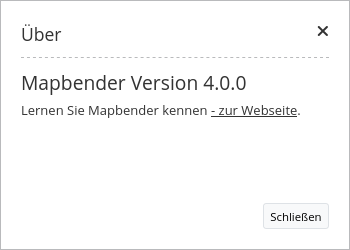

.. _about_dialog_de:

About Dialog (Über-Dialog)
********************************

Dieses Element rendert einen `Button <button.html>`_, der einen Dialog mit der aktuellen Mapbender Version anzeigt. Der Button kann im Standard-Template wie gehabt in der Toolbar verwendet werden oder auch in die Footer Region positioniert werden.

Konfiguration
=============

.. image:: ../../../figures/de/about_dialog_configuration.png
     :scale: 80

* **Beschriftung anzeigen:** Schaltet Text neben dem About Dialog Button ein/aus (Standard: true).
* **Title:** Text, der neben dem About Dialog Button angezeigt wird.
* **Tooltip:** Text, der erscheint wenn der Mauszeiger längere Zeit über dem Button gehalten wird. 

YAML-Definition:
----------------

.. code-block:: yaml

   title: 'Über Mapbender'     # Text, der neben dem About Dialog Button angezeigt wird
   tooltip: 'Über Mapbender'   # Text des Tooltips
   label: true                  # false/true, um den Button zu beschriften. Der Standardwert ist true.
   icon: 'abouticon'            # Symbol für den Button

   
Class, Widget & Style
======================

* **Class:** Mapbender\\CoreBundle\\Element\\AboutDialog
* **Widget:** mapbender.mbAboutDialog
* **Style:** mapbender.elements.css

HTTP Callbacks
==============

about
-----

Ruft Inhalte des Dialogs auf.
