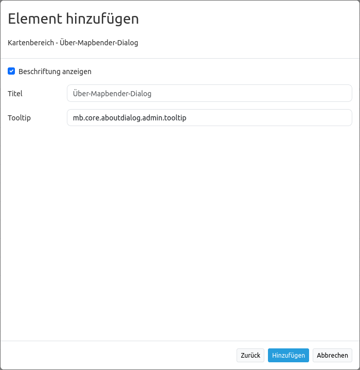

.. _about_dialog_de:

Über-Mapbender-Dialog (About Dialog)
************************************

Dieses Element erstellt einen `Button <button.html>`_, der einen Dialog mit der aktuellen Mapbender Version anzeigt. Der Button kann in die Toolbar und in den Footer eingefügt werden.

.. image:: ../../../figures/de/about_dialog.png
     :scale: 80

Konfiguration
=============

* **Beschriftung anzeigen:** Schaltet Text neben dem About Dialog Button ein/aus (Standard: true).
* **Title:** Text, der neben dem About Dialog Button angezeigt wird.
* **Tooltip:** Text, der erscheint, wenn der Mauszeiger längere Zeit über dem Button gehalten wird. 

YAML-Definition:
----------------

Diese Vorlage kann genutzt werden, um das Element in einer YAML-Anwendung einzubinden.

.. code-block:: yaml

   title: 'Über Mapbender'     # Text, der neben dem About Dialog Button angezeigt wird
   tooltip: 'Über Mapbender'   # Text des Tooltips
   label: true                  # false/true, um den Button zu beschriften (Standard: true)
   icon: 'abouticon'            # Symbol für den Button

