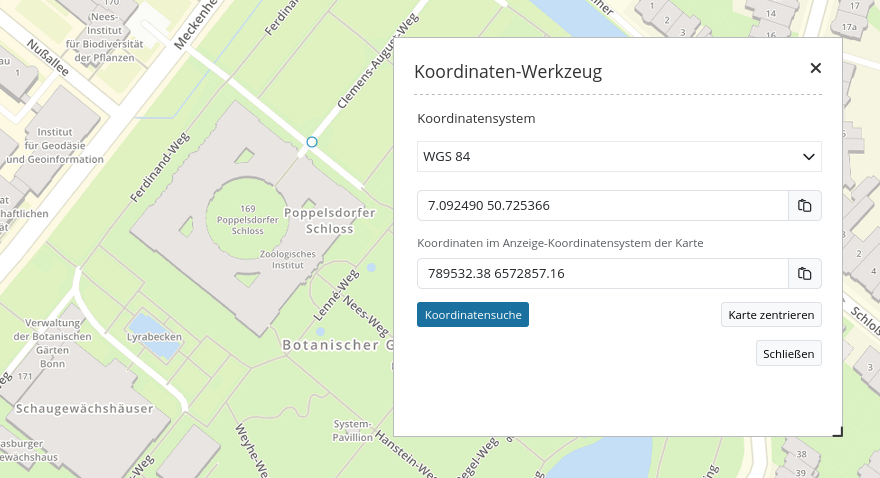

.. _coordinate_utility_de:

Koordinatenwerkzeug
*******************

Über das Element *Koordinaten Utility* lassen sich zwei Dinge realisieren:

1. Man kann zu einem Punkt mithilfe des zugehörigen eingegebenen Koordinatenpunkts springen.
2. Man kann sich den Klickpunkt aus der Karte anzeigen lassen.

Beide Funktionen werden über eine Oberfläche realisiert.

In beiden Fällen ist eine dynamische Koordinatentransformation möglich, so dass auch Punkte anderer Koordinatensysteme eingegeben werden können.

Zusätzlich besteht bei dem Element die Möglichkeit, die Koordinaten in die Zwischenablage zu kopieren.

Das Element bindet man im Mapbender-Backend entweder als Dialog zum Aufruf über einen Button ein, oder als Element in der Seitenleiste.

Einrichtung und Konfiguration
=============================

Fügen Sie das Element `Koordinaten Utility` in den Content Ihrer Anwendung ein.

.. image:: ../../../figures/de/coordinate_utility_add.png
     :scale: 80

Bei der Einrichtung des Elements haben Sie, neben den Standard Konfigurationsmöglichkeiten, noch weitere Optionen:

.. image:: ../../../figures/de/coordinate_utility_configuration.png
     :scale: 80

* **Title:** Titel des Elements
* **Target:** Karte, auf der dieses Element funktioniert (Main Map)
* **Type:** Dialog oder Element.
  
  * **Dialog:** Das Tool befindet sich in dem Content der Anwendung und wird über eine Schaltfläche geöffnet. Es erscheint als Dialog.
  * **Element:** Das Tool befindet sich in der Sidebar der Anwendung. Dazu muss es als Element deklariert werden.

* **Srs List:** Hier können weitere SRS angegeben werden, in denen das Tool transformieren soll. Das Feld kann leer gelassen werden.

* **Koordinatensysteme von der Karte hinzufügen:** Die von dem `Kartenelement  <../basic/map>`_ angegebenen Koordinatensysteme werden automatisch von dem Tool unterstützt. Diese werden in der Karte angegeben und auch im  `SRS Selector  <../basic/srs_selector>`_ unterstützt.

Wenn Sie das Tool als Dialog einbauen, benötigen Sie eine `Schaltfläche  <../misc/button>`_, die in den Toolbar eingefügt wird. Im folgenden eine Beispielkonfiguration der Schaltfläche:

.. image:: ../../../figures/de/coordinate_utility_button.png
     :scale: 80

* **Target:** Der Name des Tools, so wie er in dem Content hinterlegt ist (Koordinaten Utility)

Benutzung
=========

**Koordinate abgreifen:**

* Ist das Koordinatenwerkzeug als Dialog geöffnet, reagiert die Karte auf einen Klick. Klicken Sie in die Karte und die Klickkoordinate wird in dem Dialog angezeigt.
* Ändern Sie das Koordinatensystem im Dialog mit der Drop-Down-Liste. Die Klick-Koordinate wird in diesem angegebenen Koordinatensystem angezeigt.
* Die untere Zeile zeigt daher die Klickkoordinate noch in dem Original-Koordinatensystem der Karte.
* Die Schaltfläche hinter jeder Eingabezeile erlauben es, den Koordinatenwert direkt in die Zwischenablage zu kopieren.

**Zur Koordinate zoomen:**

* In dem Textfeld können eigene Koordinaten angegeben werden. Diese müssen in dem Koordinatensystem eingegeben werden, welches in der Drop-Down-Liste darüber festgelegt wurde.
* Über einen Klick auf die Schaltfläche **Karte zentrieren** wird zu dem Punkt gezoomt und dieser mit einem orangenen Symbol angezeigt.

