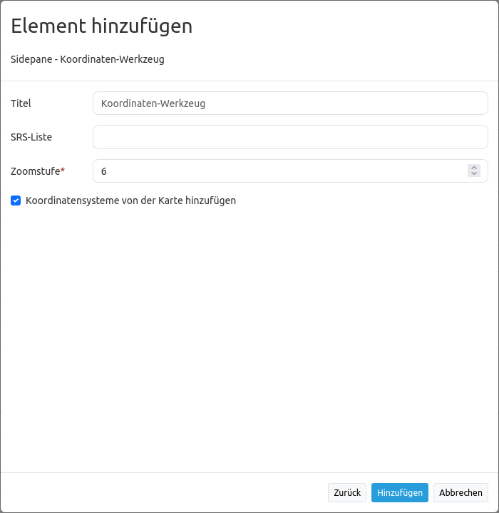

.. _coordinate_utility_de:

Koordinaten Utility (Coordinate Utility)
****************************************

Über das Element *Koordinaten Utility* lassen sich zwei Dinge realisieren:

1. Man kann zu einem Punkt mithilfe des zugehörigen eingegebenen Koordinatenpunkts springen.
2. Man kann sich den Klickpunkt aus der Karte anzeigen lassen.

Beide Funktionen werden über eine Oberfläche realisiert.

.. image:: ../../../figures/de/coordinate_utility.png
     :scale: 80

In beiden Fällen ist eine dynamische Koordinatentransformation möglich, so dass auch Punkte anderer Koordinatensysteme eingegeben werden können.
Zusätzlich besteht bei dem Element die Möglichkeit, die Koordinaten über einen Button in die Zwischenablage zu kopieren.
Das Element bindet man im Mapbender-Backend entweder als Dialog zum Aufruf über einen Button oder als Element in der Seitenleiste ein.

Konfiguration
=============

Fügen Sie das Element `Koordinaten Utility` bspw. in den Content-Bereich Ihrer Anwendung ein.

* **Title:** Titel des Elements
* **Target:** Karte, auf der dieses Element funktioniert (Main Map)
* **Type:** Dialog oder Element.
* **Srs List:** Hier können weitere SRS angegeben werden, in denen das Tool transformieren können soll. Das Feld kann leer gelassen werden.
* **Zoom-Level** Zoom-Level der Karte (Standard: 6)
* **Koordinatensysteme von der Karte hinzufügen:** Die von dem `Kartenelement  <../basic/map>`_ angegebenen Koordinatensysteme werden automatisch vom Tool unterstützt. Diese werden in der Karte angegeben und auch im  `SRS Selector  <../basic/srs_selector>`_ unterstützt.

Benutzung
=========

.. image:: ../../../figures/de/coordinate_utility.png
     :scale: 80

**Koordinate abgreifen:**

* Ist das Koordinaten Utility als Dialog geöffnet, reagiert die Karte auf einen Klick. Klicken Sie in die Karte und die Klickkoordinate wird in dem Dialog angezeigt.
* Ändern Sie das Koordinatensystem im Dialog mithilfe der Drop-Down-Liste. Die Klick-Koordinate wird in diesem angegebenen Koordinatensystem angezeigt.
* Die untere Zeile zeigt daher die Klickkoordinate noch in dem Original-Koordinatensystem der Karte.
* Die Schaltfläche hinter jeder Eingabezeile erlauben es, den Koordinatenwert direkt in die Zwischenablage zu kopieren.

**Zur Koordinate zoomen:**

* In dem Textfeld können eigene Koordinaten angegeben werden. Diese müssen in dem Koordinatensystem eingegeben werden, welches in der Drop-Down-Liste darüber festgelegt wurde.
* Über einen Klick auf die Schaltfläche **Karte zentrieren** wird zu dem Punkt gezoomt und dieser mit einem orangenen Symbol angezeigt.

YAML-Definition
===============

Diese Vorlage kann genutzt werden, um das Element in einer YAML-Anwendung einzubinden.

.. code-block:: yaml

    coordinatesutility:
        title: 'Koordinaten Utility'
        class: Mapbender\CoordinatesUtilityBundle\Element\CoordinatesUtility
        type: element
        target: map
        srsList:
            -
                name: 'EPSG:31466'
                title: '31466'
            -
                name: 'EPSG:31468'
                title: '31468'
            -
                name: 'EPSG:25833'
                title: '25832'
            -
                name: 'EPSG:4326'
                title: '4326'
                addMapSrsList: true
