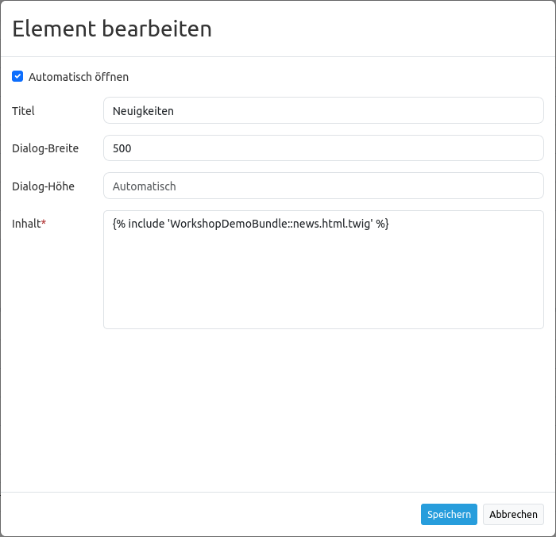

.. _copyright_de:

Copyright
*********

Dieses Element kann verwendet werden, um Text (auch HTML) in einem Dialog anzuzeigen. Der Dialog kann auf Wunsch beim Start automatisch erscheinen. Es können auch Links und Bilder integriert werden (siehe :ref:`html_de`).

.. image:: ../../../figures/de/copyright.png
     :scale: 80

Konfiguration
=============

.. image:: ../../../figures/de/copyright_configuration.png
     :scale: 80

* **Automatisches Öffnen:** Schaltet ein/aus, ob das Copyright Fenster beim Start der Anwendung automatisch geöffnet werden soll (Standard: aus).
* **Title:** Titel des Elements. Der Titel wird neben dem Button angezeigt.
* **Tooltip:** Text, der als Tooltip angezeigt wird. Dieser wird angezeigt, wenn der Mauszeiger längere Zeit über dem Button verweilt. Er wird außerdem als Kopfzeile im Copyright Fenster verwendet.
* **Popup width:** Breite des Popup Fensters (Standard: 300).
* **Popup height:** Höhe des Popup Fensters (Standard: 170).
* **Content:** Inhalt des Copyright Fensters. Dieser wird angezeigt, wenn das Element per Klick aktiviert wird (oder beim Start der Anwendung, wenn die "Automatisches Öffnen"-Option aktiviert wurde).

Verweis auf eine Twig-Datei
---------------------------

Im Content-Bereich kann auch auf eine Twig-Datei verwiesen werden. Bitte beachten Sie, dass die Twig-Datei valides HTML enthalten muss.

YAML-Definition:
----------------

Diese Vorlage kann genutzt werden, um das Element in einer YAML-Anwendung einzubinden.

.. code-block:: yaml

   class: Mapbender\CoreBundle\Element\Copyright
   title: "Copyright"              # Titel des Elements
   popupWidth: 300
   popupHeight: 170
   tooltip: "Copyright"            # Text des Tooltips
   content: "Lorem ipsum"          # Erstellen Sie ihren Text für das Copyright
   autoOpen: true                  # Automatisches Öffnen beim Start der Anwendung
                
